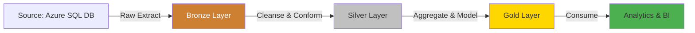
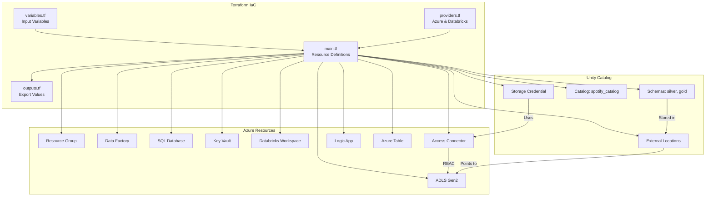
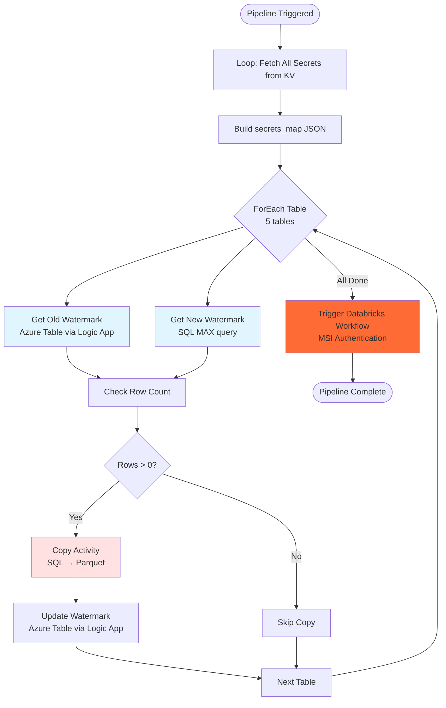
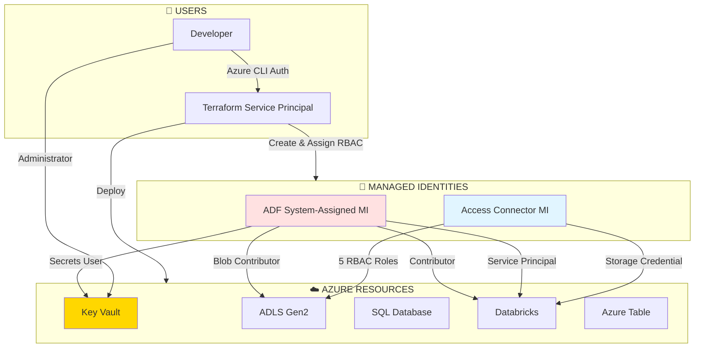
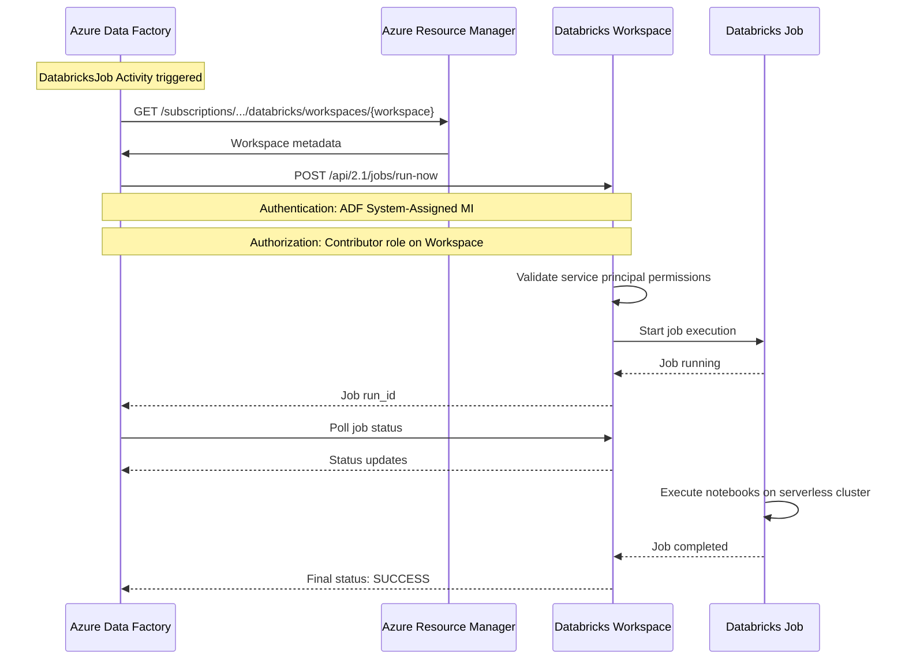
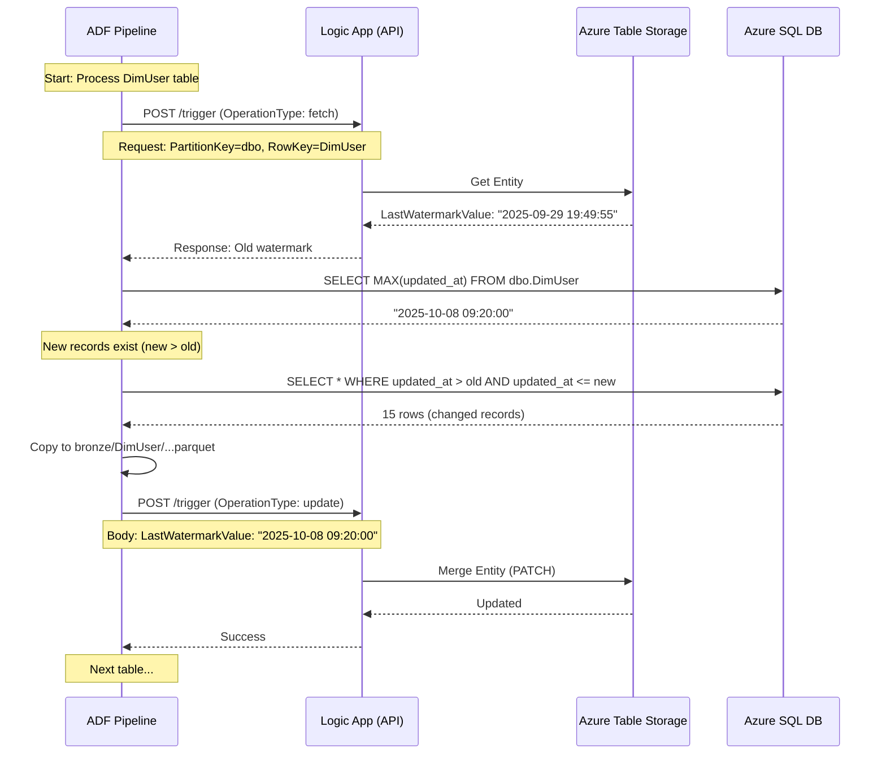
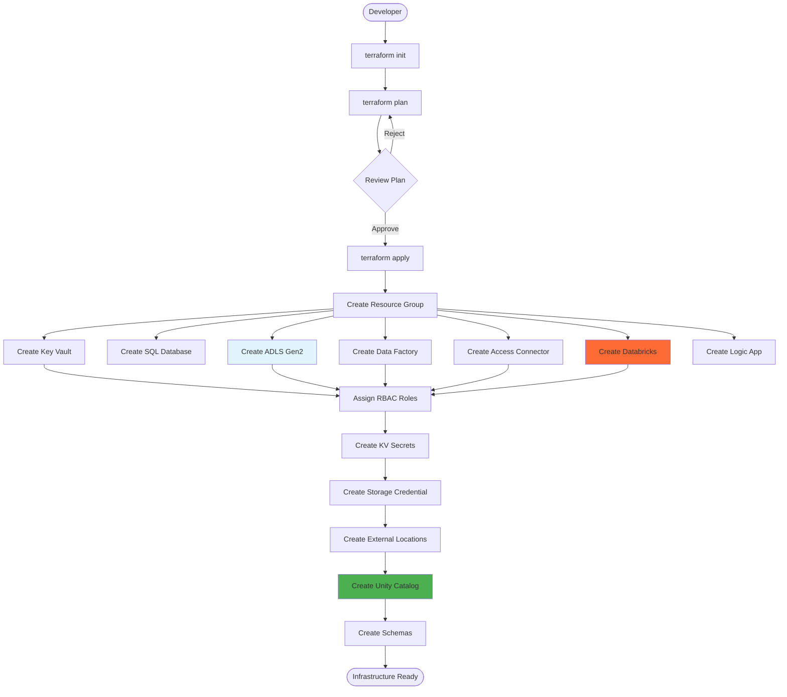

# 🏗️ Spotify Azure Data Engineering - Architecture Deep Dive

This document provides a comprehensive technical overview of the system architecture, design decisions, and implementation patterns used in the Spotify Azure Data Engineering project.

---

## 📋 Table of Contents

- [System Overview](#system-overview)
- [Medallion Architecture](#medallion-architecture)
- [Component Architecture](#component-architecture)
- [Data Pipeline Flow](#data-pipeline-flow)
- [Security & Access Control](#security--access-control)
- [Integration Patterns](#integration-patterns)
- [Design Decisions](#design-decisions)
- [Scalability & Performance](#scalability--performance)

---

## System Overview

### High-Level Architecture

```
┌─────────────────────────────────────────────────────────────────────────────┐
│                         AZURE RESOURCE GROUP                                 │
│                         (rg-spotify-dataeng)                                 │
│                                                                               │
│  ┌─────────────────────────────────────────────────────────────────────┐   │
│  │                    INFRASTRUCTURE LAYER (Terraform)                  │   │
│  │  • Resource provisioning • RBAC assignments • Managed identities     │   │
│  └─────────────────────────────────────────────────────────────────────┘   │
│                                                                               │
│  ┌──────────────┐  ┌──────────────┐  ┌──────────────┐  ┌──────────────┐  │
│  │ Azure SQL DB │  │   Key Vault  │  │ Table Storage│  │  Logic App   │  │
│  │              │  │              │  │              │  │              │  │
│  │ Star Schema  │  │  9 Secrets   │  │ 5 Watermarks │  │ Metadata API │  │
│  └──────┬───────┘  └──────┬───────┘  └──────┬───────┘  └──────┬───────┘  │
│         │                  │                  │                  │           │
│         │                  │                  │                  │           │
│  ┌──────▼──────────────────▼──────────────────▼──────────────────▼───────┐ │
│  │                  AZURE DATA FACTORY (Orchestration)                    │ │
│  │  ┌────────────────────────────────────────────────────────────────┐   │ │
│  │  │ pl_spotify_data_ingestion                                      │   │ │
│  │  │  • Watermark-based incremental load                            │   │ │
│  │  │  • ForEach loop (5 tables)                                     │   │ │
│  │  │  • Copy Activity: SQL → Parquet                                │   │ │
│  │  │  • DatabricksJob Activity: Trigger workflow                    │   │ │
│  │  └────────────────────────────────────────────────────────────────┘   │ │
│  └────────────────────────────┬───────────────────────────────────────────┘ │
│                                │                                             │
│                                │ Parquet files                               │
│                                ▼                                             │
│  ┌─────────────────────────────────────────────────────────────────────┐   │
│  │              ADLS GEN2 STORAGE (Medallion Architecture)              │   │
│  │  ┌──────────────┐  ┌──────────────┐  ┌──────────────┐              │   │
│  │  │   Bronze     │  │   Silver     │  │    Gold      │              │   │
│  │  │              │  │              │  │              │              │   │
│  │  │ Raw Parquet  │  │ Delta Tables │  │ Delta Tables │              │   │
│  │  │ Time-stamped │  │ + hash_diff  │  │ SCD Type 2   │              │   │
│  │  └──────┬───────┘  └──────┬───────┘  └──────▲───────┘              │   │
│  └─────────┼──────────────────┼──────────────────┼──────────────────────┘   │
│            │                  │                  │                           │
│            │ Autoloader       │ CDC              │ SCD Type 2                │
│            ▼                  ▼                  │                           │
│  ┌─────────────────────────────────────────────┴────────────────────────┐  │
│  │              AZURE DATABRICKS (Processing Layer)                      │  │
│  │                                                                        │  │
│  │  ┌──────────────────────────────────────────────────────────────┐    │  │
│  │  │ Databricks Asset Bundle: spotify_dab                          │    │  │
│  │  │                                                                │    │  │
│  │  │  Task 1: silver_dimensions.ipynb                              │    │  │
│  │  │  ├─ Read: Bronze (Autoloader streaming)                       │    │  │
│  │  │  ├─ Transform: Uppercase, flags, cleanup                      │    │  │
│  │  │  ├─ CDC: Hash-based change detection                          │    │  │
│  │  │  └─ Write: Silver (Delta merge operations)                    │    │  │
│  │  │                                                                │    │  │
│  │  │  Task 2: gold_dimensions.ipynb (For-Each Parallel)            │    │  │
│  │  │  ├─ Read: Silver (filter by ingested_at)                      │    │  │
│  │  │  ├─ Transform: Add surrogate keys + SCD columns               │    │  │
│  │  │  ├─ Write: Gold (append new records)                          │    │  │
│  │  │  └─ Update: Expire old records (is_current = false)           │    │  │
│  │  │                                                                │    │  │
│  │  │  Utils: transformations.py                                    │    │  │
│  │  │  └─ Reusable CDC, merge, SCD Type 2 functions                 │    │  │
│  │  └──────────────────────────────────────────────────────────────┘    │  │
│  │                                                                        │  │
│  │  Compute: Serverless Cluster                                          │  │
│  └────────────────────────────────────────────────────────────────────────┘  │
│                                │                                              │
│                                │ External Tables                              │
│                                ▼                                              │
│  ┌─────────────────────────────────────────────────────────────────────┐   │
│  │                    UNITY CATALOG (Governance)                        │   │
│  │                                                                       │   │
│  │  Catalog: spotify_catalog                                            │   │
│  │  ├─ Schema: silver                                                   │   │
│  │  │  ├─ DimUser                                                       │   │
│  │  │  ├─ DimArtist                                                     │   │
│  │  │  ├─ DimTrack                                                      │   │
│  │  │  ├─ DimDate                                                       │   │
│  │  │  └─ FactStream                                                    │   │
│  │  │                                                                    │   │
│  │  └─ Schema: gold                                                     │   │
│  │     ├─ dimuser (SCD Type 2 with surrogate keys)                     │   │
│  │     ├─ dimartist (SCD Type 2 with surrogate keys)                   │   │
│  │     ├─ dimtrack (SCD Type 2 with surrogate keys)                    │   │
│  │     └─ factstream (Slowly changing fact)                            │   │
│  │                                                                       │   │
│  │  Storage Credential: spotify_adls_credential                         │   │
│  │  └─ Access Connector Managed Identity                               │   │
│  │                                                                       │   │
│  │  External Locations:                                                 │   │
│  │  ├─ spotify_bronze → abfss://bronze@...                             │   │
│  │  ├─ spotify_silver → abfss://silver@...                             │   │
│  │  └─ spotify_gold   → abfss://gold@...                               │   │
│  └───────────────────────────────────────────────────────────────────────┘   │
└───────────────────────────────────────────────────────────────────────────────┘
```

---

## Medallion Architecture

### **Layer Definitions**



### **Bronze Layer** 🥉

**Purpose**: Raw data ingestion, minimal transformation

| Aspect | Details |
|--------|---------|
| **Format** | Parquet (compressed columnar format) |
| **Schema** | Matches source exactly |
| **Write Pattern** | Append-only with timestamp in filename |
| **Partitioning** | By table name (folder structure) |
| **Retention** | All historical raw files preserved |
| **Location** | `abfss://bronze@{storage_account}.dfs.core.windows.net/{table_name}/` |

**Example File Structure**:
```
bronze/
├── DimUser/
│   ├── DimUser_20260404120000.parquet
│   ├── DimUser_20260404130000.parquet
│   └── ...
├── DimArtist/
│   └── DimArtist_20260404120000.parquet
└── FactStream/
    └── FactStream_20260404120000.parquet
```

**Data Characteristics**:
- ✅ Complete source data (all columns)
- ✅ No quality checks
- ✅ Includes NULL and potentially dirty data
- ✅ _rescued_data column (Autoloader schema evolution)

---

### **Silver Layer** 🥈

**Purpose**: Cleaned, conformed, validated data with CDC

| Aspect | Details |
|--------|---------|
| **Format** | Delta Lake (ACID transactions) |
| **Schema** | Cleaned + metadata columns (hash_diff, ingested_at) |
| **Write Pattern** | Merge (upsert) based on primary keys |
| **CDC Method** | Hash-based change detection (SHA-256) |
| **Retention** | Current state + Delta transaction log |
| **Location** | `abfss://silver@{storage_account}.dfs.core.windows.net/{table_name}/data/` |

**Transformations Applied**:

| Table | Transformations |
|-------|----------------|
| **DimUser** | • Convert user_name to UPPERCASE<br>• Drop _rescued_data column<br>• Add hash_diff (SHA-256 of all non-PK columns)<br>• Add ingested_at timestamp |
| **DimArtist** | • Convert artist_name to UPPERCASE<br>• Drop _rescued_data<br>• Add hash_diff<br>• Add ingested_at |
| **DimTrack** | • Calculate durationFlag (low/medium/high)<br>• Clean track_name (remove hyphens)<br>• Drop _rescued_data<br>• Add hash_diff<br>• Add ingested_at |
| **DimDate** | • Drop _rescued_data<br>• Add hash_diff<br>• Add ingested_at<br>• Append-only (no merge) |
| **FactStream** | • Join with DimTrack to get artist_id<br>• Drop _rescued_data<br>• Add hash_diff<br>• Add ingested_at |

**CDC Logic**:
```python
# Hash calculation (from transformations.py)
cols_to_hash = [col for col in df.columns if col not in pk_list + ['_rescued_data']]
coalesced_cols = [F.coalesce(F.col(c).cast("string"), F.lit('')) for c in cols_to_hash]
concat_ws = F.concat_ws('~', *coalesced_cols)
hash_diff = F.sha2(concat_ws, 256)

# Merge logic
target.merge(source, "target.pk <=> source.pk")
  .whenMatchedUpdateAll("!(target.hash_diff <=> source.hash_diff)")  # Only if changed
  .whenNotMatchedInsertAll()
  .execute()
```

---

### **Gold Layer** 🥇

**Purpose**: Analytics-ready dimensional model with historical tracking

| Aspect | Details |
|--------|---------|
| **Format** | Delta Lake (optimized for analytics) |
| **Schema** | Silver schema + SCD Type 2 columns + surrogate keys |
| **Write Pattern** | Append new versions + expire old records |
| **SCD Method** | Type 2 (historical tracking) |
| **Retention** | Complete change history |
| **Location** | `abfss://gold@{storage_account}.dfs.core.windows.net/{table_name}/data/` |

**SCD Type 2 Schema**:

| Column | Type | Purpose |
|--------|------|---------|
| `{table}_sk` | BIGINT | Surrogate key (auto-increment) |
| `{natural_key}` | Various | Business key (e.g., user_id) |
| `{attributes}` | Various | Tracked attributes |
| `hash_diff` | STRING | Change detection hash |
| `ingested_at` | TIMESTAMP | Record ingestion time |
| `is_current` | BOOLEAN | Is this the active record? |
| `active_start_date_time` | TIMESTAMP | When record became active |
| `active_end_date_time` | TIMESTAMP | When record was superseded (NULL if current) |

**Example: User Record Evolution**

```sql
-- User 2 changes subscription from Family → Premium

dimuser_sk | user_id | subscription_type | is_current | active_start_date_time | active_end_date_time
-----------|---------|-------------------|------------|------------------------|---------------------
1          | 2       | Family            | false      | 2025-09-29 19:49:55    | 2025-10-08 08:10:00
2          | 2       | Premium           | true       | 2025-10-08 08:10:00    | NULL

-- Query for current state: WHERE is_current = true
-- Query for history: WHERE user_id = 2 ORDER BY active_start_date_time
```

---

## Component Architecture

### 1. **Infrastructure Layer (Terraform)**



**Key Resources Created**:

1. **Resource Group**: Container for all resources (US-East)
2. **Azure Data Factory**: System-assigned MI, optional GitHub integration
3. **ADLS Gen2**: Hierarchical namespace, 3 containers (bronze/silver/gold)
4. **Azure Databricks**: Premium SKU, Unity Catalog enabled
5. **Access Connector**: Managed identity for Unity Catalog
6. **Azure SQL Database**: Basic tier, Azure services access enabled
7. **Azure Key Vault**: RBAC-enabled, 9 secrets stored
8. **Azure Table Storage**: Metadata store for watermarks
9. **Logic App**: REST API for metadata operations

**RBAC Assignments** (Automated):
- Access Connector → ADLS: 5 roles (Blob/Queue/Account/EventGrid)
- ADF MI → ADLS: Storage Blob Data Contributor
- ADF MI → Key Vault: Key Vault Secrets User
- ADF MI → Databricks: Contributor + Workspace Access
- Current User → Key Vault: Key Vault Administrator

---

### 2. **Data Source Layer (Azure SQL)**

**Star Schema Design**:

```
┌─────────────────┐         ┌─────────────────┐         ┌─────────────────┐
│    DimUser      │         │    DimArtist    │         │    DimTrack     │
├─────────────────┤         ├─────────────────┤         ├─────────────────┤
│ PK: user_id     │         │ PK: artist_id   │         │ PK: track_id    │
│ user_name       │         │ artist_name     │         │ track_name      │
│ country         │         │ genre           │         │ album_name      │
│ subscription    │         │ country         │         │ artist_id (FK)  │
│ start_date      │         │ updated_at      │         │ duration_sec    │
│ end_date        │         └─────────────────┘         │ release_date    │
│ updated_at      │                 ▲                   │ updated_at      │
└────────┬────────┘                 │                   └────────┬────────┘
         │                          │                            │
         │        ┌─────────────────┴────────────────┐          │
         │        │                                   │          │
         │        │         FactStream                │          │
         │        │  ┌────────────────────────────┐  │          │
         └────────┼─►│ PK: stream_id              │◄─┼──────────┘
                  │  │ FK: user_id                │  │
                  │  │ FK: track_id               │  │
                  │  │ FK: date_key               │  │
                  │  │ listen_duration            │  │
                  │  │ device_type                │  │
                  │  │ stream_timestamp           │  │
                  │  └────────────────────────────┘  │
                  └─────────────────┬──────────────────┘
                                    │
                        ┌───────────▼──────────┐
                        │      DimDate         │
                        ├──────────────────────┤
                        │ PK: date_key         │
                        │ date                 │
                        │ day, month, year     │
                        │ weekday              │
                        └──────────────────────┘
```

**Watermark Columns**:
- DimUser: `updated_at` (DATETIME)
- DimArtist: `updated_at` (DATETIME)
- DimTrack: `updated_at` (DATETIME)
- DimDate: `date` (DATE)
- FactStream: `stream_timestamp` (DATETIME)

---

### 3. **Orchestration Layer (Azure Data Factory)**

**Pipeline Architecture**:



**Key Activities**:

1. **Secret Fetching Loop**
   - Retrieves 7 secrets from Key Vault using ADF MSI
   - Builds dynamic JSON map for pipeline use
   - Secure: Uses MSI, no hardcoded credentials

2. **Table Processing Loop (ForEach)**
   - Processes 5 tables: DimUser, DimArtist, DimTrack, DimDate, FactStream
   - Parallel execution (isSequential: false)
   
3. **Watermark Comparison**
   - **Old Watermark**: Retrieved from Azure Table Storage via Logic App API
   - **New Watermark**: MAX(watermark_column) from SQL source
   - **Incremental Query**: `WHERE watermark > old AND watermark <= new`

4. **Conditional Copy**
   - Checks row count before copying
   - Only copies if incremental records exist
   - Prevents empty file creation

5. **Copy Activity**
   - Source: Azure SQL (parameterized query)
   - Sink: ADLS Gen2 Parquet (timestamped filename)
   - Pattern: `{table}/{table}_{timestamp}.parquet`

6. **Watermark Update**
   - Updates Azure Table via Logic App API
   - Stores new watermark for next run
   - Ensures incremental continuity

7. **Databricks Trigger**
   - Uses DatabricksJob activity
   - Authenticates via ADF MSI
   - Triggers workflow by job_id (from global parameter)

**Global Parameters Required**:
- `key_vault_url`: Key Vault URI
- `databricks_workflow_job_id`: Databricks job ID to trigger

---

### 4. **Processing Layer (Azure Databricks)**

**Databricks Asset Bundle Structure**:

```yaml
bundle:
  name: spotify_dab
  uuid: 22a068ba-5021-46f4-8a26-b16bcf60307b

variables:
  user_email: ${env.USER_EMAIL}
  adls_storage_container_name: ${env.ADLS_STORAGE_CONTAINER_NAME}
  adf_service_principal_id: ${env.ADF_SERVICE_PRINCIPAL_ID}

targets:
  dev:
    mode: development
    permissions:
      - user_name: ${var.user_email}
        level: CAN_MANAGE
      - service_principal_name: ${var.adf_service_principal_id}
        level: CAN_MANAGE
  
  prod:
    mode: production
    workspace:
      root_path: /Workspace/PROD/.bundle/${bundle.name}/${bundle.target}
    permissions: (same as dev)

resources:
  jobs:
    spotify_etl_job:
      name: spotify_etl_workflow
      trigger:
        periodic:
          interval: 1
          unit: DAYS
      tasks:
        - silver_transformation_task
        - gold_transformation_tasks (for_each)
```

**Workflow Tasks**:

#### **Task 1: Silver Transformation** (`silver_dimensions.ipynb`)

**Purpose**: Bronze → Silver with CDC

**Process Flow**:
```
1. Initialize Parameters
   └─ catalog_name: "spotify_catalog"
   └─ adls_storage_container_name: from environment

2. For Each Table (DimUser, DimArtist, DimTrack, FactStream):
   
   a) Read with Autoloader
      └─ Format: cloudFiles (Parquet)
      └─ Schema Evolution: addNewColumns
      └─ Location: abfss://bronze@{storage}/...
      └─ Checkpoint: abfss://silver@{storage}/.../checkpoint
   
   b) Apply Transformations
      └─ Business rules (uppercase, flags, etc.)
      └─ Drop _rescued_data column
   
   c) Add Metadata
      └─ hash_diff: SHA-256 of all non-PK columns
      └─ ingested_at: current_timestamp()
   
   d) Write to Silver (Streaming Merge)
      ├─ If table exists:
      │  └─ Merge on PK
      │  └─ Update if hash_diff changed
      │  └─ Insert if not exists
      └─ Else:
         └─ Create table and insert all
   
   e) Checkpoint & Continue
      └─ Structured streaming checkpoint
      └─ Trigger: availableNow=True (micro-batch)
      └─ awaitTermination()

3. Complete Task
```

**Autoloader Benefits**:
- Schema inference & evolution
- Efficient incremental processing
- Exactly-once delivery
- Checkpoint management

#### **Task 2: Gold Transformation** (`gold_dimensions.ipynb`)

**Purpose**: Silver → Gold with SCD Type 2

**Process Flow**:
```
For Each Table (DimUser, DimArtist, DimTrack, FactStream) in Parallel:

1. Create Gold Table if Not Exists
   └─ Dynamic DDL from Silver schema
   └─ Add: {table}_sk (surrogate key, auto-increment)
   └─ Add: is_current (BOOLEAN)
   └─ Add: active_start_date_time (TIMESTAMP)
   └─ Add: active_end_date_time (TIMESTAMP)

2. Get Incremental Records from Silver
   └─ Filter: ingested_at > MAX(ingested_at) in Gold
   └─ If empty: Exit (no new records)

3. Prepare New Records
   └─ Add: is_current = true
   └─ Add: active_start_date_time = current_timestamp
   └─ Add: active_end_date_time = NULL
   └─ Add: ingested_at = current_timestamp

4. Append New Records to Gold
   └─ mode: append
   └─ Surrogate key auto-generated

5. Expire Old Records
   └─ Find duplicates: Same PK but different SK
   └─ Update old records:
      ├─ is_current = false
      └─ active_end_date_time = current_timestamp
   └─ Merge condition: PK match AND SK not match AND is_current = true
```

**SCD Type 2 Logic**:

```python
# Merge operation to expire old records
mart_delta_table.alias("t").merge(
    mart_iscurrent_record_df.alias("s"),
    "t.user_id = s.user_id AND t.dimuser_sk != s.dimuser_sk"
).whenMatchedUpdate(
    condition="t.is_current = true AND t.active_end_date_time is null",
    set={
        "is_current": "false",
        "active_end_date_time": "current_timestamp()"
    }
).execute()
```

**For-Each-Task Configuration**:
```yaml
for_each_task:
  inputs: |
    [
      {"source_table": "dimuser", "target_table": "dimuser", "pk_list": "user_id"},
      {"source_table": "dimartist", "target_table": "dimartist", "pk_list": "artist_id"},
      {"source_table": "dimtrack", "target_table": "dimtrack", "pk_list": "track_id"},
      {"source_table": "factstream", "target_table": "factstream", "pk_list": "stream_id"}
    ]
  task:
    notebook_task:
      notebook_path: ../src/gold_dimensions.ipynb
      base_parameters:
        source_table_name: "{{input.source_table}}"
        pk_list: "{{input.pk_list}}"
```

**Parallelism**: All 4 tables processed simultaneously on serverless compute.

---

### 5. **Data Governance Layer (Unity Catalog)**

**Hierarchy**:

```
Unity Catalog
└── Catalog: spotify_catalog
    ├── Schema: silver
    │   ├── External Location: spotify_silver
    │   ├── Storage Credential: spotify_adls_credential (Access Connector MI)
    │   └── Tables:
    │       ├── DimUser (external Delta table)
    │       ├── DimArtist (external Delta table)
    │       ├── DimTrack (external Delta table)
    │       ├── DimDate (external Delta table)
    │       └── FactStream (external Delta table)
    │
    └── Schema: gold
        ├── External Location: spotify_gold
        ├── Storage Credential: spotify_adls_credential (Access Connector MI)
        └── Tables:
            ├── dimuser (SCD Type 2)
            ├── dimartist (SCD Type 2)
            ├── dimtrack (SCD Type 2)
            └── factstream (SCD Type 2)
```

**Storage Credential Configuration**:
```hcl
resource "databricks_storage_credential" "spotify_adls" {
  name = "spotify_adls_credential"
  azure_managed_identity {
    access_connector_id = azurerm_databricks_access_connector.main.id
  }
}
```

**Benefits**:
- Centralized metadata management
- Fine-grained access control (GRANT/REVOKE)
- Data lineage tracking
- Audit logging
- Cross-workspace data sharing

---

## Data Pipeline Flow

### **Detailed Execution Sequence**

```
┌─────────────────────────────────────────────────────────────────────────┐
│ PHASE 1: EXTRACTION (Azure Data Factory)                                │
└─────────────────────────────────────────────────────────────────────────┘

Time: T0 (Pipeline triggered)

1. Fetch Secrets from Key Vault (MSI Authentication)
   └─ ForEach loop: 7 secrets
   └─ Build secrets_map JSON object
   └─ Duration: ~5-10 seconds

2. ForEach Table Loop (Parallel: 5 tables)
   
   Table: DimUser
   ├─ Get Old Watermark from Azure Table (Logic App API)
   │  └─ Result: "2025-09-29 19:49:55"
   │
   ├─ Get New Watermark from SQL (MAX query)
   │  └─ Result: "2025-10-08 09:20:00"
   │
   ├─ Check Incremental Row Count
   │  └─ Query: SELECT COUNT(*) WHERE updated_at > old AND updated_at <= new
   │  └─ Result: 15 rows
   │
   ├─ Copy Data (If count > 0)
   │  └─ Source: SQL Server (incremental query)
   │  └─ Sink: bronze/DimUser/DimUser_20260404133000.parquet
   │  └─ Rows copied: 15
   │
   └─ Update Watermark (Logic App API)
      └─ New value: "2025-10-08 09:20:00"
      └─ Duration: ~30 seconds per table

3. All Tables Complete (After ~2-3 minutes)
   └─ Total records: 75 (15 per table × 5 tables)
   └─ Bronze layer updated with 5 new Parquet files

4. Trigger Databricks Workflow
   └─ DatabricksJob Activity
   └─ Job ID: from global parameter
   └─ Authentication: ADF MSI
   └─ Result: Job run initiated

┌─────────────────────────────────────────────────────────────────────────┐
│ PHASE 2: BRONZE → SILVER (Databricks Task 1)                            │
└─────────────────────────────────────────────────────────────────────────┘

Time: T0 + 3 minutes (Databricks cluster starts)

Task: silver_dimensions.ipynb (Sequential processing)

1. DimUser Processing
   ├─ Autoloader Read (Streaming)
   │  └─ Detects new Parquet file: DimUser_20260404133000.parquet
   │  └─ Schema checkpoint: updated
   │  └─ Records: 15 rows
   │
   ├─ Transformations
   │  └─ user_name: "Amanda Jenkins" → "AMANDA JENKINS"
   │  └─ Drop _rescued_data column
   │
   ├─ Add Metadata
   │  └─ hash_diff: SHA-256 of (user_name + country + subscription + dates)
   │  └─ ingested_at: 2026-04-04 13:33:00
   │
   ├─ Merge to Silver Table
   │  └─ Match on: user_id
   │  └─ Update if: hash_diff changed
   │  └─ Insert if: new user_id
   │  └─ Result: 15 updates (changed subscription_type detected)
   │
   └─ Checkpoint & Complete
      └─ Duration: ~10 seconds

2. DimArtist Processing (similar flow)
   └─ 15 rows processed, 15 updates
   └─ Duration: ~10 seconds

3. DimTrack Processing
   ├─ Additional transformation: durationFlag calculation
   ├─ Clean track_name (remove hyphens)
   └─ 15 rows processed
   └─ Duration: ~10 seconds

4. DimDate Processing
   └─ Append-only (no merge)
   └─ Duration: ~5 seconds

5. FactStream Processing
   ├─ Join with DimTrack to get artist_id
   └─ 15 rows processed
   └─ Duration: ~10 seconds

Silver Task Complete: ~50 seconds total

┌─────────────────────────────────────────────────────────────────────────┐
│ PHASE 3: SILVER → GOLD (Databricks Task 2 - For-Each Parallel)          │
└─────────────────────────────────────────────────────────────────────────┘

Time: T0 + 4 minutes

Task: gold_dimensions.ipynb (For-Each: 4 tables in parallel)

Parallel Processing (4 concurrent executions):

┌─────────────────────┐  ┌─────────────────────┐  ┌─────────────────────┐
│ DimUser             │  │ DimArtist           │  │ DimTrack            │
├─────────────────────┤  ├─────────────────────┤  ├─────────────────────┤
│ 1. Get incremental  │  │ 1. Get incremental  │  │ 1. Get incremental  │
│    from Silver      │  │    from Silver      │  │    from Silver      │
│    └─ 15 rows       │  │    └─ 15 rows       │  │    └─ 15 rows       │
│                     │  │                     │  │                     │
│ 2. Add SCD columns  │  │ 2. Add SCD columns  │  │ 2. Add SCD columns  │
│    └─ is_current=T  │  │    └─ is_current=T  │  │    └─ is_current=T  │
│    └─ start_ts=now  │  │    └─ start_ts=now  │  │    └─ start_ts=now  │
│                     │  │                     │  │                     │
│ 3. Append to Gold   │  │ 3. Append to Gold   │  │ 3. Append to Gold   │
│    └─ 15 inserts    │  │    └─ 15 inserts    │  │    └─ 15 inserts    │
│                     │  │                     │  │                     │
│ 4. Expire old       │  │ 4. Expire old       │  │ 4. Expire old       │
│    └─ 15 updates    │  │    └─ 15 updates    │  │    └─ 15 updates    │
│                     │  │                     │  │                     │
│ ✅ Complete: 20s    │  │ ✅ Complete: 20s    │  │ ✅ Complete: 20s    │
└─────────────────────┘  └─────────────────────┘  └─────────────────────┘

┌─────────────────────┐
│ FactStream          │
├─────────────────────┤
│ 1. Get incremental  │
│    └─ 15 rows       │
│ 2. Add SCD columns  │
│ 3. Append to Gold   │
│ 4. Expire old       │
│ ✅ Complete: 20s    │
└─────────────────────┘

Gold Task Complete: ~20-25 seconds (parallel execution)

┌─────────────────────────────────────────────────────────────────────────┐
│ PIPELINE COMPLETE                                                        │
└─────────────────────────────────────────────────────────────────────────┘

Total Duration: ~5-6 minutes (end-to-end)
Records Processed: 75 changes across 5 tables
Gold Tables Updated: 4 dimensions + 1 fact (with history)
```

---

## Security & Access Control

### **Authentication & Authorization Pattern**



### **RBAC Assignments Matrix**

| Principal | Resource | Role | Purpose |
|-----------|----------|------|---------|
| **Access Connector MI** | ADLS Gen2 | Storage Blob Data Contributor | Read/write data |
| **Access Connector MI** | ADLS Gen2 | Storage Queue Data Contributor | Queue operations |
| **Access Connector MI** | ADLS Gen2 | Storage Account Contributor | Account management |
| **Access Connector MI** | ADLS Gen2 | EventGrid Data Contributor | Event notifications |
| **Access Connector MI** | ADLS Gen2 | EventGrid EventSubscription Contributor | Event subscriptions |
| **ADF Managed Identity** | ADLS Gen2 | Storage Blob Data Contributor | Copy activity data access |
| **ADF Managed Identity** | Key Vault | Key Vault Secrets User | Read secrets |
| **ADF Managed Identity** | Databricks Workspace | Contributor | Trigger jobs via ARM API |
| **Current User/SP** | Key Vault | Key Vault Administrator | Manage secrets (Terraform) |

### **Secret Management**

**Secrets Stored in Key Vault**:

| Secret Name | Purpose | Used By |
|-------------|---------|---------|
| `adls-storage-account-key` | ADLS access key | ADF Copy Activity |
| `adls-storage-account-name` | Storage account name | ADF pipelines |
| `adls-source-url` | DFS endpoint | ADF linked service |
| `sql-admin-username` | SQL authentication | ADF SQL linked service |
| `sql-admin-password` | SQL authentication | ADF SQL linked service |
| `sql-source-server-name` | SQL Server FQDN | ADF SQL linked service |
| `azure-table-interaction-endpoint` | Logic App URL | ADF watermark operations |
| `databricks-workspace-resource-id` | Workspace ARM ID | ADF Databricks linked service |
| `databricks-workspace-url` | Workspace URL | ADF Databricks linked service |

**Access Pattern**:
```
ADF Pipeline → Fetch Secret (MSI Auth) → Use in Linked Service → Connect to Resource
```

---

## Integration Patterns

### **1. ADF → Databricks Integration (Managed Identity)**



**Requirements**:
1. ADF MI registered as Databricks service principal (Terraform)
2. ADF MI has Contributor role on Databricks workspace (Terraform)
3. Service principal has workspace_access entitlement (Terraform)
4. Bundle deployed with ADF MI permissions (databricks.yml)

**Configuration**:
```json
{
  "name": "Invoke databricks workflow job",
  "type": "DatabricksJob",
  "typeProperties": {
    "jobId": "@pipeline().globalParameters.databricks_workflow_job_id"
  },
  "linkedServiceName": {
    "referenceName": "ls_azure_databricks_connection",
    "authentication": "MSI",
    "workspaceResourceId": "@secrets('databricks-workspace-resource-id')"
  }
}
```

---

### **2. Watermark-Based CDC with Azure Table Storage**



**Logic App Design**:

```json
{
  "trigger": "HTTP Request",
  "condition": "OperationType",
  "actions": {
    "if_fetch": {
      "GetEntity": "Read from Azure Table",
      "Response": "Return LastWatermarkValue"
    },
    "else_update": {
      "MergeEntity": "Upsert to Azure Table",
      "Response": "Confirm update"
    }
  }
}
```

**Azure Table Schema**:

| PartitionKey | RowKey | LastWatermarkValue | Timestamp |
|--------------|--------|-------------------|-----------|
| dbo | DimUser | 2025-10-08 09:20:00 | 2026-04-04 13:30:00 |
| dbo | DimArtist | 2025-10-08 09:15:00 | 2026-04-04 13:30:00 |
| dbo | DimTrack | 2025-10-08 09:15:00 | 2026-04-04 13:30:00 |
| dbo | DimDate | 2025-10-08 | 2026-04-04 13:30:00 |
| dbo | FactStream | 2025-10-08 10:00:00 | 2026-04-04 13:30:00 |

---

### **3. Databricks Autoloader (Structured Streaming)**

**How It Works**:

```python
# Autoloader configuration
df = spark.readStream.format("cloudFiles") \
    .option("cloudFiles.format", "parquet") \
    .option("cloudFiles.schemaLocation", "checkpoint_path") \
    .option("schemaEvolutionMode", "addNewColumns") \
    .load("bronze_path")

# Processing
df_transformed = df.withColumn("new_col", ...)

# Write with merge
df_transformed.writeStream \
    .format("delta") \
    .outputMode("append") \
    .option("checkpointLocation", "checkpoint_path") \
    .trigger(availableNow=True) \
    .foreachBatch(merge_function) \
    .start() \
    .awaitTermination()
```

**Key Features**:
- **Incremental Processing**: Only processes new files since last checkpoint
- **Schema Evolution**: Automatically handles schema changes
- **Exactly-Once**: Checkpoint ensures no duplicate processing
- **Efficient**: Uses file notifications (not file listing)

**File Detection Methods**:
1. **Auto** (default): Azure Event Grid or directory listing
2. **Directory Listing**: For small datasets
3. **Event Grid**: For large-scale production

---

### **4. Hash-Based Change Detection**

**Implementation** (`transformations.py`):

```python
def add_hash_diff_column(self, df, pk_list):
    # Exclude primary keys and metadata from hash
    exclude_columns = pk_list + ['_rescued_data']
    cols_to_hash = [col for col in df.columns if col not in exclude_columns]
    
    # Coalesce NULL values to empty string
    coalesced_cols = [
        F.coalesce(F.col(column).cast("string"), F.lit('')) 
        for column in cols_to_hash
    ]
    
    # Concatenate with delimiter
    concat_ws = F.concat_ws('~', *coalesced_cols)
    
    # Calculate SHA-256 hash
    df = df.withColumn("hash_diff", F.sha2(concat_ws, 256))
    
    return df
```

**Example**:

| user_id | user_name | country | subscription | updated_at | hash_diff (SHA-256) |
|---------|-----------|---------|--------------|------------|---------------------|
| 2 | Amanda Jenkins | Montserrat | Family | 2025-09-29 | abc123...def |
| 2 | Amanda Jenkins | Montserrat | Premium | 2025-10-08 | xyz789...uvw |

**Change Detected**: subscription changed Family → Premium
**Merge Action**: Update existing record with new hash_diff

---

### **5. SCD Type 2 Implementation**

**Algorithm**:

```
STEP 1: Identify New/Changed Records
├─ Read from Silver layer
├─ Filter: WHERE ingested_at > MAX(ingested_at) in Gold
└─ Result: Incremental DataFrame

STEP 2: Create Gold Table if Not Exists
├─ Copy Silver schema
├─ Add: {table}_sk BIGINT GENERATED ALWAYS AS IDENTITY
├─ Add: is_current BOOLEAN
├─ Add: active_start_date_time TIMESTAMP
├─ Add: active_end_date_time TIMESTAMP
└─ Location: abfss://gold@{storage}/...

STEP 3: Prepare New Records
├─ is_current = true
├─ active_start_date_time = current_timestamp()
├─ active_end_date_time = NULL
└─ ingested_at = current_timestamp()

STEP 4: Append New Records
└─ Surrogate key auto-generated by IDENTITY column

STEP 5: Expire Old Records
├─ Find: Records with same PK but different SK (previous versions)
├─ Update WHERE is_current = true AND active_end_date_time IS NULL:
│  ├─ is_current = false
│  └─ active_end_date_time = current_timestamp()
└─ Merge condition: t.user_id = s.user_id AND t.dimuser_sk != s.dimuser_sk
```

**Merge Statement**:
```python
mart_delta_table.alias("t").merge(
    mart_iscurrent_record_df.alias("s"),
    f"{dynamic_pk_join} AND t.{table}_sk != s.{table}_sk"
).whenMatchedUpdate(
    condition="t.is_current = true AND t.active_end_date_time is null",
    set={
        "is_current": "false",
        "active_end_date_time": "current_timestamp()"
    }
).execute()
```

**Resulting Gold Table**:

```sql
-- Example: User 2 subscription changes
SELECT 
    dimuser_sk,
    user_id,
    user_name,
    subscription_type,
    is_current,
    active_start_date_time,
    active_end_date_time
FROM spotify_catalog.gold.dimuser
WHERE user_id = 2
ORDER BY active_start_date_time;

-- Result:
┌────────────┬─────────┬────────────────┬───────────────────┬────────────┬────────────────────────┬──────────────────────┐
│ dimuser_sk │ user_id │ user_name      │ subscription_type │ is_current │ active_start_date_time │ active_end_date_time │
├────────────┼─────────┼────────────────┼───────────────────┼────────────┼────────────────────────┼──────────────────────┤
│ 45         │ 2       │ AMANDA JENKINS │ Family            │ false      │ 2025-09-29 19:49:55    │ 2025-10-08 08:10:00  │
│ 521        │ 2       │ AMANDA JENKINS │ Premium           │ true       │ 2025-10-08 08:10:00    │ NULL                 │
└────────────┴─────────┴────────────────┴───────────────────┴────────────┴────────────────────────┴──────────────────────┘
```

**Historical Analysis Queries**:
```sql
-- Current state only
SELECT * FROM spotify_catalog.gold.dimuser WHERE is_current = true;

-- Point-in-time query (as of 2025-10-07)
SELECT * FROM spotify_catalog.gold.dimuser
WHERE '2025-10-07' BETWEEN DATE(active_start_date_time) AND COALESCE(DATE(active_end_date_time), '9999-12-31');

-- Change history for user
SELECT user_id, subscription_type, active_start_date_time, active_end_date_time
FROM spotify_catalog.gold.dimuser
WHERE user_id = 2
ORDER BY active_start_date_time;
```

---

## Design Decisions

### **1. Why Medallion Architecture?**

**Decision**: Implement Bronze → Silver → Gold layers

**Rationale**:
- ✅ **Separation of concerns**: Raw ingestion vs. business logic
- ✅ **Reprocessing capability**: Can rebuild Silver/Gold from Bronze
- ✅ **Quality gates**: Progressive data quality improvement
- ✅ **Flexibility**: Multiple consumers can read from appropriate layer
- ✅ **Auditability**: Complete lineage from source to gold

**Trade-offs**:
- ⚠️ Storage costs: Multiple copies of data
- ⚠️ Processing time: Multi-stage transformations
- ✅ Mitigation: Use Delta Lake optimization, lifecycle policies

---

### **2. Why Hash-Based CDC?**

**Decision**: Use SHA-256 hash of all non-PK columns for change detection

**Rationale**:
- ✅ **Simple**: No complex field-by-field comparison
- ✅ **Efficient**: Single column comparison in merge
- ✅ **Reliable**: Detects any attribute change
- ✅ **Scalable**: Works with wide tables

**Alternative Considered**: Column-by-column comparison
- ❌ Complex merge conditions for wide tables
- ❌ Maintenance overhead when schema changes

**Implementation**:
```python
# Single hash column vs. multiple column comparison
# Merge on hash_diff is simpler and faster

# Our approach:
.whenMatchedUpdateAll("!(target.hash_diff <=> source.hash_diff)")

# vs. Column-by-column:
.whenMatchedUpdate(
    condition="target.col1 != source.col1 OR target.col2 != source.col2 OR ..."
)
```

---

### **3. Why Azure Table for Watermarks?**

**Decision**: Store watermarks in Azure Table Storage + Logic App API

**Rationale**:
- ✅ **Serverless**: No infrastructure to manage
- ✅ **Fast**: Key-value access, low latency
- ✅ **Cost-effective**: Pay per transaction (pennies)
- ✅ **Simple API**: Logic App provides REST interface
- ✅ **Integrated**: Part of ADLS storage account

**Alternatives Considered**:
1. **SQL Database Table**: Requires connection management, higher cost
2. **ADLS JSON Files**: Complex concurrency handling
3. **ADF Global Variables**: Not persistent across pipeline runs

---

### **4. Why Databricks Asset Bundles?**

**Decision**: Use DAB for Databricks workflow deployment

**Rationale**:
- ✅ **CI/CD Ready**: YAML configuration, version controlled
- ✅ **Environment Management**: Dev/Prod targets
- ✅ **Dependency Management**: Python dependencies in pyproject.toml
- ✅ **Permissions**: Declarative access control
- ✅ **Validation**: Bundle validate before deploy
- ✅ **Idempotent**: Safe to redeploy

**Bundle Configuration** (`databricks.yml`):
```yaml
bundle:
  name: spotify_dab
  
variables:
  # Injected from environment or CLI flags
  adls_storage_container_name: ${env.ADLS_STORAGE_CONTAINER_NAME}
  
targets:
  dev:
    mode: development  # Pauses schedules, adds [dev user] prefix
  prod:
    mode: production   # Enables schedules, controlled permissions
    
resources:
  jobs:
    spotify_etl_job:
      # Job definition with tasks, schedules, compute
```

---

### **5. Why Serverless Compute?**

**Decision**: Use Databricks serverless clusters for workflow

**Rationale**:
- ✅ **Cost-efficient**: Pay only for execution time
- ✅ **Auto-scaling**: Handles variable workloads
- ✅ **No management**: No cluster configuration needed
- ✅ **Fast startup**: ~30 seconds vs. 5+ minutes for standard clusters
- ✅ **Latest runtime**: Always up-to-date Spark version

**Trade-offs**:
- ⚠️ Cold start latency: ~30 seconds
- ⚠️ Limited customization: Can't install custom libraries easily
- ✅ Mitigation: Use Python wheels in pyproject.toml for dependencies

---

### **6. Why Managed Identity (vs. Tokens)?**

**Decision**: Use managed identities for all authentication

**Rationale**:
- ✅ **Security**: No secrets in code or configuration
- ✅ **Automatic rotation**: Azure manages credentials
- ✅ **Simplified management**: No token expiration
- ✅ **Audit trail**: Every action tied to identity
- ✅ **Best practice**: Microsoft-recommended approach

**MI Usage Matrix**:
- ADF MI → Key Vault, ADLS, SQL, Databricks
- Access Connector MI → ADLS (Unity Catalog)
- No passwords or access tokens in repository

---

## Scalability & Performance

### **Performance Characteristics**

| Metric | Current | Scalable To | Bottleneck |
|--------|---------|-------------|------------|
| **Records/Load** | 75 (demo) | 1M+ | SQL Server query performance |
| **Table Size** | 500 rows | 100M+ rows | Databricks cluster size |
| **Pipeline Duration** | 5-6 min | Same (parallel) | ADF overhead + cluster startup |
| **Concurrent Tables** | 5 | 100+ | ADF ForEach concurrency (default: 20) |
| **Data Volume** | <1 MB | TB+ | ADLS Gen2 (no limit) |

### **Optimization Strategies**

#### **1. ADF Optimization**
```json
{
  "typeProperties": {
    "isSequential": false,  // Parallel processing
    "batchCount": 50        // Max parallel activities
  }
}
```

#### **2. Databricks Optimization**
```python
# Enable Delta optimizations
spark.conf.set("spark.databricks.delta.optimizeWrite.enabled", "true")
spark.conf.set("spark.databricks.delta.autoCompact.enabled", "true")

# Partition large tables
df.write.partitionBy("year", "month").format("delta").save(path)

# Z-ordering for common filters
spark.sql("OPTIMIZE spotify_catalog.gold.dimuser ZORDER BY (country, subscription_type)")
```

#### **3. Autoloader Optimization**
```python
# Use Event Grid for large-scale ingestion
.option("cloudFiles.useNotifications", "true")

# Increase parallelism
.option("cloudFiles.maxFilesPerTrigger", 1000)
```

#### **4. Query Performance**
```sql
-- Create indexes on Gold tables (Unity Catalog)
-- Use LIQUID CLUSTERING for optimal performance

ALTER TABLE spotify_catalog.gold.dimuser
CLUSTER BY (user_id, country);

-- Stats collection
ANALYZE TABLE spotify_catalog.gold.dimuser COMPUTE STATISTICS FOR ALL COLUMNS;
```

---

## Data Quality & Monitoring

### **Quality Checks Implemented**

**Bronze Layer**:
- ✅ Schema validation (Autoloader)
- ✅ _rescued_data column for malformed records
- ❌ No quality checks (preserve source as-is)

**Silver Layer**:
- ✅ Duplicate detection (merge on PK)
- ✅ NULL handling (COALESCE in hash calculation)
- ✅ Data type conversions
- ✅ Business transformations

**Gold Layer**:
- ✅ Referential integrity (FK joins in FactStream)
- ✅ Historical consistency (SCD Type 2 logic)
- ✅ Surrogate key uniqueness (IDENTITY column)

### **Monitoring Points**

1. **ADF Pipeline Monitoring**
   ```bash
   # View pipeline runs
   az datafactory pipeline-run query-by-factory \
     --resource-group rg-spotify-dataeng \
     --factory-name adf-spotify-<suffix> \
     --last-updated-after "2026-04-04T00:00:00Z"
   ```

2. **Databricks Job Monitoring**
   ```bash
   # View job runs
   databricks jobs list-runs --job-id <job-id>
   
   # Get run details
   databricks jobs get-run --run-id <run-id>
   ```

3. **Data Volume Monitoring**
   ```sql
   -- Check record counts per layer
   SELECT 'Bronze' as layer, COUNT(*) FROM bronze.dimuser
   UNION ALL
   SELECT 'Silver', COUNT(*) FROM spotify_catalog.silver.dimuser
   UNION ALL
   SELECT 'Gold', COUNT(*) FROM spotify_catalog.gold.dimuser;
   
   -- Check Gold history
   SELECT 
       COUNT(*) as total_records,
       COUNT(DISTINCT user_id) as unique_users,
       SUM(CASE WHEN is_current = true THEN 1 ELSE 0 END) as current_records,
       SUM(CASE WHEN is_current = false THEN 1 ELSE 0 END) as historical_records
   FROM spotify_catalog.gold.dimuser;
   ```

---

## Deployment Architecture

### **Infrastructure Deployment Flow**



**Terraform Resource Count**:
- Main resources: 11
- RBAC assignments: 9
- Key Vault secrets: 9
- Unity Catalog components: 8
- **Total**: ~37 resources created

**Deployment Time**: 5-10 minutes

---

## Error Handling & Resilience

### **Failure Scenarios & Recovery**

| Failure Point | Impact | Recovery Strategy |
|---------------|--------|-------------------|
| **ADF Pipeline Fails** | No new data in Bronze | Retry pipeline, watermarks unchanged |
| **Silver Task Fails** | Bronze data not processed | Rerun Databricks job, Autoloader resumes from checkpoint |
| **Gold Task Fails** | Silver data not in Gold | Rerun job, incremental filter handles duplicates |
| **SQL Source Down** | Pipeline fails fast | ADF retry policy, alerts |
| **ADLS Unavailable** | Pipeline cannot write | ADF retry, throttling handled |
| **Databricks Cluster Issues** | Job fails | Serverless auto-retries, failover |
| **Watermark Update Fails** | Next run reprocesses same data | Idempotent (merge handles duplicates) |

### **Idempotency Guarantees**

1. **ADF Copy Activity**: Timestamped filenames prevent overwrites
2. **Autoloader**: Checkpoint ensures exactly-once processing
3. **Delta Merge**: Upsert logic handles re-execution
4. **SCD Type 2**: Merge on SK prevents duplicate history records

**Safe to Rerun**: All stages of the pipeline can be re-executed without data corruption.

---

## Future Enhancements

### **Potential Improvements**

1. **Data Quality Framework**
   - Great Expectations integration
   - Schema validation
   - Anomaly detection

2. **Advanced Monitoring**
   - Azure Monitor dashboards
   - Data observability (Monte Carlo, Datafold)
   - Slack/Email alerts

3. **Performance Optimization**
   - Liquid clustering for Gold tables
   - Photon engine for faster queries
   - Delta Live Tables (DLT) for declarative pipelines

4. **Advanced Analytics**
   - Streaming analytics (real-time dashboards)
   - Machine learning models (recommendation engine)
   - Graph analytics (artist collaboration networks)

5. **CI/CD Pipeline**
   - GitHub Actions for Terraform
   - Automated DAB deployment
   - Integration testing

6. **Data Mesh**
   - Domain-specific catalogs
   - Self-serve data products
   - Cross-domain data sharing

---

## Appendix: Configuration Reference

### **Terraform Output Reference**

```bash
# Get all outputs
terraform output

# Key outputs for downstream configuration
terraform output -raw databricks_workspace_url
terraform output -raw storage_account_name
terraform output -raw adf_managed_identity_application_id
terraform output -raw access_connector_id
terraform output -raw key_vault_uri
```

### **Environment Variables for DAB**

```bash
# Required
export DATABRICKS_HOST="https://<workspace>.azuredatabricks.net"
export ADLS_STORAGE_CONTAINER_NAME="<storage_account_name>"

# Optional (for permissions)
export USER_EMAIL="your-email@domain.com"
export ADF_SERVICE_PRINCIPAL_ID="<adf_mi_principal_id>"
```

### **ADF Global Parameters**

```json
{
  "key_vault_url": "https://kv-spotify-<suffix>.vault.azure.net/",
  "databricks_workflow_job_id": "<job_id_after_bundle_deploy>"
}
```

---

## References & Resources

### **Official Documentation**
- [Azure Databricks Unity Catalog](https://learn.microsoft.com/en-us/azure/databricks/data-governance/unity-catalog/)
- [Databricks Asset Bundles](https://docs.databricks.com/dev-tools/bundles/)
- [Azure Data Factory](https://learn.microsoft.com/en-us/azure/data-factory/)
- [Delta Lake](https://docs.delta.io/latest/index.html)
- [Terraform Azure Provider](https://registry.terraform.io/providers/hashicorp/azurerm/latest/docs)

### **Best Practices**
- [Medallion Architecture](https://www.databricks.com/glossary/medallion-architecture)
- [Slowly Changing Dimensions](https://en.wikipedia.org/wiki/Slowly_changing_dimension)
- [Azure Well-Architected Framework](https://learn.microsoft.com/en-us/azure/well-architected/)

---

**Document Version**: 1.0  
**Last Updated**: April 4, 2026  
**Author**: Vikneshwara R B
