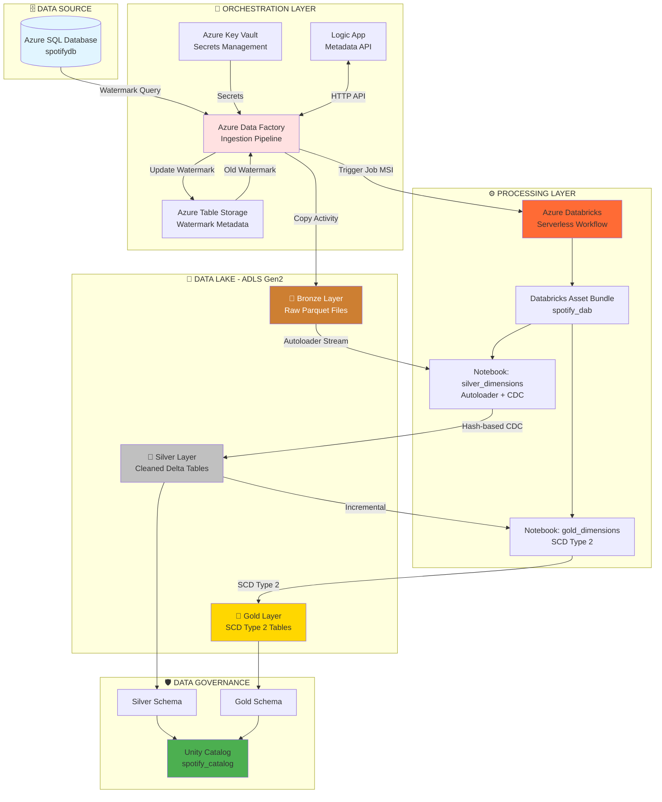

# 🎵 Spotify Azure Data Engineering Project

A production-grade **Medallion Architecture** batch ETL pipeline built on Azure, demonstrating modern data engineering practices with synthetic Spotify data.

[](https://azure.microsoft.com/)
[](https://databricks.com/)
[](https://www.terraform.io/)

---

## 📋 Table of Contents

- [Overview](#-overview)
- [Architecture](#-architecture)
- [Technology Stack](#-technology-stack)
- [Key Features](#-key-features)
- [Quick Start](#-quick-start)
- [Repository Structure](#-repository-structure)
- [Data Flow](#-data-flow)
- [Prerequisites](#-prerequisites)
- [Detailed Documentation](#-detailed-documentation)
- [Contributing](#-contributing)

---

## 🎯 Overview

This project implements an **end-to-end batch data engineering solution** for analyzing fictional Spotify data using Azure cloud services. It showcases:

- **Medallion Architecture** (Bronze → Silver → Gold layers)
- **Scheduled Batch Processing** with watermark-based incremental loading
- **Change Data Capture (CDC)** with hash-based change detection
- **SCD Type 2** dimensional modeling
- **Infrastructure as Code** with Terraform
- **Databricks Asset Bundles** for workflow orchestration
- **Azure Data Factory** for data ingestion orchestration
- **Unity Catalog** for data governance

**Data Source**: Azure SQL Database with synthetic Spotify data (500 users, 500 artists, 1000 tracks, stream events)

**Processing Pattern**: Scheduled batch pipeline (daily) using Spark Structured Streaming APIs in micro-batch mode (`trigger=availableNow`) for incremental processing with checkpoint management

---

## 🏗️ Architecture

```
┌─────────────────────────────────────────────────────────────────────────┐
│                      SPOTIFY DATA ENGINEERING PIPELINE                   │
└─────────────────────────────────────────────────────────────────────────┘

┌──────────────────┐       ┌──────────────────┐       ┌─────────────────┐
│   Azure SQL DB   │       │  Azure Key Vault │       │  Azure Table    │
│   (Source)       │       │  (Secrets)       │       │  (Metadata)     │
│                  │       │                  │       │                 │
│ • DimUser        │       │ • SQL Password   │       │ • Watermarks    │
│ • DimArtist      │───────│ • ADLS Keys      │───────│ • Last Load TS  │
│ • DimTrack       │       │ • Connections    │       │                 │
│ • DimDate        │       │ • Databricks URL │       │                 │
│ • FactStream     │       └──────────────────┘       └─────────────────┘
└────────┬─────────┘                                           ▲
         │                                                     │
         │ ①  Incremental Extract (Watermark-based)           │
         ▼                                                     │
┌─────────────────────────────────────────────────────────────┴──────────┐
│                    AZURE DATA FACTORY (ADF)                             │
│  ┌──────────────────────────────────────────────────────────────────┐  │
│  │ Pipeline: pl_spotify_data_ingestion                              │  │
│  │ • Get Old Watermark (Azure Table via Logic App)                  │  │
│  │ • Get New Watermark (SQL Query)                                  │  │
│  │ • Copy Activity (SQL → Parquet)                                  │  │
│  │ • Update Watermark (Azure Table)                                 │  │
│  │ • Trigger Databricks Workflow (MSI Auth)                         │  │
│  └──────────────────────────────────────────────────────────────────┘  │
└───────────────────────────────────────┬─────────────────────────────────┘
                                        │
                                        │ ②  Parquet Files
                                        ▼
                    ┌──────────────────────────────────────┐
                    │   ADLS Gen2 (Data Lake)               │
                    │                                       │
                    │  📂 bronze/  ← Raw Parquet Files      │
                    │  📂 silver/  ← Cleaned & Conformed    │
                    │  📂 gold/    ← SCD Type 2 Analytics   │
                    └────────────────┬──────────────────────┘
                                     │
                                     │ ③ Micro-Batch Processing + CDC
                                     ▼
                    ┌──────────────────────────────────────┐
                    │   AZURE DATABRICKS WORKFLOW          │
                    │   (Scheduled Batch - Daily)          │
                    │                                       │
                    │  🔹 Task 1: Silver Transformation     │
                    │     • Autoloader (incremental)        │
                    │     • Hash-based CDC (hash_diff)      │
                    │     • Merge operations                │
                    │     • Bronze → Silver Delta Tables    │
                    │                                       │
                    │  🔹 Task 2: Gold Transformation       │
                    │     • SCD Type 2 implementation       │
                    │     • For-each-task (parallel)        │
                    │     • Surrogate key generation        │
                    │     • Silver → Gold Delta Tables      │
                    │                                       │
                    │  🚀 Serverless Compute Cluster        │
                    └──────────────────────────────────────┘
                                     │
                                     │ ④ Analytics-Ready Data
                                     ▼
                    ┌──────────────────────────────────────┐
                    │  UNITY CATALOG (spotify_catalog)      │
                    │                                       │
                    │  📊 Gold Layer Tables (SCD Type 2)    │
                    │     • dimuser (with history)          │
                    │     • dimartist (with history)        │
                    │     • dimtrack (with history)         │
                    │     • factstream (slowly changing)    │
                    │                                       │
                    │  🔍 Ready for BI & Analytics          │
                    └──────────────────────────────────────┘
```

### Mermaid Architecture Diagram



---

## 💻 Technology Stack

| Component | Technology | Purpose |
|-----------|-----------|---------|
| **Infrastructure** | Terraform | Infrastructure as Code deployment |
| **Source Database** | Azure SQL Database | Relational data storage (synthetic Spotify data) |
| **Orchestration** | Azure Data Factory v2 | ETL pipeline orchestration & scheduling |
| **Data Lake** | ADLS Gen2 | Medallion architecture storage (Bronze/Silver/Gold) |
| **Processing** | Azure Databricks (Premium) | Distributed data processing with Spark |
| **Workflow Management** | Databricks Asset Bundles | CI/CD for Databricks resources |
| **Compute** | Serverless Databricks Cluster | On-demand compute for notebooks |
| **Data Governance** | Unity Catalog | Centralized metadata & access control |
| **Secrets Management** | Azure Key Vault | Secure credential storage |
| **Metadata Store** | Azure Table Storage | Watermark tracking for incremental loads |
| **API Layer** | Azure Logic Apps | REST API for metadata operations |
| **Language** | Python 3.10+ | Transformation logic & utilities |
| **Data Format** | Parquet, Delta Lake | Efficient columnar storage |

---

## 🌟 Key Features

### 1. **Medallion Architecture (Bronze → Silver → Gold)**
- **Bronze**: Raw data ingestion as Parquet files from source
- **Silver**: Cleaned, deduplicated, conformed data with CDC
- **Gold**: Business-ready dimensional model with SCD Type 2

### 2. **Incremental Data Loading**
- Watermark-based CDC using Azure Table Storage
- Only extracts changed/new records
- Efficient resource utilization

### 3. **Change Data Capture (CDC)**
- Hash-based change detection using SHA-256
- Automatic identification of inserts/updates
- Delta merge operations for upserts

### 4. **Slowly Changing Dimensions (SCD Type 2)**
- Historical tracking of dimension changes
- Surrogate key generation
- Active/inactive record management
- Temporal validity with start/end timestamps

### 5. **Infrastructure as Code**
- Complete Azure infrastructure via Terraform
- Automated RBAC assignments
- Managed identity authentication
- One-command deployment

### 6. **Data Governance**
- Unity Catalog integration
- External locations for each layer
- Centralized metadata management
- Role-based access control

### 7. **Secure by Design**
- Azure Key Vault for all credentials
- Managed Identity authentication (no passwords in code)
- RBAC for storage access
- Parameterized ADF pipelines

---

## 🚀 Quick Start

### **Initial Setup (7 Steps)**

#### **Step 1: Deploy Azure Infrastructure**
```bash
cd infra
cp terraform.tfvars.example terraform.tfvars
# Edit terraform.tfvars: Update resource_suffix and sql_admin_password
terraform init
terraform apply
```
⏱️ Duration: ~5-10 minutes

---

#### **Step 2: Configure ADF Global Parameter (Key Vault URL)**

**In ADF Studio**:
1. Get Key Vault URL: `cd infra && terraform output key_vault_uri`
2. Open ADF Studio: `terraform output adf_studio_url`
3. Navigate to: **Manage** → **Global Parameters** → **+ New**
4. Add parameter:
   - **Name**: `key_vault_url`
   - **Type**: `String`
   - **Value**: `<paste_key_vault_uri_from_step_1>`
5. Click **Save All**

---

#### **Step 3: Initialize Source SQL Database**

**⚠️ CRITICAL**: This must be completed before running any pipelines!

1. Get SQL Server connection:
   ```bash
   terraform output sql_server_fqdn      # Server name
   terraform output sql_database_name    # Database: spotifydb
   ```

2. Connect using Azure Portal Query Editor, SSMS, or Azure Data Studio

3. Execute SQL scripts **in order**:
   - `sql_scripts/ddl_script.sql` - Creates tables (star schema)
   - `sql_scripts/initial_load.sql` - Loads sample data (500 users, 500 artists, 1000 tracks)

4. Verify: `SELECT COUNT(*) FROM dbo.DimUser;` (Should return 500)

---

#### **Step 4: Configure Databricks CLI**

From your local machine:

1. Install Databricks CLI (if not already installed):
   ```bash
   pip install databricks-cli
   # or on macOS
   brew install databricks
   ```

2. Configure authentication to your Databricks workspace:
   ```bash
   databricks configure
   ```

3. When prompted, enter:
   - **Databricks Host**: Get from `cd infra && terraform output databricks_workspace_url`
     - Format: `https://adb-<workspace-id>.<random>.azuredatabricks.net`
   - **Token**: Generate a Personal Access Token (PAT):
     - In Databricks workspace → **User Settings** → **Developer** → **Access Tokens** → **Manage**
     - Click **Generate New Token** → Set comment (e.g., "CLI Access") → Lifetime (e.g., 90 days)
     - Copy the token (save it securely — it won't be shown again)

4. Verify connection:
   ```bash
   databricks workspace list /
   ```

---

#### **Step 5: Deploy Databricks Asset Bundle**

From your local machine:

1. Navigate to the bundle directory:
   ```bash
   cd databricks
   ```

2. Get the storage account name from Terraform:
   ```bash
   cd ../infra
   terraform output storage_account_name
   # Copy this value (e.g., sadatalake1a2b3c)
   cd ../databricks
   ```

3. Deploy the bundle:
   ```bash
   databricks bundle deploy --target prod \
     --var="adls_storage_container_name=<paste-storage-account-name-from-step-2>"
   ```

   **Alternative** (if shell substitution works in your environment):
   ```bash
   databricks bundle deploy --target prod \
     --var="adls_storage_container_name=$(cd ../infra && terraform output -raw storage_account_name)"
   ```

4. **📝 IMPORTANT**: Note the **Job ID** from deployment output (needed for Step 6)
   - Look for output like: `✅ Job created: https://.../?o=...#job/<JOB_ID>`

---

#### **Step 6: Update ADF Global Parameter (Databricks Job ID)**

**In ADF Studio**:
1. Navigate to: **Manage** → **Global Parameters**
2. Click **+ New** (or edit if exists)
3. Add parameter:
   - **Name**: `databricks_workflow_job_id`
   - **Type**: `String`
   - **Value**: `<job_id_from_step_5>`
4. Click **Save All**

---

#### **Step 7: Seed Metadata Store (One-Time)**

**In ADF Studio**:
1. Navigate to: **Author** → **Pipelines** → `pl_seed_ingestion_metadata`
2. Click **Add Trigger** → **Trigger Now**
3. Accept default parameters
4. Click **OK**
5. Monitor: **Monitor** tab (should complete in <1 minute)

**What this does**: Initializes watermarks in Azure Table Storage for incremental loading

---

### **Running the Pipeline**

#### **Initial Data Load**:
```bash
# In ADF Studio
# 1. Navigate to: Author → Pipelines → pl_spotify_data_ingestion
# 2. Click "Add Trigger" → "Trigger Now"
# 3. Monitor execution (completes in ~6-7 minutes)

# This will:
# ✅ Extract all 500 users, 500 artists from SQL
# ✅ Load Bronze layer (Parquet files)
# ✅ Transform to Silver layer (CDC)
# ✅ Create Gold layer (SCD Type 2 tables)
```

#### **Testing Incremental Changes**:
```bash
# 1. Simulate data changes in SQL Database
#    Execute: sql_scripts/incremental_load.sql
#    (Updates 60 records, inserts 35 new records)

# 2. Re-trigger: pl_spotify_data_ingestion
#    (Will detect only changed records via watermarks)

# 3. Verify SCD Type 2 history:
#    Query Gold layer to see historical versions
```

---

📖 **Detailed guides**: 
- Infrastructure: [infra/README.md](infra/README.md)
- Databricks Deployment: [databricks/DEPLOYMENT.md](databricks/DEPLOYMENT.md)
- SQL Scripts: [sql_scripts/README.md](sql_scripts/README.md)
- Pipelines: [pipeline/README.md](pipeline/README.md)

---

## 📁 Repository Structure

```
spotify_azure_de_project/
│
├── README.md                          ← You are here
├── ARCHITECTURE.md                    ← Deep-dive technical architecture
├── .gitignore                         ← Git ignore rules
│
├── 🏗️  infra/                         ← Terraform Infrastructure as Code
│   ├── README.md                      ← Infrastructure deployment guide
│   ├── main.tf                        ← Main resource definitions
│   ├── variables.tf                   ← Input variables
│   ├── outputs.tf                     ← Output values
│   ├── providers.tf                   ← Provider configuration
│   ├── terraform.tfvars.example       ← Example configuration
│   └── .gitignore
│
├── 📊 sql_scripts/                    ← Source Database SQL Scripts
│   ├── README.md                      ← SQL scripts documentation
│   ├── ddl_script.sql                 ← Table definitions (star schema)
│   ├── initial_load.sql               ← Seed data (500 users, 500 artists, etc.)
│   └── incremental_load.sql           ← CDC simulation (updates + inserts)
│
├── 🔄 pipeline/                       ← Azure Data Factory Pipelines
│   ├── README.md                      ← Pipeline documentation
│   ├── pl_spotify_data_ingestion.json ← Main ingestion pipeline
│   └── pl_seed_ingestion_metadata.json← One-time metadata setup
│
├── 🔗 linkedService/                  ← ADF Linked Services
│   ├── README.md                      ← Linked services documentation
│   ├── ls_kv_connection.json          ← Key Vault connection
│   ├── ls_mssql_server_connection.json← SQL Server connection
│   ├── ls_adls_storage_account_connection.json ← ADLS connection
│   └── ls_azure_databricks_connection.json     ← Databricks MSI connection
│
├── 📦 dataset/                        ← ADF Dataset Definitions
│   ├── README.md                      ← Dataset documentation
│   ├── ds_source_mssql_query.json     ← SQL source dataset
│   └── ds_adls_sink_parquet.json      ← Parquet sink dataset
│
├── 🏭 factory/                        ← ADF Factory Configuration
│   └── adf-spotify-v1.json            ← Global parameters
│
└── 🔥 databricks/                     ← Databricks Asset Bundle (bundle root)
    ├── README.md                      ← DAB project documentation
    ├── DEPLOYMENT.md                  ← Deployment guide
    ├── databricks.yml                 ← Bundle configuration
    ├── pyproject.toml                 ← Python dependencies
    ├── .env.example                   ← Environment variables template
    │
    ├── src/                           ← Transformation Notebooks
    │   ├── silver_dimensions.ipynb    ← Bronze → Silver (CDC)
    │   └── gold_dimensions.ipynb      ← Silver → Gold (SCD Type 2)
    │
    ├── utils/                         ← Reusable Python Modules
    │   └── transformations.py         ← CDC & SCD helper functions
    │
    ├── resources/                     ← Databricks Resource Definitions
    │   ├── base_resources_setup.yml   ← Unity Catalog (catalog, schemas, ext. locations)
    │   └── spotify_dab.job.yml        ← Workflow job configuration
    │
    └── jinja/                         ← Jinja templates (optional)
        └── jinja_notebook.ipynb
```

---

## 🔄 Data Flow

### **End-to-End Pipeline Execution**

```
1️⃣  SOURCE EXTRACTION (Azure Data Factory)
    └─ ADF reads watermark from Azure Table Storage
    └─ Extracts incremental records from Azure SQL DB
    └─ Writes Parquet files to ADLS Gen2 Bronze layer
    └─ Updates watermark in Azure Table
    └─ Triggers Databricks workflow via MSI

2️⃣  BRONZE → SILVER TRANSFORMATION (Databricks - Micro-Batch)
    └─ Autoloader processes Parquet files incrementally from Bronze
    └─ Applies business transformations:
       • Convert names to uppercase
       • Calculate duration flags
       • Clean track names
    └─ Computes hash_diff for CDC
    └─ Merges into Silver Delta tables (upsert logic)
    └─ Uses Spark Structured Streaming APIs with trigger=availableNow (micro-batch)

3️⃣  SILVER → GOLD TRANSFORMATION (Databricks)
    └─ For-each-task processes tables in parallel:
       • DimUser, DimArtist, DimTrack, FactStream
    └─ Implements SCD Type 2:
       • Generates surrogate keys
       • Tracks historical changes
       • Sets active_start/end timestamps
       • Expires old records (is_current = false)
    └─ Creates analytics-ready dimensional model

4️⃣  CONSUMPTION (Unity Catalog)
    └─ Gold tables available in spotify_catalog.gold.*
    └─ Ready for BI tools, SQL analytics, ML models
```

---

## ✅ Prerequisites

### **Required Tools**
- [Azure CLI](https://docs.microsoft.com/en-us/cli/azure/install-azure-cli) (>= 2.50.0)
- [Terraform](https://www.terraform.io/downloads) (>= 1.0)
- [Databricks CLI](https://docs.databricks.com/dev-tools/cli/) (>= 0.210)
- Python 3.10+ (for Databricks development)

### **Azure Requirements**
- Active Azure subscription
- Contributor role or higher
- Azure CLI authenticated (`az login`)

### **Optional (for development)**
- VS Code with Databricks extension
- SQL Server Management Studio or Azure Data Studio
- Git for version control

---

## 📚 Detailed Documentation

| Documentation | Description |
|--------------|-------------|
| **[ARCHITECTURE.md](ARCHITECTURE.md)** | Comprehensive architecture deep-dive |
| **[infra/README.md](infra/README.md)** | Terraform infrastructure deployment guide |
| **[databricks/README.md](databricks/README.md)** | Databricks Asset Bundle documentation |
| **[databricks/DEPLOYMENT.md](databricks/DEPLOYMENT.md)** | DAB deployment methods & troubleshooting |
| **[sql_scripts/README.md](sql_scripts/README.md)** | SQL schema & data loading guide |
| **[pipeline/README.md](pipeline/README.md)** | ADF pipeline architecture & configuration |
| **[linkedService/README.md](linkedService/README.md)** | ADF linked services documentation |
| **[dataset/README.md](dataset/README.md)** | ADF dataset definitions |

---

## 🎓 Learning Objectives

This project demonstrates:

1. **Modern Data Engineering**: Medallion architecture, Delta Lake, CDC
2. **Cloud-Native Development**: Azure PaaS services, managed identities
3. **Infrastructure as Code**: Terraform for reproducible deployments
4. **Data Governance**: Unity Catalog, external locations, RBAC
5. **Dimensional Modeling**: Star schema, SCD Type 2
6. **DevOps Practices**: Databricks Asset Bundles, CI/CD readiness
7. **Security Best Practices**: Key Vault, MSI authentication, no hardcoded secrets

---

## 🔧 Common Operations

### **Run Complete Pipeline**
```bash
# Trigger from ADF Studio
# Or via Azure CLI
az datafactory pipeline create-run \
  --resource-group rg-spotify-dataeng \
  --factory-name adf-spotify-<suffix> \
  --name pl_spotify_data_ingestion
```

### **Run Databricks Workflow**
```bash
cd databricks
databricks bundle run spotify_etl_job --target dev
```

### **Simulate Data Changes**
```sql
-- Execute in Azure SQL Database
-- File: sql_scripts/incremental_load.sql
-- Triggers CDC detection in next pipeline run
```

### **Query Gold Layer**
```sql
-- In Databricks SQL or notebook
SELECT * FROM spotify_catalog.gold.dimuser 
WHERE is_current = true
ORDER BY active_start_date_time DESC;
```

### **Check Pipeline Status**
```bash
# List ADF pipeline runs
az datafactory pipeline-run list \
  --resource-group rg-spotify-dataeng \
  --factory-name adf-spotify-<suffix>

# List Databricks job runs
databricks jobs list-runs --job-id <job-id>
```

---

## 🐛 Troubleshooting

### **Common Issues**

| Issue | Solution |
|-------|----------|
| Terraform: "StorageAccountAlreadyTaken" | Change `resource_suffix` in terraform.tfvars |
| ADF: "KeyVault access denied" | Ensure ADF MSI has Key Vault Secrets User role |
| Databricks: "Reference to undeclared resource" | Set environment variables or use --var flags |
| Unity Catalog: "Storage credential failed" | Verify Access Connector RBAC roles on ADLS |

📖 See detailed troubleshooting in individual READMEs.

---

## 🧪 Testing the Pipeline

### **1. Initial Load Test**
```bash
# Execute initial_load.sql → Run ADF pipeline → Verify Bronze/Silver/Gold
```

### **2. Incremental Load Test**
```bash
# Execute incremental_load.sql → Run ADF pipeline → Verify CDC detection
```

### **3. Validation Queries**
```sql
-- Check record counts
SELECT 'Silver' as layer, count(*) FROM spotify_catalog.silver.dimuser
UNION ALL
SELECT 'Gold', count(*) FROM spotify_catalog.gold.dimuser;

-- Verify SCD Type 2 history
SELECT user_id, user_name, is_current, active_start_date_time, active_end_date_time
FROM spotify_catalog.gold.dimuser
WHERE user_id = 2
ORDER BY active_start_date_time DESC;
```

---

##  Getting Help

1. **Documentation**: Start with [ARCHITECTURE.md](ARCHITECTURE.md) for system design
2. **Deployment Issues**: Check [infra/README.md](infra/README.md) troubleshooting section
3. **Databricks Problems**: See [databricks/DEPLOYMENT.md](databricks/DEPLOYMENT.md)
4. **Pipeline Debugging**: Refer to [pipeline/README.md](pipeline/README.md)

---

## 🤝 Contributing

Contributions are welcome! To contribute:

1. Fork the repository
2. Create a feature branch (`git checkout -b feature/amazing-feature`)
3. Commit your changes (`git commit -m 'Add amazing feature'`)
4. Push to the branch (`git push origin feature/amazing-feature`)
5. Open a Pull Request

---

## 📄 License

This project is provided as-is for educational and portfolio purposes.

---

## 👤 Author

**Vikneshwara R B**

📧 Contact: [GitHub Profile](https://github.com/vikneshwara-r-b/spotify_azure_de_project)

---

## 🌟 Acknowledgments

- **Medallion Architecture**: Databricks best practices
- **Synthetic Data**: Generated using Python Faker library
- **Azure Icons**: Microsoft Azure documentation
- **Design Patterns**: Industry-standard data engineering patterns

---

**⭐ Star this repo if you found it helpful!**

**Last Updated**: April 19, 2026  
**Status**: Production-Ready Demo Project
