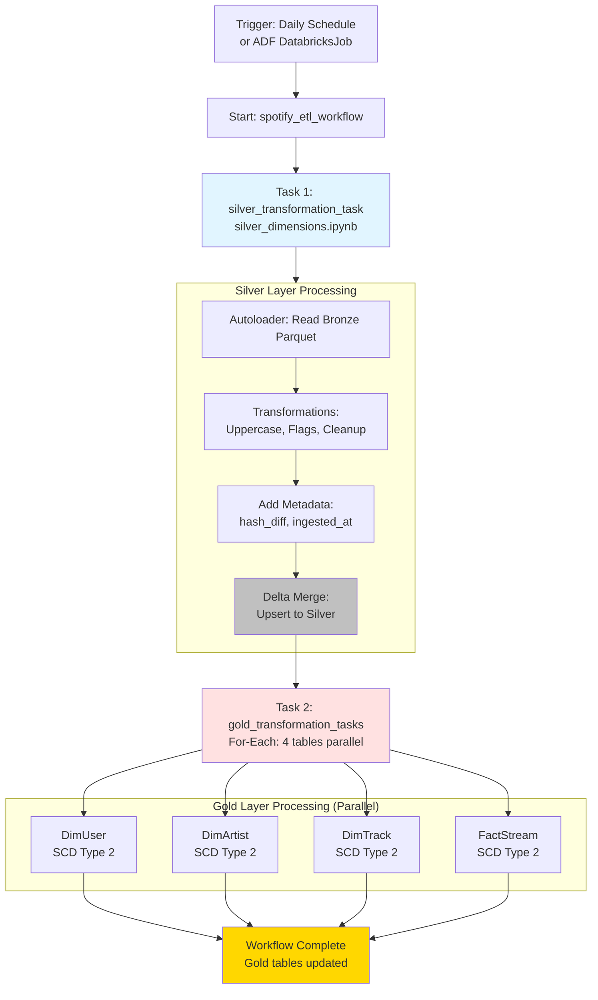

# 🎵 Spotify Databricks Asset Bundle (spotify_dab)

Databricks Asset Bundle for the Spotify data engineering project, implementing Silver and Gold layer transformations with CDC and SCD Type 2 patterns.

---

## 📋 Table of Contents

- [Overview](#overview)
- [Architecture](#architecture)
- [Notebooks](#notebooks)
- [Utilities](#utilities)
- [Workflow Configuration](#workflow-configuration)
- [Deployment](#deployment)
- [Usage](#usage)
- [Troubleshooting](#troubleshooting)

---

## Overview

This Databricks Asset Bundle orchestrates the **Bronze → Silver → Gold** data transformation pipeline for Spotify batch analytics.

**Bundle Name**: `spotify_dab`  
**UUID**: `22a068ba-5021-46f4-8a26-b16bcf60307b`  
**Bundle Root**: `databricks/` (previously `databricks/spotify_dab/`)

### **Key Features**

- ✅ **Autoloader (Micro-Batch)**: Incremental file ingestion from Bronze using Spark Structured Streaming APIs with `trigger=availableNow`
- ✅ **Hash-Based CDC**: Change detection using SHA-256
- ✅ **SCD Type 2**: Historical dimension tracking
- ✅ **Parallel Processing**: For-each-task for Gold layer (4 tables)
- ✅ **Serverless Compute**: Auto-scaling, pay-per-use
- ✅ **Unity Catalog**: Governed data in spotify_catalog
- ✅ **Scheduled Batch**: Daily workflow execution (not continuous)

---

## Architecture

### **Workflow Structure**

```
spotify_etl_workflow
├── Task 1: silver_transformation_task (Sequential)
│   └── Notebook: silver_dimensions.ipynb
│       ├── Input: Bronze Parquet files (ADLS Gen2)
│       ├── Processing:
│       │   ├─ DimUser: Uppercase names + CDC
│       │   ├─ DimArtist: Uppercase names + CDC
│       │   ├─ DimTrack: Duration flags + cleanup + CDC
│       │   ├─ DimDate: CDC (append-only)
│       │   └─ FactStream: Join artist_id + CDC
│       └── Output: Silver Delta tables
│
└── Task 2: gold_transformation_tasks (For-Each Parallel)
    └── Notebook: gold_dimensions.ipynb
        ├── Iterations: 4 tables (DimUser, DimArtist, DimTrack, FactStream)
        ├── Input per table: Silver Delta table (incremental)
        ├── Processing:
        │   ├─ Create SCD Type 2 table (if not exists)
        │   ├─ Add surrogate key ({table}_sk)
        │   ├─ Add is_current, active_start_date_time, active_end_date_time
        │   ├─ Append new versions
        │   └─ Expire old records (is_current = false)
        └── Output: Gold SCD Type 2 tables

Schedule: Daily at midnight (paused in dev mode)
Compute: Serverless cluster (auto-provisioned)
```

### **Mermaid Workflow Diagram**



---

## Notebooks

### 1. **`silver_dimensions.ipynb`** - Bronze to Silver Transformation

**Purpose**: Read Bronze Parquet files, apply business transformations, implement CDC, write to Silver Delta tables

**Location**: `src/silver_dimensions.ipynb`

**Input Parameters**:
- `catalog_name`: Unity Catalog name (default: "spotify_catalog")
- `adls_storage_container_name`: ADLS storage account name

**Processing Logic**:

#### **A. DimUser Processing**

```python
# 1. Read with Autoloader
df_user = spark.readStream.format("cloudFiles") \
    .option("cloudFiles.format", "parquet") \
    .option("cloudFiles.schemaLocation", f"abfss://silver@{storage}/DimUser/checkpoint") \
    .option("schemaEvolutionMode", "addNewColumns") \
    .load(f"abfss://bronze@{storage}/DimUser")

# 2. Transform: Uppercase user_name
df_user = df_user.withColumn("user_name", F.upper(F.col("user_name")))

# 3. Drop rescued data column
df_user = transform_obj.dropColumns(df_user, ["_rescued_data"])

# 4. Add metadata columns (hash_diff, ingested_at)
df_user = transform_obj.add_metadata_cols(df_user, ['user_id'])

# 5. Merge to Silver table
if table_exists:
    # Merge on user_id
    # Update if hash_diff changed
    # Insert if new user_id
else:
    # Create table and insert all
```

**Output**: `spotify_catalog.silver.DimUser`

#### **B. DimArtist Processing**

Similar to DimUser:
- Uppercase `artist_name`
- Add hash_diff and ingested_at
- Merge on `artist_id`

**Output**: `spotify_catalog.silver.DimArtist`

#### **C. DimTrack Processing**

```python
# Additional transformations:

# 1. Calculate durationFlag
df_track = df_track.withColumn(
    "durationFlag",
    F.when(F.col("duration_sec") <= 150, "low")
     .when((F.col("duration_sec") > 150) & (F.col("duration_sec") < 300), "medium")
     .otherwise("high")
)

# 2. Clean track_name (remove hyphens)
df_track = df_track.withColumn("track_name", F.regexp_replace(F.col("track_name"), "-", " "))

# 3. Add metadata and merge
```

**Output**: `spotify_catalog.silver.DimTrack`

#### **D. DimDate Processing**

```python
# Simple append (no merge)
# DimDate is slowly growing, dates are immutable
df_date.writeStream.toTable(target_table_full_name)
```

**Output**: `spotify_catalog.silver.DimDate`

#### **E. FactStream Processing**

```python
# Join with DimTrack to get artist_id
df_track = spark.read.table(f"{catalog_name}.silver.dimtrack")

df_joined_fact = df_fact.join(df_track, "track_id", "left") \
    .select("df_fact.*", "artist_id")

# Add metadata and merge
```

**Output**: `spotify_catalog.silver.FactStream`

**Duration**: ~50 seconds for all 5 tables

---

### 2. **`gold_dimensions.ipynb`** - Silver to Gold SCD Type 2

**Purpose**: Implement SCD Type 2 for dimensional modeling with historical tracking

**Location**: `src/gold_dimensions.ipynb`

**Input Parameters** (Passed from for_each_task):
- `catalog_name`: "spotify_catalog"
- `adls_storage_container_name`: Storage account name
- `source_schema_name`: "silver"
- `source_table_name`: Table name (e.g., "dimuser")
- `pk_list`: Primary key column(s) (e.g., "user_id")
- `target_schema_name`: "gold"
- `target_table_name`: Table name (e.g., "dimuser")

**Processing Steps**:

#### **Step 1: Create Gold Table (If Not Exists)**

```python
# Dynamic DDL generation from Silver schema
transform_obj.create_scd2_table(
    spark,
    catalog_name="spotify_catalog",
    source_schema="silver",
    source_table="dimuser",
    target_schema="gold",
    target_table="dimuser",
    adls_storage_container_name="adlsspotify001"
)

# Generated table structure:
# CREATE TABLE spotify_catalog.gold.dimuser (
#   dimuser_sk BIGINT GENERATED ALWAYS AS IDENTITY,
#   user_id INT,
#   user_name STRING,
#   country STRING,
#   subscription_type STRING,
#   start_date DATE,
#   end_date DATE,
#   updated_at TIMESTAMP,
#   hash_diff STRING,
#   ingested_at TIMESTAMP,
#   is_current BOOLEAN,
#   active_start_date_time TIMESTAMP,
#   active_end_date_time TIMESTAMP
# )
# LOCATION 'abfss://gold@{storage}/dimuser/data'
```

#### **Step 2: Get Incremental Records from Silver**

```python
source_df = spark.table("spotify_catalog.silver.dimuser")

# Get maximum ingested_at from Gold
max_ts = spark.sql("""
    SELECT COALESCE(MAX(ingested_at), TIMESTAMP('1900-01-01'))
    FROM spotify_catalog.gold.dimuser
""").collect()[0][0]

# Filter for new/changed records only
incremental_df = source_df.filter(F.col("ingested_at") > F.lit(max_ts))

# If empty, exit (no processing needed)
if incremental_df.isEmpty():
    dbutils.notebook.exit("No new records to process")
```

#### **Step 3: Prepare New Records with SCD Columns**

```python
incremental_df = incremental_df \
    .withColumn("is_current", F.lit(True)) \
    .withColumn("ingested_at", F.current_timestamp()) \
    .withColumn("active_start_date_time", F.current_timestamp()) \
    .withColumn("active_end_date_time", F.lit(None).cast("timestamp"))
```

#### **Step 4: Append New Records**

```python
# Surrogate key auto-generated by IDENTITY column
incremental_df.write.format("delta").mode("append").saveAsTable("spotify_catalog.gold.dimuser")
```

#### **Step 5: Expire Old Records**

```python
# Get current active records
mart_df = spark.table("spotify_catalog.gold.dimuser")

# Find latest record per user_id (window function)
mart_iscurrent_record_df = mart_df \
    .withColumn("rn", F.row_number().over(Window.partitionBy("user_id").orderBy(F.desc("active_start_date_time")))) \
    .filter((F.col("is_current") == True) & (F.col("active_end_date_time").isNull())) \
    .filter("rn=1").drop("rn")

# Merge to expire old records
mart_delta_table.alias("t").merge(
    mart_iscurrent_record_df.alias("s"),
    "t.user_id = s.user_id AND t.dimuser_sk != s.dimuser_sk"  # Same user, different SK
).whenMatchedUpdate(
    condition="t.is_current = true AND t.active_end_date_time is null",
    set={
        "is_current": "false",
        "active_end_date_time": "current_timestamp()"
    }
).execute()
```

**Result**: Historical tracking maintained

**Example Output**:
```sql
-- User 2's subscription change (Family → Premium)
dimuser_sk | user_id | subscription_type | is_current | active_start_date_time | active_end_date_time
-----------|---------|-------------------|------------|------------------------|---------------------
45         | 2       | Family            | false      | 2025-09-29 19:49:55    | 2025-10-08 08:10:00
521        | 2       | Premium           | true       | 2025-10-08 08:10:00    | NULL
```

**Duration**: ~5-6 seconds per table (4 tables in parallel = ~20-25 seconds total)

---

## Utilities

### **`utils/transformations.py`** - Reusable Functions

**Class**: `reusable_transformations`

**Methods**:

#### **1. `dropColumns(df, columns)`**
```python
def dropColumns(self, df, columns):
    df = df.drop(*columns)
    return df

# Usage:
df = transform_obj.dropColumns(df, ["_rescued_data"])
```

**Purpose**: Remove unnecessary columns (e.g., _rescued_data from Autoloader)

---

#### **2. `add_hash_diff_column(df, pk_list)`**
```python
def add_hash_diff_column(self, df, pk_list):
    # Exclude primary keys and metadata from hash
    exclude_columns = pk_list + ['_rescued_data']
    cols_to_hash = [col for col in df.columns if col not in exclude_columns]
    
    # Coalesce NULL values to empty string
    coalesced_cols = [F.coalesce(F.col(c).cast("string"), F.lit('')) for c in cols_to_hash]
    
    # Concatenate with delimiter
    concat_ws = F.concat_ws('~', *coalesced_cols)
    
    # Calculate SHA-256 hash
    df = df.withColumn("hash_diff", F.sha2(concat_ws, 256))
    return df

# Usage:
df = transform_obj.add_hash_diff_column(df, ['user_id'])
# Result: New column 'hash_diff' with SHA-256 hash
```

**Purpose**: Generate hash for CDC (change detection in merge operations)

---

#### **3. `add_metadata_cols(df, pk_list)`**
```python
def add_metadata_cols(self, df, pk_list):
    df = self.add_hash_diff_column(df, pk_list)
    df = df.withColumn("ingested_at", F.current_timestamp())
    return df

# Usage:
df = transform_obj.add_metadata_cols(df, ['user_id'])
# Result: Adds hash_diff + ingested_at columns
```

**Purpose**: Add all metadata columns needed for Silver layer

---

#### **4. `create_scd2_table(...)`**
```python
def create_scd2_table(self, spark, catalog_name, source_schema, source_table, 
                      target_schema, target_table, adls_storage_container_name):
    # Reads source schema
    # Generates DDL with:
    #   - Surrogate key: {table}_sk BIGINT GENERATED ALWAYS AS IDENTITY
    #   - Original columns from source
    #   - SCD columns: is_current, active_start_date_time, active_end_date_time
    # Creates external Delta table in Unity Catalog
    
    spark.sql(create_stmt)

# Usage:
transform_obj.create_scd2_table(
    spark,
    catalog_name="spotify_catalog",
    source_schema="silver",
    source_table="dimuser",
    target_schema="gold",
    target_table="dimuser",
    adls_storage_container_name="adlsspotify001"
)
```

**Purpose**: Dynamically create Gold SCD Type 2 tables

---

#### **5. `build_pk_join_string(pk_column_list)`**
```python
def build_pk_join_string(self, pk_column_list):
    pk_join_list = []
    for column in pk_column_list:
        pk_join_list.append("target." + column + " <=> source." + column)
    return ' AND '.join(pk_join_list)

# Example:
pk_join_string = transform_obj.build_pk_join_string(['user_id'])
# Result: "target.user_id <=> source.user_id"

# Multi-column example:
pk_join_string = transform_obj.build_pk_join_string(['user_id', 'date_key'])
# Result: "target.user_id <=> source.user_id AND target.date_key <=> source.date_key"
```

**Purpose**: Build merge condition for primary key matching

**Note**: Uses `<=>` (null-safe equality operator)

---

#### **6. `build_prep_merge_column_list_string(prep_new_data_df)`**
```python
def build_prep_merge_column_list_string(self, prep_new_data_df):
    column_list = prep_new_data_df.columns
    metadata_columns = ['ingested_at', '_rescued_data']
    filtered_column_list = list(filter(lambda x: x not in metadata_columns, column_list))
    
    prep_merge_column_list = []
    for column in filtered_column_list:
        prep_merge_column_list.append("target." + column + " <=> source." + column)
    
    return '!(' + ' AND '.join(prep_merge_column_list) + ')'

# Example result:
# "!(target.user_id <=> source.user_id AND target.user_name <=> source.user_name AND target.hash_diff <=> source.hash_diff ...)"
# This returns TRUE when columns DON'T match (i.e., update needed)
```

**Purpose**: Build condition for detecting changes (used in whenMatchedUpdateAll)

---

#### **7. `perform_merge_operation(...)`**
```python
def perform_merge_operation(self, target_table_delta, merge_keys_list, prep_merge_column_list_string):
    def _microbatch_merge_operation(batch_df, batch_id):
        (target_table_delta.alias("target")
            .merge(batch_df.alias("source"), merge_keys_list)
            .whenMatchedUpdateAll(prep_merge_column_list_string)  # Update if changed
            .whenNotMatchedInsertAll()                           # Insert if new
            .execute()
        )
    return _microbatch_merge_operation

# Usage in foreachBatch:
df.writeStream \
    .foreachBatch(transform_obj.perform_merge_operation(target_delta, keys, conditions)) \
    .start()
```

**Purpose**: Perform upsert (merge) operations in streaming context

---

## Workflow Configuration

### **`databricks.yml`** - Main Bundle Configuration

```yaml
bundle:
  name: spotify_dab
  uuid: 22a068ba-5021-46f4-8a26-b16bcf60307b

variables:
  adls_storage_container_name:
    description: "ADLS Gen2 storage container name"
    default: ${env.ADLS_STORAGE_CONTAINER_NAME}

include:
  - resources/*.yml
  - resources/*/*.yml

targets:
  dev:
    mode: development
    default: true

  prod:
    mode: production
    workspace:
      root_path: /Workspace/PROD/.bundle/${bundle.name}/${bundle.target}
```

**Variables** (Required):
- `DATABRICKS_HOST`: Workspace URL (set via `databricks configure` or env var)
- `ADLS_STORAGE_CONTAINER_NAME`: ADLS storage account name

> **Note**: `USER_EMAIL` and `ADF_SERVICE_PRINCIPAL_ID` have been removed. Job permissions are no longer managed in the bundle config.

---

### **`resources/base_resources_setup.yml`** - Unity Catalog Resources

This file provisions the Unity Catalog structure directly via DAB, replacing the Terraform-managed approach used previously.

```yaml
resources:
  catalogs:
    spotify_catalog:
      name: spotify_catalog
      comment: 'Main catalog for Spotify data engineering project'

  schemas:
    bronze_schema:
      name: bronze
      catalog_name: ${resources.catalogs.spotify_catalog.name}
    silver_schema:
      name: silver
      catalog_name: ${resources.catalogs.spotify_catalog.name}
    gold_schema:
      name: gold
      catalog_name: ${resources.catalogs.spotify_catalog.name}

  external_locations:
    ext_bronze_location:
      name: spotify_ext_bronze
      url: 'abfss://bronze@${var.adls_storage_container_name}.dfs.core.windows.net/'
      credential_name: spotify_adls_credential
    ext_silver_location:
      name: spotify_ext_silver
      url: 'abfss://silver@${var.adls_storage_container_name}.dfs.core.windows.net/'
      credential_name: spotify_adls_credential
    ext_gold_location:
      name: spotify_ext_gold
      url: 'abfss://gold@${var.adls_storage_container_name}.dfs.core.windows.net/'
      credential_name: spotify_adls_credential
```

> **Note**: The storage credential `spotify_adls_credential` is still created by Terraform (`infra/main.tf`) as a prerequisite. The DAB references it but does not create it.

---

### **`resources/spotify_dab.job.yml`** - Workflow Definition

```yaml
resources:
  jobs:
    spotify_etl_job:
      name: spotify_etl_workflow

      # Use STANDARD mode to reduce compute costs
      performance_target: STANDARD

      tasks:
        # Task 1: Silver Layer
        - task_key: silver_transformation_task
          notebook_task:
            notebook_path: ../src/silver_dimensions.ipynb
            base_parameters:
              catalog_name: "spotify_catalog"
              adls_storage_container_name: ${var.adls_storage_container_name}
        
        # Task 2: Gold Layer (For-Each)
        - task_key: gold_transformation_tasks
          depends_on:
            - task_key: silver_transformation_task
          for_each_task:
            inputs: |
              [
                {"source_table": "dimuser", "target_table": "dimuser", "pk_list": "user_id"},
                {"source_table": "dimartist", "target_table": "dimartist", "pk_list": "artist_id"},
                {"source_table": "dimtrack", "target_table": "dimtrack", "pk_list": "track_id"},
                {"source_table": "factstream", "target_table": "factstream", "pk_list": "stream_id"}
              ]
            task:
              task_key: process_gold_table
              notebook_task:
                notebook_path: ../src/gold_dimensions.ipynb
                base_parameters:
                  catalog_name: "spotify_catalog"
                  adls_storage_container_name: ${var.adls_storage_container_name}
                  source_schema_name: "silver"
                  source_table_name: "{{input.source_table}}"
                  pk_list: "{{input.pk_list}}"
                  target_schema_name: "gold"
                  target_table_name: "{{input.target_table}}"
```

**Features**:
- **Daily Schedule**: Runs every 24 hours (paused in dev mode)
- **Sequential Silver**: Processes all tables in order
- **Parallel Gold**: 4 tables processed simultaneously
- **Dependency**: Gold waits for Silver completion

---

## Deployment

### **Quick Deployment**

```bash
# Navigate to bundle directory
cd databricks

# Configure Databricks CLI with your workspace
databricks configure
# Enter: Databricks Host (https://adb-xxxx.azuredatabricks.net)
# Enter: Personal Access Token

# Validate configuration
databricks bundle validate --target dev

# Deploy to dev workspace
DATABRICKS_BUNDLE_ENGINE=direct databricks bundle deploy --target dev \
  --var="adls_storage_container_name=<your-storage-account-name>"

# Deploy to prod workspace
DATABRICKS_BUNDLE_ENGINE=direct databricks bundle deploy --target prod \
  --var="adls_storage_container_name=<your-storage-account-name>"

# Get storage account name from Terraform:
# cd ../infra && terraform output -raw storage_account_name

# Run the workflow after deployment
databricks bundle run spotify_etl_job --target dev
```

📖 **Complete Guide**: See [DEPLOYMENT.md](DEPLOYMENT.md) for multiple deployment methods and troubleshooting

---

## Usage

### **Running the Workflow**

**Method 1: Databricks CLI**
```bash
databricks bundle run spotify_etl_job --target dev
```

**Method 2: Databricks Workspace UI**
```
1. Open Databricks workspace
2. Navigate to: Workflows → Jobs
3. Find: [dev your_name] spotify_etl_workflow
4. Click "Run now"
5. Monitor execution
```

**Method 3: Triggered by ADF**
```
# Automatically triggered after ADF pipeline completes
# DatabricksJob activity in pl_spotify_data_ingestion
```

### **Monitoring Execution**

**CLI**:
```bash
# List job runs
databricks jobs list-runs --job-id <job-id> --limit 10

# Get run details
databricks jobs get-run --run-id <run-id>

# Cancel a run
databricks jobs cancel-run --run-id <run-id>
```

**Workspace UI**:
```
Workflows → Jobs → spotify_etl_workflow → Runs tab
View:
  - Run status (Succeeded, Failed, Running)
  - Task-level details
  - Logs for each task
  - Duration per task
```

### **Querying Results**

```sql
-- Check Silver layer
SELECT COUNT(*) FROM spotify_catalog.silver.dimuser;

-- Check Gold layer (current records only)
SELECT COUNT(*) FROM spotify_catalog.gold.dimuser WHERE is_current = true;

-- View SCD history
SELECT 
    dimuser_sk,
    user_id,
    user_name,
    subscription_type,
    is_current,
    active_start_date_time,
    active_end_date_time
FROM spotify_catalog.gold.dimuser
WHERE user_id = 2
ORDER BY active_start_date_time DESC;

-- Point-in-time query (as of Oct 7, 2025)
SELECT *
FROM spotify_catalog.gold.dimuser
WHERE '2025-10-07' BETWEEN DATE(active_start_date_time) 
                       AND COALESCE(DATE(active_end_date_time), '9999-12-31')
  AND user_id = 2;
```

---

## Troubleshooting

### **Common Issues**

#### **1. "Reference to Undeclared Resource"**

**Error**: Variable not found during bundle deploy

**Solution**:
```bash
# Set all required environment variables
export DATABRICKS_HOST="https://..."
export ADLS_STORAGE_CONTAINER_NAME="..."

# Or use --var flags
databricks bundle deploy --target dev \
  --var="adls_storage_container_name=adlsspotify001"
```

---

#### **2. "Cannot Access ADLS"**

**Error**: Path does not exist or permission denied

**Solution**:
```bash
# Verify Unity Catalog external locations
# In Databricks workspace:
# Catalog → spotify_catalog → External Locations
# Verify: spotify_bronze, spotify_silver, spotify_gold exist

# Check Access Connector permissions
az role assignment list --scope $(terraform output -raw storage_account_id)
```

---

#### **3. "Table Already Exists"**

**Error**: Cannot create table (already exists)

**Solution**:
```sql
-- Check if table exists
SHOW TABLES IN spotify_catalog.silver;

-- Drop if needed (CAUTION: Data loss)
DROP TABLE IF EXISTS spotify_catalog.silver.dimuser;

-- Or: Let notebook handle it (has IF NOT EXISTS logic)
```

---

#### **4. "Notebook Not Found"**

**Error**: Path ../src/silver_dimensions.ipynb not found

**Solution**:
```bash
# Verify bundle deployed successfully
databricks bundle deploy --target dev

# Check workspace path
# Notebooks should be at: /Workspace/Users/{user}/.bundle/spotify_dab/dev/files/src/
```

---

## Python Dependencies

### **`pyproject.toml`**

```toml
[project]
name = "spotify_dab"
version = "0.0.1"
requires-python = ">=3.10,<=3.13"

[dependency-groups]
dev = [
    "pytest",
    "databricks-dlt",
    "databricks-connect>=15.4,<15.5"
]
```

**Development Dependencies**:
- `pytest`: Unit testing
- `databricks-dlt`: DLT pipeline support (future)
- `databricks-connect`: Local development/debugging

**Install for Local Development**:
```bash
# Using uv (recommended)
uv sync

# Or using pip
pip install -e ".[dev]"
```

---

## Development Workflow

### **Local Development**

```bash
# 1. Clone repository
git clone https://github.com/vikneshwara-r-b/spotify_azure_de_project.git
cd spotify_azure_de_project/databricks

# 2. Install dependencies
uv sync

# 3. Configure Databricks CLI
databricks configure

# 4. Develop notebooks in Databricks workspace
# Open: https://{workspace}.azuredatabricks.net
# Navigate to: Workspace → Users → {user} → .bundle/spotify_dab/dev/files/src/

# 5. Test changes
# Run notebooks interactively
# Or: databricks bundle run spotify_etl_job --target dev

# 6. Commit and deploy
git add .
git commit -m "Update transformations"
git push
DATABRICKS_BUNDLE_ENGINE=direct databricks bundle deploy --target prod \
  --var="adls_storage_container_name=<your-storage-account-name>"
```

### **Testing Notebooks Locally**

```bash
# Using databricks-connect (local Spark)
python

>>> from databricks.connect import DatabricksSession
>>> spark = DatabricksSession.builder.getOrCreate()
>>> df = spark.table("spotify_catalog.silver.dimuser")
>>> df.show()
```

---

## Configuration Reference

### **Environment Variables**

| Variable | Required | Description | Get From |
|----------|----------|-------------|----------|
| `DATABRICKS_HOST` | ✅ Yes | Workspace URL | `databricks configure` or `terraform output databricks_workspace_url` |
| `ADLS_STORAGE_CONTAINER_NAME` | ✅ Yes | ADLS storage account name | `terraform output -raw storage_account_name` |
| `DATABRICKS_BUNDLE_ENGINE` | ✅ Yes | Set to `direct` | Hard-coded as `direct` |

> `USER_EMAIL` and `ADF_SERVICE_PRINCIPAL_ID` are no longer variables in `databricks.yml`.

### **Targets**

**Development** (`--target dev`):
- Mode: Development
- Prefix: `[dev {user}]` added to job name
- Schedule: Paused (won't run automatically)
- Workspace Path: `/Users/{user}/.bundle/spotify_dab/dev/`

**Production** (`--target prod`):
- Mode: Production
- Prefix: None
- Schedule: Active (runs daily)
- Workspace Path: `/Workspace/PROD/.bundle/spotify_dab/prod/`

---

## Performance Optimization

### **Current Optimizations**

✅ **Autoloader**: Efficient incremental file processing  
✅ **Delta Merge**: Upsert operations (no full rewrites)  
✅ **Serverless Compute**: Auto-scaling based on workload  
✅ **For-Each-Task**: Parallel processing for Gold layer  
✅ **Checkpoint**: Prevents reprocessing in streaming  

### **Future Enhancements**

🔮 **Delta Optimization**:
```python
# Enable auto-optimization
spark.conf.set("spark.databricks.delta.optimizeWrite.enabled", "true")
spark.conf.set("spark.databricks.delta.autoCompact.enabled", "true")

# Manual optimization
spark.sql("OPTIMIZE spotify_catalog.gold.dimuser ZORDER BY (country, subscription_type)")
```

🔮 **Liquid Clustering** (for large tables):
```sql
ALTER TABLE spotify_catalog.gold.dimuser 
CLUSTER BY (user_id, country);
```

🔮 **Photon Engine**: Enable in cluster configuration for 2-3x faster queries

---

## Monitoring & Observability

### **Job Metrics**

Available in Databricks workspace:
- Task duration
- Data read/written
- Cluster utilization
- Error logs

### **Data Quality Metrics**

```sql
-- Record counts per layer
SELECT 'Bronze' as layer, COUNT(*) FROM bronze_parquet_count
UNION ALL
SELECT 'Silver', COUNT(*) FROM spotify_catalog.silver.dimuser
UNION ALL
SELECT 'Gold', COUNT(*) FROM spotify_catalog.gold.dimuser;

-- SCD Type 2 metrics
SELECT 
    COUNT(*) as total_versions,
    COUNT(DISTINCT user_id) as unique_users,
    SUM(CASE WHEN is_current THEN 1 ELSE 0 END) as current_versions,
    SUM(CASE WHEN NOT is_current THEN 1 ELSE 0 END) as historical_versions,
    AVG(DATEDIFF(COALESCE(active_end_date_time, CURRENT_TIMESTAMP()), active_start_date_time)) as avg_version_days
FROM spotify_catalog.gold.dimuser;
```

---

## Best Practices

### **Notebook Development**

✅ **Modular**: Use utils/transformations.py for reusable logic  
✅ **Parameterized**: Use dbutils.widgets for flexibility  
✅ **Idempotent**: Safe to re-run (merge operations)  
✅ **Monitored**: Use display() for debugging  
✅ **Checkpointed**: Structured streaming with checkpoints  

### **Bundle Management**

✅ **Version Control**: Commit databricks.yml and notebooks  
✅ **Environment Separation**: Use dev/prod targets  
✅ **Validation**: Always validate before deploy  
✅ **Testing**: Test in dev before prod deployment  
✅ **Documentation**: Update README when adding resources  

---

## Related Documentation

- **[DEPLOYMENT.md](DEPLOYMENT.md)**: Comprehensive deployment guide
- **[databricks.yml](databricks.yml)**: Bundle configuration reference
- **[resources/base_resources_setup.yml](resources/base_resources_setup.yml)**: Unity Catalog resource definitions
- **[resources/spotify_dab.job.yml](resources/spotify_dab.job.yml)**: Workflow job definition
- **[../ARCHITECTURE.md](../ARCHITECTURE.md)**: Complete system architecture
- **[../pipeline/README.md](../pipeline/README.md)**: ADF integration details
- **[../infra/README.md](../infra/README.md)**: Terraform infrastructure documentation

---

## Quick Links

- 📚 [Databricks Asset Bundles Documentation](https://docs.databricks.com/dev-tools/bundles/)
- 📚 [Unity Catalog Guide](https://learn.microsoft.com/en-us/azure/databricks/data-governance/unity-catalog/)
- 📚 [Autoloader Documentation](https://docs.databricks.com/ingestion/auto-loader/)
- 📚 [Delta Lake Documentation](https://docs.delta.io/latest/index.html)

---

**Last Updated**: April 19, 2026  
**Author**: Vikneshwara R B  
**Bundle Version**: 0.0.1
