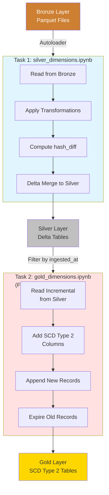

# 🔥 Databricks Processing Layer

This directory contains the Databricks Asset Bundle (DAB) for the Spotify data engineering project, implementing Bronze→Silver→Gold transformations.

---

## 📋 Overview

The Databricks layer handles all data processing and transformation logic using **Apache Spark** on **Azure Databricks**. It implements the **Silver and Gold layers** of the medallion architecture.

**Key Components**:
- 🎯 **Databricks Asset Bundle** (`spotify_dab/`) - Complete workflow definition
- 📓 **Notebooks** - Transformation logic (Python + PySpark)
- 🛠️ **Utilities** - Reusable transformation functions
- ⚙️ **Workflow** - Orchestrated multi-task job
- 🚀 **Serverless Compute** - On-demand cluster execution

---

## 🏗️ Architecture

```
┌─────────────────────────────────────────────────────────────────────────┐
│                    DATABRICKS PROCESSING LAYER                           │
└─────────────────────────────────────────────────────────────────────────┘

          ADLS Gen2                 Databricks Workflow              Unity Catalog
          
┌────────────────────┐       ┌──────────────────────────┐      ┌──────────────────┐
│  Bronze Container  │       │  Task 1: Silver Layer    │      │  spotify_catalog │
│                    │──────►│                          │─────►│                  │
│ 📂 DimUser/        │       │  silver_dimensions.ipynb │      │  Schema: silver  │
│ 📂 DimArtist/      │       │                          │      │  • DimUser       │
│ 📂 DimTrack/       │       │  • Autoloader Streaming  │      │  • DimArtist     │
│ 📂 DimDate/        │       │  • CDC (hash_diff)       │      │  • DimTrack      │
│ 📂 FactStream/     │       │  • Delta Merge           │      │  • DimDate       │
│                    │       │  • Transformations       │      │  • FactStream    │
│ Format: Parquet    │       └────────────┬─────────────┘      └──────────────────┘
└────────────────────┘                    │                              ▲
                                         │                              │
                                         ▼                              │
                              ┌──────────────────────────┐              │
                              │  Task 2: Gold Layer      │              │
                              │                          │──────────────┘
                              │  gold_dimensions.ipynb   │
                              │  (For-Each Parallel)     │      ┌──────────────────┐
                              │                          │      │  spotify_catalog │
                              │  • SCD Type 2            │─────►│                  │
                              │  • Surrogate Keys        │      │  Schema: gold    │
                              │  • Historical Tracking   │      │  • dimuser       │
                              │  • Parallel Processing   │      │  • dimartist     │
                              │                          │      │  • dimtrack      │
                              │  Utilities:              │      │  • factstream    │
                              │  • transformations.py    │      │                  │
                              └──────────────────────────┘      └──────────────────┘
                              
                              Compute: Serverless Cluster
                              Runtime: Latest DBR
```

---

## 📁 Directory Structure

```
databricks/
├── README.md                          ← You are here
└── spotify_dab/                       ← Databricks Asset Bundle
    ├── README.md                      ← Complete DAB documentation
    ├── DEPLOYMENT.md                  ← Deployment guide
    ├── databricks.yml                 ← Bundle configuration (main)
    ├── pyproject.toml                 ← Python dependencies
    ├── .env.example                   ← Environment variables template
    ├── .gitignore                     ← Databricks-specific ignores
    │
    ├── src/                           ← Transformation Notebooks
    │   ├── silver_dimensions.ipynb    ← Bronze → Silver (CDC)
    │   └── gold_dimensions.ipynb      ← Silver → Gold (SCD Type 2)
    │
    ├── utils/                         ← Reusable Python Modules
    │   └── transformations.py         ← CDC & SCD helper functions
    │
    ├── resources/                     ← Workflow Definitions
    │   └── spotify_dab.job.yml        ← Job configuration (tasks, schedule)
    │
    └── jinja/                         ← Template Notebooks (optional)
        └── jinja_notebook.ipynb
```

---

## 🎯 What is Databricks Asset Bundles (DAB)?

**Databricks Asset Bundles** is a declarative way to define, deploy, and manage Databricks resources using YAML configuration and CLI tools.

### **Benefits**:

✅ **Version Control**: All resources defined in code (GitOps)  
✅ **CI/CD Ready**: Deploy via CLI, integrate with GitHub Actions  
✅ **Environment Management**: Separate dev/prod configurations  
✅ **Dependency Management**: Python packages in pyproject.toml  
✅ **Permissions**: Declarative access control  
✅ **Validation**: `databricks bundle validate` before deploy  
✅ **Idempotent**: Safe to redeploy multiple times  

### **Resources Managed by DAB**:

- ✅ Workflows (Jobs)
- ✅ Notebooks
- ✅ Python modules
- ✅ Permissions
- ✅ Compute configurations
- ✅ Schedules & triggers

---

## 🚀 Quick Navigation

### **For Deployment**:
👉 See [spotify_dab/DEPLOYMENT.md](spotify_dab/DEPLOYMENT.md)
- Multiple deployment methods
- Environment variables guide
- Troubleshooting

### **For Technical Details**:
👉 See [spotify_dab/README.md](spotify_dab/README.md)
- Notebook documentation
- Transformation logic
- Utilities reference
- Workflow configuration

### **For Architecture**:
👉 See [../ARCHITECTURE.md](../ARCHITECTURE.md)
- Complete system design
- Integration patterns
- Design decisions

---

## 🔄 Data Transformation Flow

### **Pipeline Overview**



### **Task Execution**

**Task 1: Silver Transformation**
- **Type**: Sequential (processes tables one by one)
- **Input**: Bronze Parquet files (5 tables)
- **Output**: Silver Delta tables (5 tables)
- **Duration**: ~50 seconds
- **Pattern**: Streaming merge with CDC

**Task 2: Gold Transformation**
- **Type**: For-Each Parallel (4 tables simultaneously)
- **Input**: Silver Delta tables (4 tables - excluding DimDate)
- **Output**: Gold SCD Type 2 tables (4 tables)
- **Duration**: ~20-25 seconds
- **Pattern**: Batch processing with historical tracking

---

## 🛠️ Technologies Used

| Component | Technology | Version | Purpose |
|-----------|-----------|---------|---------|
| **Compute** | Azure Databricks | Premium SKU | Distributed data processing |
| **Runtime** | Databricks Runtime | Latest | Spark + Delta Lake |
| **Cluster** | Serverless | N/A | Auto-scaling, pay-per-use |
| **Language** | Python | 3.10+ | Notebook & utility code |
| **Framework** | PySpark | 3.5+ | Distributed processing |
| **Storage Format** | Delta Lake | 3.0+ | ACID transactions, time travel |
| **Streaming** | Structured Streaming | Spark 3.5+ | Incremental processing |
| **Autoloader** | Databricks Autoloader | Built-in | File ingestion |
| **Asset Management** | Databricks Asset Bundles | CLI 0.210+ | Deployment & lifecycle |
| **Catalog** | Unity Catalog | Built-in | Data governance |

---

## 📊 Data Processing Summary

### **Transformations Applied**

| Layer | Tables | Transformations | Output |
|-------|--------|----------------|--------|
| **Bronze** | 5 tables | None (Raw from ADF) | Parquet files |
| **Silver** | 5 tables | Uppercase names, flags, cleanup, hash_diff, metadata | Delta tables with CDC |
| **Gold** | 4 tables | SCD Type 2, surrogate keys, historical tracking | Analytics-ready dimensions |

### **Processing Patterns**

**Silver Layer**:
- **Pattern**: Streaming merge (foreachBatch)
- **CDC Method**: Hash-based change detection
- **Write Mode**: Upsert (update if changed, insert if new)
- **Checkpoint**: Ensures exactly-once processing

**Gold Layer**:
- **Pattern**: Batch incremental (filter by timestamp)
- **SCD Method**: Type 2 (preserve history)
- **Write Mode**: Append + update (new versions + expire old)
- **Parallelism**: For-each-task (4 concurrent executions)

---

## 🔐 Permissions & Access

### **Who Can Access?**

Configured in `spotify_dab/databricks.yml`:

**Development Target**:
- User (via `USER_EMAIL` env var): CAN_MANAGE
- ADF Service Principal: CAN_MANAGE

**Production Target**:
- Same permissions
- Deployed to separate workspace path

### **Required Permissions**:

**For Deployment**:
- Databricks workspace access
- Unity Catalog access (create schemas, tables)
- ADLS access via Access Connector

**For Execution**:
- Read: Bronze container
- Write: Silver & Gold containers
- Unity Catalog: Create/update tables

**Granted By**: 
- Terraform (infrastructure + RBAC)
- Bundle deployment (workflow permissions)

---

## 🚀 Getting Started

### **Prerequisites**

```bash
# 1. Databricks CLI installed
pip install databricks-cli
# or
brew install databricks

# 2. Infrastructure deployed
cd ../infra
terraform apply

# 3. Authenticated to Databricks
databricks auth login --host https://<workspace>.azuredatabricks.net
```

### **Quick Deploy**

```bash
# Navigate to bundle directory
cd spotify_dab/

# Set environment variables
export DATABRICKS_HOST="https://$(cd ../../infra && terraform output -raw databricks_workspace_url)"
export ADLS_STORAGE_CONTAINER_NAME=$(cd ../../infra && terraform output -raw storage_account_name)
export ADF_SERVICE_PRINCIPAL_ID=$(cd ../../infra && terraform output -raw adf_managed_identity_application_id)

# Validate bundle
databricks bundle validate --target dev

# Deploy bundle
databricks bundle deploy --target dev

# Run workflow
databricks bundle run spotify_etl_job --target dev
```

---

## 📚 Documentation

| Document | Description |
|----------|-------------|
| **[spotify_dab/README.md](spotify_dab/README.md)** | Complete technical documentation |
| **[spotify_dab/DEPLOYMENT.md](spotify_dab/DEPLOYMENT.md)** | Deployment methods & troubleshooting |
| **[spotify_dab/databricks.yml](spotify_dab/databricks.yml)** | Bundle configuration (main file) |
| **[spotify_dab/resources/spotify_dab.job.yml](spotify_dab/resources/spotify_dab.job.yml)** | Workflow job definition |

---

## 🔗 Integration Points

### **Upstream**:
- **Azure Data Factory**: Triggers Databricks workflow via DatabricksJob activity
- **ADLS Bronze**: Reads Parquet files via Autoloader

### **Downstream**:
- **ADLS Silver/Gold**: Writes Delta tables
- **Unity Catalog**: Registers tables for governance
- **Analytics Tools**: Gold tables ready for BI/ML

---

## 💡 Key Concepts

### **Databricks Asset Bundle**

**What It Is**: 
- YAML-based configuration for Databricks resources
- Similar to Terraform, but for Databricks-specific resources
- Deployed via Databricks CLI

**What It Manages**:
```yaml
bundle:
  name: spotify_dab
  
resources:
  jobs:
    spotify_etl_job:       # Workflow definition
      tasks:
        - silver_task      # Notebook execution
        - gold_task        # Parallel for-each
```

### **Unity Catalog Integration**

**Tables Created**:
```sql
-- Silver Layer
spotify_catalog.silver.DimUser
spotify_catalog.silver.DimArtist
spotify_catalog.silver.DimTrack
spotify_catalog.silver.DimDate
spotify_catalog.silver.FactStream

-- Gold Layer (SCD Type 2)
spotify_catalog.gold.dimuser
spotify_catalog.gold.dimartist
spotify_catalog.gold.dimtrack
spotify_catalog.gold.factstream
```

**Storage Credential**: `spotify_adls_credential` (Access Connector MI)  
**External Locations**: `spotify_bronze`, `spotify_silver`, `spotify_gold`

### **Serverless Compute**

**Benefits**:
- No cluster management
- Fast startup (~30 seconds)
- Auto-scaling
- Pay per second
- Latest Databricks Runtime

**Configuration** (Automatic):
```yaml
# In databricks.yml
# Serverless is default for notebook tasks
# No cluster configuration needed
```

---

## 📖 Next Steps

1. 📚 **Read**: [spotify_dab/README.md](spotify_dab/README.md) for detailed documentation
2. 🚀 **Deploy**: Follow [spotify_dab/DEPLOYMENT.md](spotify_dab/DEPLOYMENT.md)
3. 🔍 **Explore**: Open notebooks in Databricks workspace
4. 🎯 **Run**: Execute workflow and monitor results

---

## 🤝 Support

For questions or issues:
- Review [spotify_dab/DEPLOYMENT.md](spotify_dab/DEPLOYMENT.md) troubleshooting section
- Check [../ARCHITECTURE.md](../ARCHITECTURE.md) for system design
- See [spotify_dab/README.md](spotify_dab/README.md) for technical details

---

**Last Updated**: April 4, 2026  
**Author**: Vikneshwara R B
