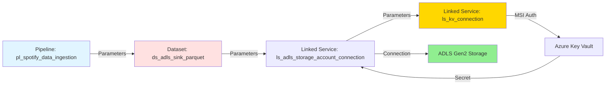
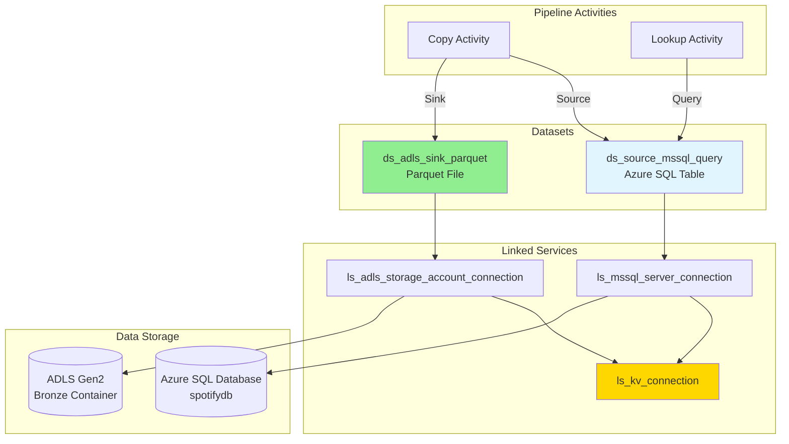

# 📦 Azure Data Factory Dataset Documentation

This directory contains ADF dataset definitions that define the structure and location of data used in Copy activities.

---

## 📋 Table of Contents

- [Overview](#overview)
- [Datasets](#datasets)
- [Parameterization Pattern](#parameterization-pattern)
- [Usage in Pipelines](#usage-in-pipelines)
- [Best Practices](#best-practices)

---

## Overview

**Datasets** in Azure Data Factory represent the structure of data within data stores. They point to or reference the data you want to use in your activities as inputs or outputs.

**Total Datasets**: 2

**Pattern**: Parameterized datasets for dynamic table/file handling

---

## Datasets

### 1. **`ds_source_mssql_query.json`** - SQL Source Dataset

**Purpose**: Define Azure SQL Database source for Copy activities

**Type**: `AzureSqlTable`

**Linked Service**: `ls_mssql_server_connection`

**Parameters**:

| Parameter | Type | Description | Example |
|-----------|------|-------------|---------|
| `db_server_name` | String | SQL Server FQDN | `sql-spotify-001.database.windows.net` |
| `db_user_name` | String | SQL admin username | `sqladmin` |
| `db_name` | String | Database name | `spotifydb` |
| `key_vault_url` | String | Key Vault URI | `https://kv-spotify-001.vault.azure.net/` |
| `db_password_secret_key` | String | Password secret name | `sql-admin-password` |

**Configuration**:
```json
{
  "name": "ds_source_mssql_query",
  "properties": {
    "linkedServiceName": {
      "referenceName": "ls_mssql_server_connection",
      "type": "LinkedServiceReference",
      "parameters": {
        "db_server_name": "@dataset().db_server_name",
        "db_user_name": "@dataset().db_user_name",
        "db_name": "@dataset().db_name",
        "key_vault_url": "@dataset().key_vault_url",
        "db_password_secret_key": "@dataset().db_password_secret_key"
      }
    },
    "parameters": {
      "db_server_name": { "type": "string" },
      "db_user_name": { "type": "string" },
      "db_name": { "type": "string" },
      "key_vault_url": { "type": "string" },
      "db_password_secret_key": { "type": "string" }
    },
    "folder": {
      "name": "sql_datasets"
    },
    "type": "AzureSqlTable",
    "schema": []
  }
}
```

**Key Features**:
- ✅ **No fixed table**: Schema inferred at runtime
- ✅ **Query-based**: Uses `sqlReaderQuery` in Copy Activity (not table name)
- ✅ **Fully parameterized**: All connection details from pipeline
- ✅ **Secure**: Password from Key Vault

**Usage in Copy Activity**:
```json
{
  "source": {
    "type": "AzureSqlSource",
    "sqlReaderQuery": "SELECT * FROM dbo.DimUser WHERE updated_at > '...'",
    "queryTimeout": "02:00:00"
  },
  "dataset": {
    "referenceName": "ds_source_mssql_query",
    "type": "DatasetReference",
    "parameters": {
      "db_server_name": "@variables('sql_server')",
      "db_user_name": "sqladmin",
      "db_name": "spotifydb",
      "key_vault_url": "@pipeline().globalParameters.key_vault_url",
      "db_password_secret_key": "sql-admin-password"
    }
  }
}
```

**Used By**:
- Copy Activity (source) in `pl_spotify_data_ingestion`
- Lookup Activities (Get New Watermark Value, Check incremental row count)

---

### 2. **`ds_adls_sink_parquet.json`** - ADLS Parquet Sink Dataset

**Purpose**: Define ADLS Gen2 Parquet file destination for Copy activities

**Type**: `Parquet`

**Linked Service**: `ls_adls_storage_account_connection`

**Parameters**:

| Parameter | Type | Description | Example |
|-----------|------|-------------|---------|
| `container_name` | String | ADLS container | `bronze` |
| `folder_name` | String | Folder path within container | `DimUser` |
| `file_name` | String | Parquet file name | `DimUser_20260404133000.parquet` |
| `key_vault_url` | String | Key Vault URI | `https://kv-spotify-001.vault.azure.net/` |
| `adls_source_url` | String | ADLS DFS endpoint | `https://adlsspotify001.dfs.core.windows.net/` |

**Configuration**:
```json
{
  "name": "ds_adls_sink_parquet",
  "properties": {
    "linkedServiceName": {
      "referenceName": "ls_adls_storage_account_connection",
      "type": "LinkedServiceReference",
      "parameters": {
        "key_vault_url": "@dataset().key_vault_url",
        "adls_source_url": "@dataset().adls_source_url"
      }
    },
    "parameters": {
      "container_name": { "type": "string" },
      "file_name": { "type": "string" },
      "folder_name": { "type": "string" },
      "key_vault_url": { "type": "string" },
      "adls_source_url": { "type": "string" }
    },
    "folder": {
      "name": "file_datasets"
    },
    "type": "Parquet",
    "typeProperties": {
      "location": {
        "type": "AzureBlobFSLocation",
        "fileName": "@dataset().file_name",
        "folderPath": "@dataset().folder_name",
        "fileSystem": "@dataset().container_name"
      },
      "compressionCodec": "none"
    },
    "schema": []
  }
}
```

**Key Features**:
- ✅ **Dynamic file naming**: Timestamp-based file names
- ✅ **Dynamic folder structure**: One folder per table
- ✅ **Parameterized container**: Can target bronze/silver/gold
- ✅ **No schema definition**: Schema inferred from source
- ✅ **No compression**: Faster writes (compression optional)

**Usage in Copy Activity**:
```json
{
  "sink": {
    "type": "ParquetSink",
    "storeSettings": {
      "type": "AzureBlobFSWriteSettings",
      "copyBehavior": "PreserveHierarchy"
    }
  },
  "dataset": {
    "referenceName": "ds_adls_sink_parquet",
    "type": "DatasetReference",
    "parameters": {
      "container_name": "bronze",
      "folder_name": "@item().tableName",
      "file_name": "@concat(item().tableName,'_',formatDateTime(activity('Get New Watermark Value').output.firstRow.NewWatermarkValue,'yyyyMMddHHmmss'),'.parquet')",
      "key_vault_url": "@pipeline().globalParameters.key_vault_url",
      "adls_source_url": "@string(json(variables('secrets_map'))['adls-source-url'])"
    }
  }
}
```

**File Path Resolution**:
```
Parameter Values:
├─ container_name: "bronze"
├─ folder_name: "DimUser"
└─ file_name: "DimUser_20260404133000.parquet"

Resolved Path:
└─ abfss://bronze@adlsspotify001.dfs.core.windows.net/DimUser/DimUser_20260404133000.parquet
```

**Used By**:
- Copy Activity (sink) in `pl_spotify_data_ingestion`

---

## Parameterization Pattern

### **Why Parameterized Datasets?**

**Benefits**:
- ✅ **Single dataset handles multiple tables**: No need for 5 separate datasets
- ✅ **Dynamic file naming**: Timestamp-based unique files
- ✅ **Flexible folder structure**: Organize by table name
- ✅ **Environment agnostic**: Same dataset, different environments
- ✅ **Reduced maintenance**: Update once, affects all pipelines

### **Parameter Flow Diagram**



### **Example: Dynamic File Creation**

**Pipeline ForEach Loop**:
```json
{
  "items": [
    {"tableName": "DimUser", "Watermark_Column": "updated_at"},
    {"tableName": "DimArtist", "Watermark_Column": "updated_at"},
    ...
  ]
}
```

**Dataset Parameter Resolution**:
```
Iteration 1:
├─ folder_name: "DimUser"
└─ file_name: "DimUser_20260404133000.parquet"
   └─ Result: bronze/DimUser/DimUser_20260404133000.parquet

Iteration 2:
├─ folder_name: "DimArtist"
└─ file_name: "DimArtist_20260404133015.parquet"
   └─ Result: bronze/DimArtist/DimArtist_20260404133015.parquet

...and so on for all 5 tables
```

**Single Dataset → Multiple Files**

---

## Usage in Pipelines

### **Copy Activity Configuration**

```json
{
  "name": "Copy MSSQL to Parquet Sink",
  "type": "Copy",
  "inputs": [
    {
      "referenceName": "ds_source_mssql_query",
      "type": "DatasetReference",
      "parameters": {
        "db_server_name": "@string(json(variables('secrets_map'))['sql-source-server-name'])",
        "db_user_name": "@string(json(variables('secrets_map'))['sql-admin-username'])",
        "db_name": "spotifydb",
        "key_vault_url": "@pipeline().globalParameters.key_vault_url",
        "db_password_secret_key": "sql-admin-password"
      }
    }
  ],
  "outputs": [
    {
      "referenceName": "ds_adls_sink_parquet",
      "type": "DatasetReference",
      "parameters": {
        "container_name": "bronze",
        "folder_name": "@item().tableName",
        "file_name": "@concat(item().tableName,'_',formatDateTime(activity('Get New Watermark Value').output.firstRow.NewWatermarkValue,'yyyyMMddHHmmss'),'.parquet')",
        "key_vault_url": "@pipeline().globalParameters.key_vault_url",
        "adls_source_url": "@string(json(variables('secrets_map'))['adls-source-url'])"
      }
    }
  ],
  "typeProperties": {
    "source": {
      "type": "AzureSqlSource",
      "sqlReaderQuery": "SELECT * FROM @{item().tableSchemaName}.@{item().tableName} WHERE ..."
    },
    "sink": {
      "type": "ParquetSink"
    }
  }
}
```

### **Lookup Activity Configuration**

```json
{
  "name": "Get New Watermark Value",
  "type": "Lookup",
  "source": {
    "type": "AzureSqlSource",
    "sqlReaderQuery": "SELECT COALESCE(MAX(@{item().Watermark_Column}),'1900-01-01') AS NewWatermarkValue FROM @{item().tableSchemaName}.@{item().tableName}"
  },
  "dataset": {
    "referenceName": "ds_source_mssql_query",
    "type": "DatasetReference",
    "parameters": {
      "db_server_name": "@string(json(variables('secrets_map'))['sql-source-server-name'])",
      "db_user_name": "@string(json(variables('secrets_map'))['sql-admin-username'])",
      "db_name": "spotifydb",
      "key_vault_url": "@pipeline().globalParameters.key_vault_url",
      "db_password_secret_key": "sql-admin-password"
    }
  }
}
```

---

## File Naming Strategy

### **Parquet File Naming Convention**

**Pattern**: `{TableName}_{Timestamp}.parquet`

**Format Function**:
```
@concat(
  item().tableName,
  '_',
  formatDateTime(
    activity('Get New Watermark Value').output.firstRow.NewWatermarkValue,
    'yyyyMMddHHmmss'
  ),
  '.parquet'
)
```

**Examples**:

| Table | Watermark Value | File Name |
|-------|----------------|-----------|
| DimUser | 2025-10-07 19:49:55 | `DimUser_20251007194955.parquet` |
| DimArtist | 2025-10-08 09:15:00 | `DimArtist_20251008091500.parquet` |
| FactStream | 2025-10-08 10:00:00 | `FactStream_20251008100000.parquet` |

**Benefits**:
- ✅ **Unique files**: Timestamp prevents overwrites
- ✅ **Chronological sorting**: Lexicographic order = time order
- ✅ **Traceability**: Know when data was extracted
- ✅ **Idempotent**: Re-running pipeline creates new file (no corruption)

---

## Folder Structure

### **Bronze Layer Organization**

```
abfss://bronze@adlsspotify001.dfs.core.windows.net/
├── DimUser/
│   ├── DimUser_20260404120000.parquet        ← Initial load
│   ├── DimUser_20260404133000.parquet        ← Incremental load 1
│   ├── DimUser_20260404150000.parquet        ← Incremental load 2
│   └── ...
│
├── DimArtist/
│   ├── DimArtist_20260404120015.parquet
│   ├── DimArtist_20260404133015.parquet
│   └── ...
│
├── DimTrack/
│   └── DimTrack_20260404120030.parquet
│
├── DimDate/
│   └── DimDate_20260404120045.parquet
│
└── FactStream/
    ├── FactStream_20260404120100.parquet
    └── ...
```

**Folder Strategy**:
- One folder per table (enables efficient Autoloader processing)
- Chronological files within folder
- No subfolders (simple structure)

---

## Schema Handling

### **Schema-less Design**

Both datasets use `"schema": []` (empty array):

**Reason**: Schema inferred at runtime
- **Source** (SQL): Schema from SQL table
- **Sink** (Parquet): Schema from source data

**Benefits**:
- ✅ No manual schema maintenance
- ✅ Handles schema evolution automatically
- ✅ Simplifies dataset definition

**Autoloader Schema Evolution**:
```python
# In Databricks silver_dimensions.ipynb
df = spark.readStream.format("cloudFiles") \
    .option("cloudFiles.format", "parquet") \
    .option("cloudFiles.schemaLocation", "checkpoint_path") \
    .option("schemaEvolutionMode", "addNewColumns")  # Handles new columns
    .load("bronze_path")
```

---

## Compression & Format Options

### **Parquet Configuration**

**Current Settings**:
```json
{
  "compressionCodec": "none"
}
```

**Why No Compression?**
- Faster writes during Copy Activity
- Data already columnar (Parquet inherently efficient)
- Minimal storage cost for small dataset

**Alternative Compression Options**:

| Codec | Compression Ratio | Speed | Use Case |
|-------|-------------------|-------|----------|
| `none` | 1x (baseline) | ⚡⚡⚡ Fastest | Current (small datasets) |
| `snappy` | 1.5-2x | ⚡⚡ Fast | Recommended for production |
| `gzip` | 2-3x | ⚡ Slower | Long-term archival |
| `lz4` | 1.5x | ⚡⚡⚡ Fast | Real-time streaming |

**To Enable Compression** (Future Enhancement):
```json
{
  "typeProperties": {
    "compressionCodec": "snappy"  // Change from "none"
  }
}
```

---

## Best Practices

### **Dataset Design**

✅ **Parameterize everything**: No hardcoded values  
✅ **Use folders for organization**: Group by category (sql_datasets, file_datasets)  
✅ **Schema inference**: Let ADF/Databricks handle schema  
✅ **Consistent naming**: `ds_{source/sink}_{system}_{format}`  
✅ **Generic datasets**: Reusable across multiple pipelines  

### **File Management**

✅ **Timestamp-based names**: Ensures uniqueness  
✅ **Table-based folders**: Enables efficient downstream processing  
✅ **No overwrites**: Append-only pattern (preserve history)  
✅ **Cleanup strategy**: Use ADLS lifecycle policies for old files  

### **Performance**

✅ **Choose compression wisely**: Balance speed vs. storage  
✅ **Parquet for analytics**: Columnar format, efficient for Spark  
✅ **Partition large tables**: Use folderPath with partitions  

---

## Advanced Configuration

### **Partitioned Parquet Files**

**For Large Tables** (Future Enhancement):

```json
{
  "typeProperties": {
    "location": {
      "type": "AzureBlobFSLocation",
      "folderPath": "@concat(dataset().folder_name, '/year=', year(activity('Get New Watermark Value').output.firstRow.NewWatermarkValue), '/month=', month(...))",
      "fileSystem": "@dataset().container_name"
    },
    "partitionColumns": ["year", "month"]
  }
}
```

**Result**:
```
bronze/FactStream/
└── year=2025/
    └── month=10/
        ├── FactStream_20251008100000.parquet
        └── FactStream_20251008110000.parquet
```

**Benefits**: Efficient partition pruning in Spark queries

---

### **Schema Definition** (Optional)

**When to Define Schema**:
- Data type enforcement needed
- Source schema frequently changes
- Want to subset columns (projection)

**Example**:
```json
{
  "schema": [
    { "name": "user_id", "type": "int32" },
    { "name": "user_name", "type": "string" },
    { "name": "country", "type": "string" },
    { "name": "subscription_type", "type": "string" },
    { "name": "updated_at", "type": "timestamp" }
  ]
}
```

**Current Approach**: Empty schema (flexible, auto-infer)

---

## Dataset Dependency Graph



---

## Troubleshooting

### **Common Issues**

#### **1. "Dataset schema mismatch"**

**Error**:
```
Column 'xyz' defined in schema but not found in source
```

**Solution**: Remove schema definition (use `"schema": []`)

---

#### **2. "Invalid file path"**

**Error**:
```
The specified path does not exist: bronze/DimUser/...
```

**Solution**:
```bash
# Verify container exists
az storage fs list \
  --account-name adlsspotify<suffix> \
  --auth-mode login

# Create bronze container if missing (should be created by Terraform)
az storage fs create \
  --account-name adlsspotify<suffix> \
  --name bronze \
  --auth-mode login
```

---

#### **3. "Parameter value cannot be null"**

**Error**:
```
The parameter 'file_name' cannot be null or empty
```

**Solution**: 
```json
// Verify activity dependencies
// file_name uses output from "Get New Watermark Value"
// Ensure that activity completed successfully
```

---

#### **4. "Cannot overwrite file"**

**Error**:
```
File already exists and overwrite is not allowed
```

**Solution**: 
- Check file naming logic (should include timestamp)
- Verify `formatDateTime` function working correctly
- Ensure unique timestamps per table

---

## Validation

### **Test Dataset Configuration**

**Method 1: Preview Data (ADF Studio)**
```
1. Open dataset in ADF Studio
2. Click "Preview data"
3. Provide parameter values
4. Click "OK"
5. Review schema and sample rows
```

**Method 2: Copy Activity Test**
```
1. Create test pipeline with Copy Activity
2. Use datasets with hardcoded test parameters
3. Run pipeline
4. Verify file created in ADLS
5. Check file content with Databricks or Azure Storage Explorer
```

### **Validation Queries**

**Check Bronze Files**:
```bash
# List all files for a table
az storage fs file list \
  --account-name adlsspotify<suffix> \
  --file-system bronze \
  --path DimUser \
  --auth-mode login

# Expected: Multiple .parquet files with timestamps
```

**Read Parquet in Databricks**:
```python
# Verify file content
df = spark.read.parquet("abfss://bronze@adlsspotify001.dfs.core.windows.net/DimUser/DimUser_20260404133000.parquet")
df.display()

# Check schema
df.printSchema()

# Count records
print(f"Records: {df.count()}")
```

---

## Integration with Databricks

### **How Databricks Consumes These Files**

**Autoloader Pattern**:
```python
# silver_dimensions.ipynb
df_user = spark.readStream.format("cloudFiles") \
    .option("cloudFiles.format", "parquet") \
    .option("cloudFiles.schemaLocation", "checkpoint_path") \
    .load("abfss://bronze@{storage}/DimUser")  # All files in folder

# Autoloader automatically:
# ✅ Detects new files (DimUser_*.parquet)
# ✅ Processes incrementally
# ✅ Handles schema evolution
# ✅ Maintains checkpoint
```

**File Processing**:
```
Bronze Files:
├── DimUser_20260404120000.parquet (500 rows) ← Processed in Run 1
├── DimUser_20260404133000.parquet (15 rows)  ← Processed in Run 2
└── DimUser_20260404150000.parquet (25 rows)  ← Processed in Run 3

Autoloader Checkpoint:
└─ Tracks processed files
└─ Only reads new files (Run 2 processes only second file)
```

---

## Dataset Configuration Summary

### **Quick Reference**

| Dataset | Type | Linked Service | Parameters | Folder | Purpose |
|---------|------|----------------|------------|--------|---------|
| `ds_source_mssql_query` | AzureSqlTable | ls_mssql_server_connection | 5 | sql_datasets | SQL source (query-based) |
| `ds_adls_sink_parquet` | Parquet | ls_adls_storage_account_connection | 5 | file_datasets | Parquet sink (dynamic path) |

### **Parameter Summary**

**ds_source_mssql_query**:
- `db_server_name`: From secrets_map
- `db_user_name`: From secrets_map
- `db_name`: Fixed ("spotifydb")
- `key_vault_url`: From global parameter
- `db_password_secret_key`: Fixed ("sql-admin-password")

**ds_adls_sink_parquet**:
- `container_name`: Fixed ("bronze")
- `folder_name`: Dynamic (@item().tableName)
- `file_name`: Dynamic (table + timestamp)
- `key_vault_url`: From global parameter
- `adls_source_url`: From secrets_map

---

## Folder Organization in ADF Studio

```
Datasets/
├── file_datasets/
│   └── ds_adls_sink_parquet
└── sql_datasets/
    └── ds_source_mssql_query
```

**Purpose**: Logical grouping for easier navigation in ADF Studio

---

## Related Documentation

- **[../pipeline/README.md](../pipeline/README.md)**: Pipelines that use these datasets
- **[../linkedService/README.md](../linkedService/README.md)**: Underlying connection definitions
- **[../databricks/spotify_dab/README.md](../databricks/spotify_dab/README.md)**: How Databricks reads Bronze files
- **[../ARCHITECTURE.md](../ARCHITECTURE.md)**: End-to-end data flow

---

**Last Updated**: April 4, 2026  
**Author**: Vikneshwara R B
