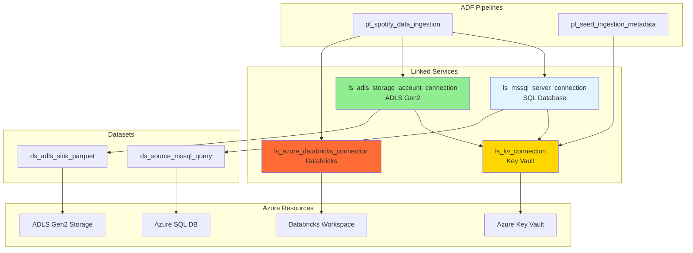

# 🔗 Azure Data Factory Linked Services Documentation

This directory contains ADF linked service definitions that establish connections to various Azure resources used in the Spotify data engineering pipeline.

---

## 📋 Table of Contents

- [Overview](#overview)
- [Linked Services](#linked-services)
- [Configuration Patterns](#configuration-patterns)
- [Authentication Methods](#authentication-methods)
- [Testing & Validation](#testing--validation)
- [Troubleshooting](#troubleshooting)

---

## Overview

**Linked Services** in Azure Data Factory are connection definitions that specify how to connect to external data stores and compute services. They encapsulate authentication details and connection strings.

**Total Linked Services**: 4

**Security Pattern**: All credentials stored in Azure Key Vault, referenced dynamically with Managed Identity authentication.

---

## Linked Services

### 1. **`ls_kv_connection.json`** - Azure Key Vault

**Purpose**: Connect to Azure Key Vault to retrieve secrets

**Type**: `AzureKeyVault`

**Parameters**:

| Parameter | Type | Description | Example |
|-----------|------|-------------|---------|
| `key_vault_url` | String | Key Vault URI | `https://kv-spotify-001.vault.azure.net/` |

**Configuration**:
```json
{
  "name": "ls_kv_connection",
  "type": "AzureKeyVault",
  "typeProperties": {
    "baseUrl": "@{linkedService().key_vault_url}"
  }
}
```

**Authentication**: 
- **Method**: Azure Data Factory Managed Identity
- **Automatic**: No explicit auth configuration needed
- **Requirements**: ADF MI must have `Key Vault Secrets User` role (granted by Terraform)

**Usage Example**:
```json
{
  "password": {
    "type": "AzureKeyVaultSecret",
    "store": {
      "referenceName": "ls_kv_connection",
      "type": "LinkedServiceReference",
      "parameters": {
        "key_vault_url": "@linkedService().key_vault_url"
      }
    },
    "secretName": "sql-admin-password"
  }
}
```

**Used By**: All other linked services (for password/key retrieval)

---

### 2. **`ls_mssql_server_connection.json`** - Azure SQL Database

**Purpose**: Connect to Azure SQL Database source

**Type**: `AzureSqlDatabase`

**Parameters**:

| Parameter | Type | Description | Example |
|-----------|------|-------------|---------|
| `db_server_name` | String | SQL Server FQDN | `sql-spotify-001.database.windows.net` |
| `db_user_name` | String | SQL admin username | `sqladmin` |
| `db_name` | String | Database name | `spotifydb` |
| `key_vault_url` | String | Key Vault URI | `https://kv-spotify-001.vault.azure.net/` |
| `db_password_secret_key` | String | Secret name in KV | `sql-admin-password` |

**Configuration**:
```json
{
  "name": "ls_mssql_server_connection",
  "type": "AzureSqlDatabase",
  "typeProperties": {
    "server": "@{linkedService().db_server_name}",
    "database": "@{linkedService().db_name}",
    "encrypt": "mandatory",
    "trustServerCertificate": false,
    "authenticationType": "SQL",
    "userName": "@{linkedService().db_user_name}",
    "password": {
      "type": "AzureKeyVaultSecret",
      "store": {
        "referenceName": "ls_kv_connection",
        "type": "LinkedServiceReference"
      },
      "secretName": "@{linkedService().db_password_secret_key}"
    }
  }
}
```

**Authentication**:
- **Method**: SQL Authentication
- **Username**: Passed as parameter
- **Password**: Retrieved from Key Vault (via ls_kv_connection)

**Security Features**:
- ✅ Encrypted connection (TLS/SSL)
- ✅ Password in Key Vault (not in pipeline)
- ✅ Parameterized (no hardcoded values)

**Used By**: 
- `ds_source_mssql_query` dataset
- Lookup activities (watermark queries)
- Copy activities (source)

---

### 3. **`ls_adls_storage_account_connection.json`** - ADLS Gen2

**Purpose**: Connect to Azure Data Lake Storage Gen2 for Bronze layer writes

**Type**: `AzureBlobFS`

**Parameters**:

| Parameter | Type | Description | Example |
|-----------|------|-------------|---------|
| `key_vault_url` | String | Key Vault URI | `https://kv-spotify-001.vault.azure.net/` |
| `adls_source_url` | String | ADLS DFS endpoint | `https://adlsspotify001.dfs.core.windows.net/` |

**Configuration**:
```json
{
  "name": "ls_adls_storage_account_connection",
  "type": "AzureBlobFS",
  "typeProperties": {
    "url": "@{linkedService().adls_source_url}",
    "accountKey": {
      "type": "AzureKeyVaultSecret",
      "store": {
        "referenceName": "ls_kv_connection",
        "type": "LinkedServiceReference",
        "parameters": {
          "key_vault_url": "@linkedService().key_vault_url"
        }
      },
      "secretName": "adls-storage-account-key"
    }
  }
}
```

**Authentication**:
- **Method**: Storage Account Key
- **Key Source**: Azure Key Vault (via ls_kv_connection)
- **Alternative**: Could use Managed Identity (future enhancement)

**Used By**:
- `ds_adls_sink_parquet` dataset
- Copy activities (sink)

**Storage Containers Accessed**:
- `bronze/` - Raw Parquet files

---

### 4. **`ls_azure_databricks_connection.json`** - Azure Databricks

**Purpose**: Connect to Databricks workspace to trigger workflow jobs

**Type**: `AzureDatabricks`

**Parameters**:

| Parameter | Type | Description | Example |
|-----------|------|-------------|---------|
| `databricks_workspace_url` | String | Workspace URL | `https://adb-123.azuredatabricks.net` |
| `databricks_workspace_resource_id` | String | Azure Resource ID | `/subscriptions/.../databricks/workspaces/...` |

**Configuration**:
```json
{
  "name": "ls_azure_databricks_connection",
  "type": "AzureDatabricks",
  "typeProperties": {
    "domain": "@linkedService().databricks_workspace_url",
    "authentication": "MSI",
    "workspaceResourceId": "@linkedService().databricks_workspace_resource_id"
  }
}
```

**Authentication**:
- **Method**: Managed Service Identity (MSI)
- **Identity**: ADF System-Assigned Managed Identity
- **Requirements**:
  1. ✅ ADF MI registered as Databricks service principal (Terraform)
  2. ✅ Contributor role on Databricks workspace (Terraform)
  3. ✅ workspace_access entitlement (Terraform)

**Used By**:
- DatabricksJob activity in `pl_spotify_data_ingestion` pipeline

**Capabilities**:
- Trigger workflow jobs
- Monitor job execution
- Pass parameters to notebooks

**Important Note**: 
⚠️ **Test Connection will fail** for DatabricksJob activity type (expected behavior)  
✅ Connection works at runtime when job is triggered

---

## Configuration Patterns

### **Parameterized Linked Services**

All linked services use **parameters** instead of hardcoded values, enabling:

✅ **Reusability**: Same linked service, different environments  
✅ **Security**: Values from Key Vault, not in code  
✅ **Flexibility**: Change configurations without redeploying  
✅ **Environment Management**: Dev/Test/Prod with different parameters  

**Pattern**:
```json
{
  "properties": {
    "parameters": {
      "param_name": {
        "type": "string"
      }
    },
    "typeProperties": {
      "property": "@{linkedService().param_name}"
    }
  }
}
```

**Usage in Pipeline**:
```json
{
  "linkedServiceName": {
    "referenceName": "ls_mssql_server_connection",
    "type": "LinkedServiceReference",
    "parameters": {
      "db_server_name": "@variables('sql_server')",
      "db_user_name": "sqladmin",
      "db_name": "spotifydb",
      "key_vault_url": "@pipeline().globalParameters.key_vault_url",
      "db_password_secret_key": "sql-admin-password"
    }
  }
}
```

---

### **Key Vault Integration Pattern**

**Chaining Pattern**: `Pipeline → Linked Service → Key Vault Linked Service → Secret`

```
┌──────────────────────────────────────────────────────────────┐
│ ADF Pipeline Activity                                         │
├──────────────────────────────────────────────────────────────┤
│ Uses: ls_mssql_server_connection                             │
│   └─ Parameter: db_password_secret_key = "sql-admin-password"│
└───────────────────────────┬──────────────────────────────────┘
                            │
                            ▼
┌──────────────────────────────────────────────────────────────┐
│ Linked Service: ls_mssql_server_connection                   │
├──────────────────────────────────────────────────────────────┤
│ password: {                                                   │
│   type: "AzureKeyVaultSecret",                               │
│   store: {                                                    │
│     referenceName: "ls_kv_connection",  ←───────────────┐   │
│     parameters: { key_vault_url: "..." }                │   │
│   },                                                     │   │
│   secretName: "@{linkedService().db_password_secret_key}"│   │
│ }                                                        │   │
└──────────────────────────────────────────────────────────┘   │
                            │                                   │
                            ▼                                   │
┌──────────────────────────────────────────────────────────────┘
│ Linked Service: ls_kv_connection                             │
├──────────────────────────────────────────────────────────────┤
│ type: "AzureKeyVault"                                        │
│ baseUrl: "@{linkedService().key_vault_url}"                  │
│ authentication: MSI (automatic)                              │
└───────────────────────────┬──────────────────────────────────┘
                            │
                            ▼
┌──────────────────────────────────────────────────────────────┐
│ Azure Key Vault                                              │
├──────────────────────────────────────────────────────────────┤
│ Secret: sql-admin-password                                   │
│ Value: "P@ssw0rd123!"                                        │
│ Access: ADF MI (Key Vault Secrets User role)                │
└──────────────────────────────────────────────────────────────┘
```

**Benefits**:
- Single Key Vault linked service for all secrets
- Secrets never exposed in pipeline JSON
- Centralized secret management
- Audit trail for secret access

---

## Authentication Methods

### **Comparison Matrix**

| Linked Service | Auth Method | Credential Location | Managed by |
|----------------|-------------|---------------------|------------|
| **ls_kv_connection** | Managed Identity | N/A (MSI automatic) | Azure AD |
| **ls_mssql_server_connection** | SQL Authentication | Key Vault | Key Vault |
| **ls_adls_storage_account_connection** | Account Key | Key Vault | Key Vault |
| **ls_azure_databricks_connection** | Managed Identity | N/A (MSI automatic) | Azure AD |

### **Why Different Auth Methods?**

**Key Vault**: MSI (no credentials needed)
- Azure handles authentication automatically
- Best practice for Azure-to-Azure communication

**SQL Database**: SQL Authentication (username/password from KV)
- Azure SQL supports multiple auth types
- SQL auth chosen for simplicity
- Alternative: Azure AD authentication (more secure)

**ADLS Gen2**: Account Key (from KV)
- Simplest setup for ADF Copy Activity
- Alternative: Managed Identity (recommended for production)

**Databricks**: MSI (no credentials needed)
- Required for DatabricksJob activity
- Uses ADF's system-assigned managed identity
- Most secure option (no tokens, auto-rotation)

---

## Testing & Validation

### **Test Connection in ADF Studio**

**ls_kv_connection**:
```
✅ Test Connection → Success
   (Requires: ADF MI has Key Vault Secrets User role)
```

**ls_mssql_server_connection**:
```
✅ Test Connection → Success
   (Requires: SQL server firewall allows Azure services)
   (Requires: Correct username/password in Key Vault)
```

**ls_adls_storage_account_connection**:
```
✅ Test Connection → Success
   (Requires: Storage account key in Key Vault)
   (Requires: Correct ADLS URL)
```

**ls_azure_databricks_connection**:
```
⚠️ Test Connection → May Fail (Expected for DatabricksJob type)
   "Error code: 9512"
   
   This is EXPECTED behavior:
   - DatabricksJob activity doesn't require cluster config
   - Test Connection tries to validate cluster access
   - Connection works at runtime when triggering jobs
   
   ✅ Runtime: Works correctly when pipeline executes
   (Requires: ADF MI has Contributor on Databricks workspace)
   (Requires: Service principal registered in Databricks)
```

### **Validation via Pipeline**

```bash
# Best way to validate: Run a minimal pipeline
# If Copy Activity succeeds, linked services are working

# Test Key Vault access
az datafactory pipeline create-run \
  --resource-group rg-spotify-dataeng \
  --factory-name adf-spotify-<suffix> \
  --name pl_spotify_data_ingestion

# Monitor execution
# Success = All linked services working correctly
```

---

## Usage in Pipelines

### **Example 1: Copy Activity with SQL Source**

```json
{
  "name": "Copy MSSQL to Parquet Sink",
  "type": "Copy",
  "inputs": [
    {
      "referenceName": "ds_source_mssql_query",
      "type": "DatasetReference",
      "parameters": {
        "db_server_name": "@variables('sql_server_fqdn')",
        "db_user_name": "@variables('sql_username')",
        "db_name": "spotifydb",
        "key_vault_url": "@pipeline().globalParameters.key_vault_url",
        "db_password_secret_key": "sql-admin-password"
      }
    }
  ]
}
```

**Flow**: Pipeline → Dataset → Linked Service → Key Vault → SQL DB

---

### **Example 2: DatabricksJob Activity**

```json
{
  "name": "Invoke databricks workflow job",
  "type": "DatabricksJob",
  "typeProperties": {
    "jobId": "@pipeline().globalParameters.databricks_workflow_job_id"
  },
  "linkedServiceName": {
    "referenceName": "ls_azure_databricks_connection",
    "type": "LinkedServiceReference",
    "parameters": {
      "databricks_workspace_url": "@variables('databricks_url')",
      "databricks_workspace_resource_id": "@variables('databricks_resource_id')"
    }
  }
}
```

**Flow**: Pipeline → Linked Service → Databricks API (MSI auth)

---

### **Example 3: WebActivity with Logic App**

```json
{
  "name": "Get Old Watermark Value",
  "type": "WebActivity",
  "typeProperties": {
    "method": "POST",
    "url": "@variables('logic_app_url')",
    "body": {
      "PartitionKey": "dbo",
      "RowKey": "DimUser",
      "OperationType": "fetch"
    }
  }
}
```

**Note**: Logic App URL fetched from Key Vault (not a linked service)

---

## Linked Service Dependency Graph



---

## Parameter Resolution Flow

### **How Parameters Flow Through the System**

```
Step 1: Pipeline Executes
├─ Global Parameters
│  ├─ key_vault_url: "https://kv-spotify-001.vault.azure.net/"
│  └─ databricks_workflow_job_id: "893430576998872"
│
├─ Variables (from Key Vault)
│  ├─ secrets_map: {"sql-source-server-name": "...", ...}
│  └─ Extracted dynamically via WebActivity + MSI

Step 2: Dataset Reference
├─ ds_source_mssql_query
│  └─ Parameters passed from pipeline:
│     ├─ db_server_name: "@string(json(variables('secrets_map'))['sql-source-server-name'])"
│     ├─ db_user_name: "@string(json(variables('secrets_map'))['sql-admin-username'])"
│     ├─ db_name: "spotifydb"
│     ├─ key_vault_url: "@pipeline().globalParameters.key_vault_url"
│     └─ db_password_secret_key: "sql-admin-password"

Step 3: Linked Service Reference
├─ ls_mssql_server_connection
│  └─ Parameters received from dataset:
│     ├─ db_server_name: "sql-spotify-001.database.windows.net"
│     ├─ db_user_name: "sqladmin"
│     ├─ db_name: "spotifydb"
│     └─ Constructs connection string

Step 4: Key Vault Secret Retrieval
├─ ls_kv_connection
│  └─ Fetches: sql-admin-password
│  └─ Authentication: ADF MSI
│  └─ Returns: "P@ssw0rd123!"

Step 5: Connection Established
└─ SQL Database connection active
   └─ Ready for query execution
```

---

## Configuration Files Reference

### **Linked Service JSON Structure**

```json
{
  "name": "linked_service_name",
  "properties": {
    "description": "Optional description",
    "parameters": {
      "param1": { "type": "string" },
      "param2": { "type": "string" }
    },
    "annotations": [],
    "type": "LinkedServiceType",
    "typeProperties": {
      // Type-specific configuration
      "connectionString": "...",
      "authentication": "...",
      // etc.
    }
  }
}
```

### **Common Type Properties**

**For AzureSqlDatabase**:
- `server`, `database`, `userName`
- `authenticationType`: "SQL" | "MSI" | "ServicePrincipal"
- `password`: AzureKeyVaultSecret or SecureString
- `encrypt`: "mandatory" | "optional"

**For AzureBlobFS** (ADLS Gen2):
- `url`: ADLS DFS endpoint
- `accountKey`: AzureKeyVaultSecret or SecureString
- Alternative: `servicePrincipalId` + `servicePrincipalKey` (MSI)

**For AzureDatabricks**:
- `domain`: Workspace URL
- `authentication`: "MSI" | "AccessToken"
- `workspaceResourceId`: Azure Resource Manager ID

**For AzureKeyVault**:
- `baseUrl`: Key Vault URI
- Authentication: Automatic via ADF MSI

---

## Troubleshooting

### **Common Issues & Solutions**

#### **1. Key Vault Access Denied**

**Error**: 
```json
{
  "errorCode": "KeyVaultAccessDenied",
  "message": "The user or application does not have secrets get permission"
}
```

**Root Cause**: ADF MI missing Key Vault RBAC role

**Solution**:
```bash
# Verify role assignment
az role assignment list \
  --scope $(terraform output -raw key_vault_id) \
  --assignee $(terraform output -raw adf_principal_id) \
  --query "[?roleDefinitionName=='Key Vault Secrets User']"

# If not found, apply Terraform (should be automatic)
cd infra
terraform apply

# Or manually assign
az role assignment create \
  --role "Key Vault Secrets User" \
  --assignee $(terraform output -raw adf_principal_id) \
  --scope $(terraform output -raw key_vault_id)
```

---

#### **2. SQL Connection Failed**

**Error**:
```json
{
  "errorCode": "SqlConnectionFailed",
  "message": "Cannot connect to SQL Database"
}
```

**Possible Causes**:
1. **Firewall**: ADF IP not allowed
2. **Credentials**: Wrong username/password
3. **Server Name**: Incorrect FQDN

**Solution**:
```bash
# 1. Verify firewall allows Azure services
az sql server firewall-rule show \
  --resource-group rg-spotify-dataeng \
  --server sql-spotify-<suffix> \
  --name AllowAzureServices

# 2. Verify credentials in Key Vault
az keyvault secret show \
  --vault-name kv-spotify-<suffix> \
  --name sql-admin-password

# 3. Test connection from Azure Portal SQL Query Editor
```

---

#### **3. ADLS Connection Failed**

**Error**:
```json
{
  "errorCode": "StorageAccountAuthorizationFailed",
  "message": "Cannot access storage account"
}
```

**Root Cause**: Invalid storage account key or URL

**Solution**:
```bash
# Verify Key Vault secret
az keyvault secret show \
  --vault-name kv-spotify-<suffix> \
  --name adls-storage-account-key

# Compare with actual storage key
az storage account keys list \
  --resource-group rg-spotify-dataeng \
  --account-name adlsspotify<suffix>

# Update if mismatch
az keyvault secret set \
  --vault-name kv-spotify-<suffix> \
  --name adls-storage-account-key \
  --value "<correct_key>"
```

---

#### **4. Databricks Job Trigger Failed**

**Error**:
```json
{
  "errorCode": "3200",
  "message": "Authentication failed or user does not have permission"
}
```

**Root Cause**: ADF MI not registered in Databricks or missing permissions

**Solution**:
```bash
# 1. Verify Terraform created service principal
terraform state show databricks_service_principal.adf

# 2. Verify Contributor role on workspace
az role assignment list \
  --scope $(terraform output -raw databricks_workspace_id) \
  --assignee $(terraform output -raw adf_principal_id)

# 3. Re-apply Terraform if missing
cd infra
terraform apply

# 4. Verify in Databricks workspace
# Navigate to: Settings → Identity and Access → Service Principals
# Should see: ADF-adf-spotify-<suffix>
```

---

### **Debugging Linked Service Issues**

**Step-by-Step Debug Process**:

```
1. Test Connection in ADF Studio
   └─ Author → Linked Services → Select → Test Connection
   └─ Review error message

2. Verify Prerequisites
   ├─ Key Vault: ADF MI has Secrets User role
   ├─ SQL: Firewall allows Azure services
   ├─ ADLS: Correct account key in Key Vault
   └─ Databricks: Service principal registered

3. Check Parameter Values
   └─ Debug mode: Add Set Variable activity to log parameters
   └─ Verify Key Vault URL format (must end with /)
   └─ Verify ADLS URL format (https://...dfs.core.windows.net/)

4. Review Activity Output
   └─ Monitor → Pipeline runs → Activity runs
   └─ Click on activity → Input/Output tabs
   └─ Check resolved parameter values

5. Test Manually
   ├─ Key Vault: az keyvault secret show
   ├─ SQL: Connect via SSMS
   ├─ ADLS: az storage fs file list
   └─ Databricks: databricks jobs list (CLI)
```

---

## Best Practices

### **Security**

✅ **Never hardcode credentials** in linked services  
✅ **Use Key Vault** for all secrets  
✅ **Use Managed Identity** where possible  
✅ **Parameterize** all connection details  
✅ **Limit RBAC** to least privilege (Secrets User, not Administrator)  

### **Maintainability**

✅ **Consistent naming**: `ls_{service_type}_connection`  
✅ **Descriptive parameters**: Clear purpose in name  
✅ **Documentation**: Add descriptions in JSON  
✅ **Testing**: Always test after creation  

### **Reusability**

✅ **Parameterized**: One linked service, multiple environments  
✅ **Generic**: Not tied to specific pipeline  
✅ **Modular**: Independent from datasets  

---

## Environment-Specific Configuration

### **Dev vs. Prod**

**Pattern**: Use same linked service JSON, different parameter values at runtime

**Dev Environment**:
```json
{
  "parameters": {
    "key_vault_url": "https://kv-spotify-dev.vault.azure.net/",
    "db_server_name": "sql-spotify-dev.database.windows.net"
  }
}
```

**Prod Environment**:
```json
{
  "parameters": {
    "key_vault_url": "https://kv-spotify-prod.vault.azure.net/",
    "db_server_name": "sql-spotify-prod.database.windows.net"
  }
}
```

**Implementation**:
- Use ADF triggers with different parameter values
- Or: Create separate pipelines for Dev/Prod
- Or: Use ADF ARM templates with parameter files

---

## Configuration Summary

### **Quick Reference Table**

| Linked Service | Connects To | Auth | Parameters | Test Connection |
|----------------|-------------|------|------------|-----------------|
| `ls_kv_connection` | Key Vault | MSI | key_vault_url | ✅ Works |
| `ls_mssql_server_connection` | SQL DB | SQL Auth | 5 params | ✅ Works |
| `ls_adls_storage_account_connection` | ADLS Gen2 | Account Key | key_vault_url, adls_source_url | ✅ Works |
| `ls_azure_databricks_connection` | Databricks | MSI | workspace_url, workspace_resource_id | ⚠️ Expected fail |

### **Deployment Order**

```
1. ls_kv_connection          ← Base (no dependencies)
2. ls_mssql_server_connection ← Depends on: ls_kv_connection
3. ls_adls_storage_account_connection ← Depends on: ls_kv_connection
4. ls_azure_databricks_connection ← Independent (MSI)
```

---

## Advanced Topics

### **Alternative: ADLS with Managed Identity**

**Current Implementation**: Account Key (from Key Vault)

**Alternative Configuration** (More Secure):
```json
{
  "name": "ls_adls_storage_account_connection_msi",
  "type": "AzureBlobFS",
  "typeProperties": {
    "url": "@{linkedService().adls_source_url}",
    "authenticationType": "Msi"
  }
}
```

**Requirements**:
- ADF MI needs `Storage Blob Data Contributor` role on ADLS (✅ Already assigned by Terraform)

**Benefit**: No account key needed, auto-rotation

---

### **Alternative: SQL with Azure AD**

**Current Implementation**: SQL Authentication

**Alternative Configuration** (More Secure):
```json
{
  "name": "ls_mssql_server_connection_aad",
  "type": "AzureSqlDatabase",
  "typeProperties": {
    "server": "@{linkedService().db_server_name}",
    "database": "@{linkedService().db_name}",
    "authenticationType": "MSI"
  }
}
```

**Requirements**:
- SQL Server must have Azure AD admin configured
- ADF MI added as SQL user with appropriate permissions

---

## Related Documentation

- **[../pipeline/README.md](../pipeline/README.md)**: How pipelines use these linked services
- **[../dataset/README.md](../dataset/README.md)**: Dataset definitions that reference these
- **[../infra/README.md](../infra/README.md)**: Infrastructure that creates the resources
- **[../ARCHITECTURE.md](../ARCHITECTURE.md)**: Complete authentication flow

---

**Last Updated**: April 4, 2026  
**Author**: Vikneshwara R B
