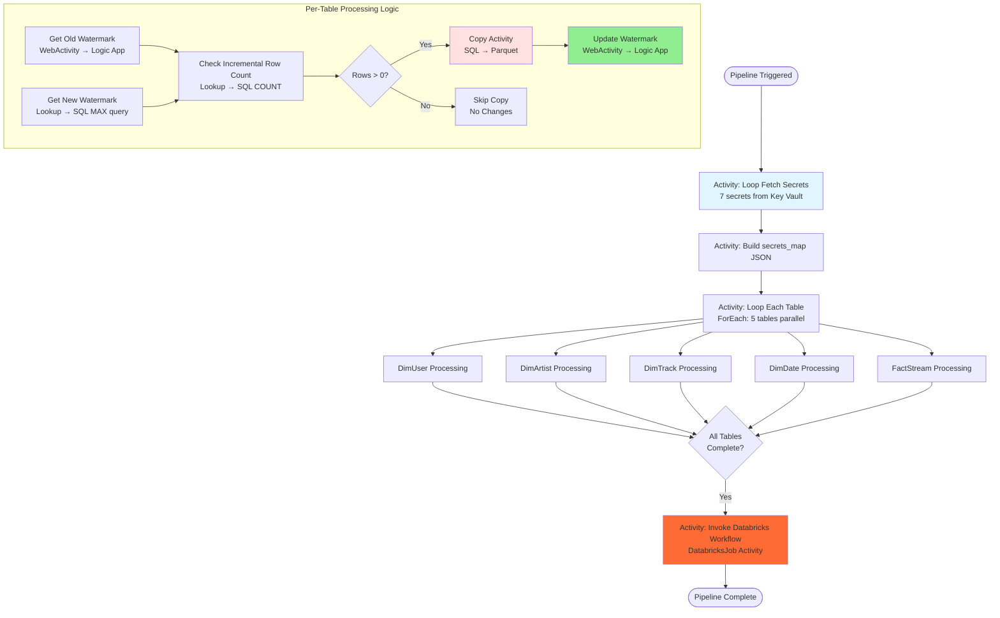

# 🔄 Azure Data Factory Pipeline Documentation

This directory contains Azure Data Factory pipeline definitions for the Spotify data engineering project, implementing watermark-based incremental data ingestion.

---

## 📋 Table of Contents

- [Overview](#overview)
- [Pipeline Architecture](#pipeline-architecture)
- [Pipelines](#pipelines)
- [Watermark Pattern](#watermark-pattern)
- [Global Parameters](#global-parameters)
- [Execution Flow](#execution-flow)
- [Configuration Guide](#configuration-guide)
- [Monitoring & Troubleshooting](#monitoring--troubleshooting)

---

## Overview

The ADF pipelines orchestrate the **Bronze layer ingestion** from Azure SQL Database to ADLS Gen2, implementing efficient incremental loading and automatic Databricks workflow triggering.

**Key Features**:
- ✅ Watermark-based CDC (Change Data Capture)
- ✅ Metadata-driven dynamic pipeline (5 tables)
- ✅ Azure Table Storage for watermark persistence
- ✅ Logic App API for metadata operations
- ✅ Secure: Key Vault integration (no hardcoded secrets)
- ✅ Managed Identity authentication
- ✅ Databricks workflow trigger with MSI

---

## Pipeline Architecture

```
┌─────────────────────────────────────────────────────────────────────────┐
│                      ADF PIPELINE ECOSYSTEM                              │
├─────────────────────────────────────────────────────────────────────────┤
│                                                                           │
│  Pipeline 1: pl_seed_ingestion_metadata (ONE-TIME SETUP)                │
│  ┌────────────────────────────────────────────────────────────────┐     │
│  │  1. Fetch Logic App URL (Key Vault)                            │     │
│  │  2. For Each Table in table_list:                              │     │
│  │     └─ Insert Initial Watermark (1900-01-01) via Logic App     │     │
│  │  3. Complete: Metadata store initialized                       │     │
│  └────────────────────────────────────────────────────────────────┘     │
│                                                                           │
│  Pipeline 2: pl_spotify_data_ingestion (RECURRING PIPELINE)             │
│  ┌────────────────────────────────────────────────────────────────┐     │
│  │  1. Loop: Fetch All Secrets from Key Vault (MSI)              │     │
│  │     └─ Build secrets_map JSON                                  │     │
│  │                                                                  │     │
│  │  2. For Each Table (Parallel: 5 tables):                       │     │
│  │     ├─ Get Old Watermark (Azure Table via Logic App)           │     │
│  │     ├─ Get New Watermark (SQL MAX query)                       │     │
│  │     ├─ Check Row Count (Conditional copy)                      │     │
│  │     ├─ Copy Data (SQL → Parquet) [if rows > 0]                │     │
│  │     └─ Update Watermark (Azure Table via Logic App)            │     │
│  │                                                                  │     │
│  │  3. Trigger Databricks Workflow (DatabricksJob Activity)       │     │
│  │     └─ Authentication: ADF Managed Identity                    │     │
│  │     └─ Job ID: from global parameter                           │     │
│  │                                                                  │     │
│  │  4. Complete: Bronze layer updated, Databricks triggered       │     │
│  └────────────────────────────────────────────────────────────────┘     │
│                                                                           │
└─────────────────────────────────────────────────────────────────────────┘
```

### **Mermaid Pipeline Flow**



---

## Pipelines

### 1. **`pl_seed_ingestion_metadata.json`** (One-Time Setup)

**Purpose**: Initialize watermark values in Azure Table Storage

**When to Run**: Once, before first data ingestion

**Activities**:

```
1. Fetch Logic App URL
   └─ WebActivity: GET Key Vault secret
   └─ Secret: azure-table-interaction-endpoint
   └─ Authentication: MSI

2. Set logic_app_url Variable
   └─ Store URL for subsequent calls

3. Loop Every Table (Sequential: 5 tables)
   └─ For Each table in table_list parameter:
      └─ Insert Watermark Value
         └─ WebActivity: POST to Logic App
         └─ Body: {
              PartitionKey: "dbo",
              RowKey: "DimUser",
              LastWatermarkValue: "1900-01-01 00:00:00",
              OperationType: "insert"
            }
```

**Parameters**:

| Parameter | Type | Default Value | Description |
|-----------|------|---------------|-------------|
| `table_list` | Array | 5 tables with initial watermark | Table configuration |

**Sample Parameter**:
```json
{
  "table_list": [
    {
      "tableName": "DimUser",
      "tableSchemaName": "dbo",
      "LastWatermarkValue": "1900-01-01 00:00:00"
    },
    {
      "tableName": "DimArtist",
      "tableSchemaName": "dbo",
      "LastWatermarkValue": "1900-01-01 00:00:00"
    },
    ...
  ]
}
```

**How to Run**:
```bash
# Method 1: ADF Studio
# 1. Open ADF Studio (terraform output adf_studio_url)
# 2. Navigate to Author → Pipelines → pl_seed_ingestion_metadata
# 3. Click "Add Trigger" → "Trigger Now"
# 4. Accept default parameters
# 5. Click "OK"

# Method 2: Azure CLI
az datafactory pipeline create-run \
  --resource-group rg-spotify-dataeng \
  --factory-name adf-spotify-<suffix> \
  --name pl_seed_ingestion_metadata
```

**Expected Result**:
- Azure Table `samplemetadatastore` populated with 5 rows
- Each row has initial watermark: `1900-01-01 00:00:00`
- Ready for first incremental load

---

### 2. **`pl_spotify_data_ingestion.json`** (Main Pipeline)

**Purpose**: Incremental data extraction from SQL to ADLS Gen2 Bronze layer

**When to Run**: 
- **Initial Load**: After seeding metadata (loads all data)
- **Incremental Loads**: Scheduled or manual (loads only changes)

**Activities Breakdown**:

#### **Activity 1: Loop Each Secret Key** (ForEach - Sequential)

**Purpose**: Fetch all required secrets from Key Vault dynamically

```json
{
  "name": "Loop each secret key",
  "type": "ForEach",
  "typeProperties": {
    "items": "@pipeline().parameters.input_secret_keys",
    "isSequential": true,
    "activities": [
      {
        "name": "Fetch Secret KV Pair",
        "type": "WebActivity",
        "method": "GET",
        "url": "@{pipeline().globalParameters.key_vault_url}secrets/@{item()}?api-version=7.0",
        "authentication": {
          "type": "MSI",
          "resource": "https://vault.azure.net/"
        }
      },
      {
        "name": "Append secret key and value",
        "type": "AppendVariable",
        "variableName": "secret_kv_pair_list"
      }
    ]
  }
}
```

**Secrets Fetched** (7 total):
1. `adls-source-url`
2. `adls-storage-account-name`
3. `azure-table-interaction-endpoint`
4. `sql-admin-username`
5. `sql-source-server-name`
6. `databricks-workspace-url`
7. `databricks-workspace-resource-id`

**Output**: `secret_kv_pair_list` array variable

---

#### **Activity 2: Set Secrets Map** (SetVariable)

**Purpose**: Convert array to JSON object for easy access

```json
{
  "name": "Set secrets map",
  "type": "SetVariable",
  "variableName": "secrets_map",
  "value": "@concat('{', join(variables('secret_kv_pair_list'), ','), '}')"
}
```

**Example Output**:
```json
{
  "adls-source-url": "https://adlsspotify001.dfs.core.windows.net/",
  "sql-source-server-name": "sql-spotify-001.database.windows.net",
  "sql-admin-username": "sqladmin",
  ...
}
```

**Usage**: `@string(json(variables('secrets_map'))['sql-source-server-name'])`

---

#### **Activity 3: Loop Each Table** (ForEach - Parallel)

**Purpose**: Process all 5 tables independently

```json
{
  "name": "Loop Each Table",
  "type": "ForEach",
  "typeProperties": {
    "items": "@pipeline().parameters.table_list",
    "isSequential": false,  // ⚡ PARALLEL EXECUTION
    "activities": [...]
  }
}
```

**Sub-Activities** (per table):

##### **3a. Get Old Watermark Value**

```json
{
  "name": "Get Old Watermark Value",
  "type": "WebActivity",
  "method": "POST",
  "url": "@string(json(variables('secrets_map'))['azure-table-interaction-endpoint'])",
  "body": {
    "PartitionKey": "@{item().tableSchemaName}",
    "RowKey": "@{item().tableName}",
    "OperationType": "fetch"
  }
}
```

**Returns**: `{"Entity": {"LastWatermarkValue": "2025-09-29 19:49:55"}}`

##### **3b. Get New Watermark Value**

```json
{
  "name": "Get New Watermark Value",
  "type": "Lookup",
  "source": {
    "type": "AzureSqlSource",
    "sqlReaderQuery": "SELECT COALESCE(MAX(@{item().Watermark_Column}),'1900-01-01') AS NewWatermarkValue FROM @{item().tableSchemaName}.@{item().tableName}"
  }
}
```

**Returns**: `{"firstRow": {"NewWatermarkValue": "2025-10-08 09:20:00"}}`

##### **3c. Check Incremental Row Count**

```json
{
  "name": "Check incremental row count",
  "type": "Lookup",
  "sqlReaderQuery": "SELECT COALESCE(COUNT(*),0) as rows_read FROM @{item().tableSchemaName}.@{item().tableName} WHERE @{item().Watermark_Column} > '@{activity('Get Old Watermark Value').output.Entity.LastWatermarkValue}' AND @{item().Watermark_Column} <= '@{activity('Get New Watermark Value').output.firstRow.NewWatermarkValue}'"
}
```

**Returns**: `{"firstRow": {"rows_read": 15}}`

##### **3d. Check for Incremental Load** (IfCondition)

```json
{
  "name": "Check for incremental load",
  "type": "IfCondition",
  "expression": "@greater(activity('Check incremental row count').output.firstRow.rows_read, 0)",
  "ifTrueActivities": [
    // Copy MSSQL to Parquet Sink
    // Update New Watermark Value
  ]
}
```

##### **3e. Copy MSSQL to Parquet Sink**

```json
{
  "name": "Copy MSSQL to Parquet Sink",
  "type": "Copy",
  "source": {
    "type": "AzureSqlSource",
    "sqlReaderQuery": "SELECT * FROM @{item().tableSchemaName}.@{item().tableName} WHERE @{item().Watermark_Column} > '@{activity('Get Old Watermark Value').output.Entity.LastWatermarkValue}' AND @{item().Watermark_Column} <= '@{activity('Get New Watermark Value').output.firstRow.NewWatermarkValue}'"
  },
  "sink": {
    "type": "ParquetSink",
    "fileName": "@concat(item().tableName,'_',formatDateTime(activity('Get New Watermark Value').output.firstRow.NewWatermarkValue,'yyyyMMddHHmmss'),'.parquet')"
  }
}
```

**File Naming Pattern**: `{TableName}_{Timestamp}.parquet`  
**Example**: `DimUser_20260404133000.parquet`

##### **3f. Update New Watermark Value**

```json
{
  "name": "Update New Watermark Value",
  "type": "WebActivity",
  "method": "POST",
  "url": "@string(json(variables('secrets_map'))['azure-table-interaction-endpoint'])",
  "body": {
    "PartitionKey": "@{item().tableSchemaName}",
    "RowKey": "@{item().tableName}",
    "LastWaterMarkValue": "@{activity('Get New Watermark Value').output.firstRow.NewWatermarkValue}",
    "OperationType": "update"
  }
}
```

---

#### **Activity 4: Invoke Databricks Workflow**

**Purpose**: Trigger Databricks Asset Bundle workflow after Bronze ingestion

```json
{
  "name": "Invoke databricks workflow job",
  "type": "DatabricksJob",
  "dependsOn": [
    {
      "activity": "Loop Each Table",
      "dependencyConditions": ["Succeeded"]
    }
  ],
  "typeProperties": {
    "jobId": "@pipeline().globalParameters.databricks_workflow_job_id"
  },
  "linkedServiceName": {
    "referenceName": "ls_azure_databricks_connection",
    "type": "LinkedServiceReference",
    "parameters": {
      "databricks_workspace_url": "@string(json(variables('secrets_map'))['databricks-workspace-url'])",
      "databricks_workspace_resource_id": "@string(json(variables('secrets_map'))['databricks-workspace-resource-id'])"
    }
  }
}
```

**Authentication**: ADF System-Assigned Managed Identity  
**Requirements**: 
- ADF MI registered as Databricks service principal (via Terraform)
- Contributor role on Databricks workspace (via Terraform)

---

## Watermark Pattern

### **How Watermarks Work**

```
┌────────────────────────────────────────────────────────────────────────┐
│                        WATERMARK LIFECYCLE                              │
└────────────────────────────────────────────────────────────────────────┘

Initial State (After pl_seed_ingestion_metadata):
┌─────────────────────────────────────────────┐
│ Azure Table: samplemetadatastore            │
├──────────────┬──────────┬──────────────────┤
│ PartitionKey │ RowKey   │ LastWatermarkValue│
├──────────────┼──────────┼──────────────────┤
│ dbo          │ DimUser  │ 1900-01-01        │
└──────────────┴──────────┴──────────────────┘

First Pipeline Run (Initial Load):
┌─────────────────────────────────────────────┐
│ SQL Query Returns:                          │
│ Old Watermark: 1900-01-01                   │
│ New Watermark: 2025-10-07 19:49:55         │
│ Incremental Query: WHERE updated_at > old  │
│                    AND updated_at <= new    │
│ Result: 500 rows (all users)               │
└─────────────────────────────────────────────┘
        │
        ▼
┌─────────────────────────────────────────────┐
│ Copy to Bronze:                             │
│ File: DimUser_20251007194955.parquet        │
│ Records: 500                                │
└─────────────────────────────────────────────┘
        │
        ▼
┌─────────────────────────────────────────────┐
│ Update Watermark:                           │
│ LastWatermarkValue: 2025-10-07 19:49:55    │
└─────────────────────────────────────────────┘

Second Pipeline Run (Incremental Load):
┌─────────────────────────────────────────────┐
│ SQL Query Returns:                          │
│ Old Watermark: 2025-10-07 19:49:55         │
│ New Watermark: 2025-10-08 09:20:00         │
│ Incremental Query: WHERE updated_at > old  │
│                    AND updated_at <= new    │
│ Result: 15 rows (only changes)             │
└─────────────────────────────────────────────┘
        │
        ▼
┌─────────────────────────────────────────────┐
│ Copy to Bronze:                             │
│ File: DimUser_20251008092000.parquet        │
│ Records: 15                                 │
└─────────────────────────────────────────────┘
        │
        ▼
┌─────────────────────────────────────────────┐
│ Update Watermark:                           │
│ LastWatermarkValue: 2025-10-08 09:20:00    │
└─────────────────────────────────────────────┘
```

### **Watermark Logic Pseudocode**

```python
# In ADF pipeline
for table in table_list:
    old_watermark = azure_table.get(partitionKey='dbo', rowKey=table.tableName)
    new_watermark = sql.query(f"SELECT MAX({table.watermark_column}) FROM {table.tableName}")
    
    if new_watermark > old_watermark:
        incremental_data = sql.query(f"""
            SELECT * FROM {table.tableName}
            WHERE {table.watermark_column} > '{old_watermark}'
              AND {table.watermark_column} <= '{new_watermark}'
        """)
        
        if incremental_data.count > 0:
            copy_to_bronze(
                data=incremental_data,
                filename=f"{table.tableName}_{format_timestamp(new_watermark)}.parquet"
            )
            
            azure_table.update(
                partitionKey='dbo',
                rowKey=table.tableName,
                LastWatermarkValue=new_watermark
            )
    else:
        skip_copy()  # No new data
```

---

## Global Parameters

ADF uses **global parameters** to store configuration values accessible across all pipelines.

### **Required Parameters**

| Parameter Name | Type | Example Value | Purpose |
|----------------|------|---------------|---------|
| `key_vault_url` | String | `https://kv-spotify-001.vault.azure.net/` | Key Vault URI for secret retrieval |
| `databricks_workflow_job_id` | String | `893430576998872` | Databricks job ID to trigger |

### **How to Configure**

**Step 1**: Get Values from Terraform
```bash
cd infra
terraform output key_vault_uri
# Copy the URL

# After deploying Databricks bundle:
cd ../databricks/spotify_dab
databricks bundle deploy --target dev
# Note the job ID from deployment output
```

**Step 2**: Set in ADF Studio
```
1. Open ADF Studio
2. Navigate to: Manage → Global Parameters
3. Click "+ New"
4. Add parameters:
   - Name: key_vault_url
     Type: String
     Value: <from terraform output>
   
   - Name: databricks_workflow_job_id
     Type: String
     Value: <from bundle deployment>
     
5. Click "Save All"
```

**Alternative**: Import from `factory/adf-spotify-v1.json`

---

## Execution Flow

### **Step-by-Step Execution**

```
┌─────────────────────────────────────────────────────────────────────────┐
│ TIME: T0 - Pipeline Start                                               │
└─────────────────────────────────────────────────────────────────────────┘

00:00 → Start: pl_spotify_data_ingestion triggered
00:01 → Activity: Loop each secret key (Sequential)
        ├─ Fetch adls-source-url (1s)
        ├─ Fetch adls-storage-account-name (1s)
        ├─ Fetch azure-table-interaction-endpoint (1s)
        ├─ Fetch sql-admin-username (1s)
        ├─ Fetch sql-source-server-name (1s)
        ├─ Fetch databricks-workspace-url (1s)
        └─ Fetch databricks-workspace-resource-id (1s)
        └─ Total: ~7-10 seconds

00:10 → Activity: Set secrets map
        └─ Build JSON object from array
        └─ Duration: <1 second

00:11 → Activity: Loop Each Table (Parallel - 5 tables)

        ┌─────────────────────────────────────────────────────────┐
        │ DimUser (user_id, 500 rows)                            │
        ├─────────────────────────────────────────────────────────┤
        │ 00:11 → Get Old Watermark (Logic App API)              │
        │         └─ Result: 1900-01-01 (initial load)           │
        │ 00:11 → Get New Watermark (SQL Lookup)                 │
        │         └─ Result: 2025-10-07 19:49:55                │
        │ 00:12 → Check incremental row count                    │
        │         └─ Result: 500 rows                            │
        │ 00:13 → Copy MSSQL to Parquet                          │
        │         └─ Duration: ~20 seconds (500 rows)            │
        │         └─ File: DimUser_20251007194955.parquet        │
        │ 00:33 → Update New Watermark                           │
        │         └─ New value: 2025-10-07 19:49:55             │
        │ 00:34 → Complete ✅                                     │
        └─────────────────────────────────────────────────────────┘

        [Similar for DimArtist, DimTrack, DimDate, FactStream]
        
        └─ All 5 tables complete in parallel: ~30-40 seconds

00:50 → All Tables Complete
01:00 → Activity: Invoke databricks workflow job
        ├─ DatabricksJob Activity
        ├─ Authentication: ADF MSI
        ├─ Job Trigger: Run-Now API
        └─ Duration: ~5 seconds (async trigger)

01:05 → Pipeline Complete ✅
        └─ Databricks workflow now executing independently

┌─────────────────────────────────────────────────────────────────────────┐
│ TIME: T0 + 1 minute - Databricks Workflow Running (Async)              │
└─────────────────────────────────────────────────────────────────────────┘

01:05 → Databricks Job Started
01:35 → Task 1: silver_dimensions.ipynb (Sequential)
        └─ Process all 5 tables: ~50 seconds
        └─ Bronze → Silver transformations

02:25 → Task 2: gold_dimensions.ipynb (For-Each Parallel)
        └─ Process 4 tables: ~20-25 seconds
        └─ Silver → Gold SCD Type 2

02:50 → Databricks Workflow Complete ✅
        └─ Total workflow duration: ~4-5 minutes

┌─────────────────────────────────────────────────────────────────────────┐
│ TOTAL END-TO-END DURATION: ~6-7 minutes                                │
└─────────────────────────────────────────────────────────────────────────┘
```

---

## Configuration Guide

### **Prerequisites**

Before running pipelines:

1. ✅ Infrastructure deployed (Terraform)
2. ✅ SQL Database populated (sql_scripts/ddl_script.sql + initial_load.sql)
3. ✅ Global parameters configured in ADF Studio
4. ✅ Databricks Asset Bundle deployed
5. ✅ All linked services created and tested

### **First-Time Setup Checklist**

```bash
# 1. Verify Terraform deployment
cd infra
terraform output

# 2. Configure ADF Global Parameters
# - Open ADF Studio
# - Set key_vault_url (from terraform output)
# - Set databricks_workflow_job_id (after bundle deploy)

# 3. Populate SQL Database
# - Execute ddl_script.sql
# - Execute initial_load.sql

# 4. Seed Metadata Store
# - Run pl_seed_ingestion_metadata pipeline

# 5. Deploy Databricks Bundle
cd ../databricks/spotify_dab
databricks bundle deploy --target dev
# Note the job ID

# 6. Update ADF Global Parameter
# - Set databricks_workflow_job_id to the noted job ID

# 7. Run Main Pipeline
# - Trigger pl_spotify_data_ingestion
```

### **Running the Pipeline**

**Method 1: ADF Studio UI**
```
1. Open ADF Studio (terraform output adf_studio_url)
2. Navigate to: Author → Pipelines → pl_spotify_data_ingestion
3. Click "Add Trigger" → "Trigger Now"
4. Review parameters (use defaults)
5. Click "OK"
6. Monitor: Monitor tab → Pipeline runs
```

**Method 2: Azure CLI**
```bash
# Trigger pipeline run
az datafactory pipeline create-run \
  --resource-group rg-spotify-dataeng \
  --factory-name adf-spotify-<suffix> \
  --name pl_spotify_data_ingestion

# Output: Run ID
{
  "runId": "abc123-def456-..."
}

# Check status
az datafactory pipeline-run show \
  --resource-group rg-spotify-dataeng \
  --factory-name adf-spotify-<suffix> \
  --run-id <run-id>
```

**Method 3: REST API**
```bash
# Get access token
TOKEN=$(az account get-access-token --resource https://management.azure.com --query accessToken -o tsv)

# Trigger pipeline
curl -X POST "https://management.azure.com/subscriptions/{subscription-id}/resourceGroups/rg-spotify-dataeng/providers/Microsoft.DataFactory/factories/adf-spotify-{suffix}/pipelines/pl_spotify_data_ingestion/createRun?api-version=2018-06-01" \
  -H "Authorization: Bearer $TOKEN" \
  -H "Content-Type: application/json"
```

---

## Monitoring & Troubleshooting

### **Monitoring Pipeline Execution**

**1. ADF Studio Monitor Tab**
```
Navigate to: Monitor → Pipeline runs
View:
  - Run status (In Progress, Succeeded, Failed)
  - Duration
  - Triggered by (Manual, Schedule, Event)
  - Activity runs (drill down)
```

**2. Activity-Level Details**
```
Click on pipeline run → View activity runs
Details:
  - Input parameters
  - Output values
  - Error messages
  - Duration per activity
  - Retry attempts
```

**3. Azure CLI Monitoring**
```bash
# List recent pipeline runs
az datafactory pipeline-run query-by-factory \
  --resource-group rg-spotify-dataeng \
  --factory-name adf-spotify-<suffix> \
  --last-updated-after "2026-04-04T00:00:00Z" \
  --last-updated-before "2026-04-05T00:00:00Z"

# Get specific run details
az datafactory pipeline-run show \
  --resource-group rg-spotify-dataeng \
  --factory-name adf-spotify-<suffix> \
  --run-id <run-id>

# Query activity runs for a pipeline run
az datafactory activity-run query-by-pipeline-run \
  --resource-group rg-spotify-dataeng \
  --factory-name adf-spotify-<suffix> \
  --run-id <run-id>
```

### **Common Issues & Solutions**

#### **1. "KeyVault Access Denied"**

**Error**: 
```
Error code: KeyVaultAccessDenied
Message: The user or application does not have access to the KeyVault
```

**Solution**:
```bash
# Verify ADF MI has Key Vault Secrets User role
az role assignment list \
  --scope $(terraform output -raw key_vault_id) \
  --query "[?roleDefinitionName=='Key Vault Secrets User']" \
  --output table

# If missing, run terraform apply again (should be automatic)
cd infra
terraform apply
```

#### **2. "Reference to Undeclared Global Parameter"**

**Error**:
```
Invalid template: The template parameter 'key_vault_url' is not found
```

**Solution**:
```
# Global parameters not configured
# Go to ADF Studio → Manage → Global Parameters
# Add required parameters (see Global Parameters section)
```

#### **3. "DatabricksJob Activity Failed: 3200"**

**Error**:
```
ErrorCode=3200
Message=Cannot access Databricks workspace
```

**Solution**:
```bash
# ADF MI missing Contributor role on Databricks workspace
# Verify role assignment
az role assignment list \
  --scope $(terraform output -raw databricks_workspace_id) \
  --assignee $(terraform output -raw adf_principal_id)

# Should show: Contributor role
# If missing, run terraform apply
```

#### **4. "Copy Activity Failed: Invalid Column"**

**Error**:
```
Column 'invalid_column' not found in source
```

**Solution**:
```sql
-- Verify SQL schema matches ddl_script.sql
-- Re-run DDL script if schema mismatch
-- Check for typos in pipeline parameter table_list
```

#### **5. "Logic App Returns 404"**

**Error**:
```
WebActivity failed: 404 Not Found
```

**Solution**:
```bash
# Logic App trigger URL might have changed
# Get new URL from Terraform
cd infra
terraform output logic_app_trigger_url

# Update Key Vault secret
az keyvault secret set \
  --vault-name kv-spotify-<suffix> \
  --name azure-table-interaction-endpoint \
  --value "<new_trigger_url>"
```

#### **6. "No Data Copied (0 rows)"**

**Possible Causes**:
```
1. Watermarks are equal (no new data)
   → Check: SELECT MAX(updated_at) FROM dbo.DimUser
   → Compare with Azure Table watermark

2. Watermark not updated in SQL
   → Run: sql_scripts/incremental_load.sql

3. Watermark in Azure Table ahead of SQL
   → Reset: Use pl_seed_ingestion_metadata
```

---

## Performance Tuning

### **Pipeline Optimization**

**1. Parallel Execution**
```json
{
  "typeProperties": {
    "isSequential": false,  // Enable parallel ForEach
    "batchCount": 50       // Max parallel activities (default: 20)
  }
}
```

**2. Copy Activity Optimization**
```json
{
  "sink": {
    "type": "ParquetSink",
    "storeSettings": {
      "maxConcurrentConnections": 10,  // Parallel writes
      "copyBehavior": "PreserveHierarchy"
    },
    "formatSettings": {
      "compressionCodec": "snappy"  // Fast compression
    }
  }
}
```

**3. Conditional Copy** (Already implemented)
```json
{
  "expression": "@greater(activity('Check incremental row count').output.firstRow.rows_read, 0)"
  // Only copies if data exists
}
```

### **Performance Optimization Tips**

| Activity Type | Optimization Strategy |
|---------------|----------------------|
| **Copy Activity** | Use incremental loading (watermarks) to minimize data volume |
| **Lookup Activity** | Index watermark columns for faster queries |
| **WebActivity** | Batch operations where possible |
| **DatabricksJob** | Serverless compute provides auto-scaling |

---

## Integration with Downstream

### **Bronze Layer Output**

**File Structure Created**:
```
abfss://bronze@{storage_account}.dfs.core.windows.net/
├── DimUser/
│   ├── DimUser_20260404120000.parquet
│   ├── DimUser_20260404130000.parquet  ← New incremental file
│   └── ...
├── DimArtist/
│   └── DimArtist_20260404120000.parquet
├── DimTrack/
│   └── DimTrack_20260404120000.parquet
├── DimDate/
│   └── DimDate_20260404120000.parquet
└── FactStream/
    └── FactStream_20260404120000.parquet
```

**Consumed By**: 
- Databricks `silver_dimensions.ipynb` notebook
- Autoloader streams these files incrementally

### **Databricks Workflow Trigger**

After pipeline completes, Databricks workflow executes:

```
ADF Pipeline Complete
        │
        ▼
Databricks Job API: /api/2.1/jobs/run-now
        │
        ▼
Start: spotify_etl_workflow
        │
        ├─ Task 1: silver_dimensions.ipynb
        │   └─ Bronze → Silver (CDC)
        │
        └─ Task 2: gold_dimensions.ipynb (For-Each)
            └─ Silver → Gold (SCD Type 2)
```

---

## Best Practices

### **Pipeline Design Patterns**

✅ **Metadata-Driven**: Single pipeline handles multiple tables  
✅ **Idempotent**: Safe to re-run (watermarks prevent duplicates)  
✅ **Secure**: All secrets in Key Vault, MSI authentication  
✅ **Modular**: Reusable linked services and datasets  
✅ **Monitored**: Activity-level logging and metrics  
✅ **Scalable**: Parallel table processing  

### **Operational Guidelines**

**Daily Operations**:
```bash
# 1. Simulate data changes in SQL
# Execute: sql_scripts/incremental_load.sql

# 2. Trigger pipeline
# ADF Studio → Trigger Now

# 3. Monitor execution
# ADF Studio → Monitor tab

# 4. Verify results
# Check Bronze files in ADLS
# Check Silver/Gold tables in Databricks
```

**Troubleshooting Workflow**:
```
1. Check pipeline run status (ADF Monitor)
2. Drill into failed activity
3. Review input/output JSON
4. Check error code and message
5. Verify prerequisites (secrets, permissions, data)
6. Review linked service test connection
7. Check source data availability
```

---

## Related Components

### **Linked Services Used**

| Linked Service | Purpose | Parameters |
|----------------|---------|------------|
| `ls_kv_connection` | Key Vault access | key_vault_url |
| `ls_mssql_server_connection` | SQL Server connection | db_server_name, db_user_name, db_name, password (from KV) |
| `ls_adls_storage_account_connection` | ADLS Gen2 access | adls_source_url, accountKey (from KV) |
| `ls_azure_databricks_connection` | Databricks job trigger | workspace_url, workspace_resource_id, MSI auth |

📖 **See**: [../linkedService/README.md](../linkedService/README.md)

### **Datasets Used**

| Dataset | Type | Purpose |
|---------|------|---------|
| `ds_source_mssql_query` | AzureSqlTable | SQL source (parameterized) |
| `ds_adls_sink_parquet` | Parquet | ADLS Bronze sink |

📖 **See**: [../dataset/README.md](../dataset/README.md)

---

## Pipeline Parameters Reference

### **`pl_spotify_data_ingestion` Parameters**

```json
{
  "table_list": {
    "type": "array",
    "defaultValue": [
      {
        "tableName": "DimUser",
        "tableSchemaName": "dbo",
        "Watermark_Column": "updated_at"
      },
      {
        "tableName": "DimArtist",
        "tableSchemaName": "dbo",
        "Watermark_Column": "updated_at"
      },
      {
        "tableName": "DimTrack",
        "tableSchemaName": "dbo",
        "Watermark_Column": "updated_at"
      },
      {
        "tableName": "DimDate",
        "tableSchemaName": "dbo",
        "Watermark_Column": "date"
      },
      {
        "tableName": "FactStream",
        "tableSchemaName": "dbo",
        "Watermark_Column": "stream_timestamp"
      }
    ]
  },
  "input_secret_keys": {
    "type": "array",
    "defaultValue": [
      "adls-source-url",
      "adls-storage-account-name",
      "azure-table-interaction-endpoint",
      "sql-admin-username",
      "sql-source-server-name",
      "databricks-workspace-url",
      "databricks-workspace-resource-id"
    ]
  }
}
```

### **Pipeline Variables**

```json
{
  "secrets_map": {
    "type": "String",
    "defaultValue": "{}"
  },
  "secret_kv_pair_list": {
    "type": "Array",
    "defaultValue": []
  }
}
```

---

## Testing the Pipeline

### **Test Scenario 1: Initial Load**

```bash
# Objective: Load all 500 users, 500 artists, 1000 tracks

# 1. Ensure SQL database populated
# 2. Ensure metadata seeded
# 3. Trigger pipeline

# Expected Results:
# - 5 Parquet files in Bronze
# - Watermarks updated in Azure Table
# - Databricks job triggered
# - 500 users, 500 artists in Silver
# - SCD Type 2 tables in Gold with is_current = true
```

### **Test Scenario 2: Incremental Load**

```bash
# Objective: Test CDC detection

# 1. Execute: sql_scripts/incremental_load.sql (95 changes)
# 2. Trigger pipeline

# Expected Results:
# - Only changed records copied (95 rows)
# - New Parquet files with timestamp
# - Watermarks advanced
# - Silver: 60 updates + 35 inserts detected
# - Gold: 60 new versions + 60 expired records
```

### **Test Scenario 3: No Changes**

```bash
# Objective: Test skip logic when no new data

# 1. Run pipeline twice without SQL changes

# Expected Results:
# - First run: Normal execution
# - Second run: 0 rows copied (Check incremental row count = 0)
# - Databricks still triggered (idempotent)
# - No new files in Bronze
```

### **Validation Queries**

**Verify Bronze Files**:
```bash
# Azure CLI
az storage fs file list \
  --account-name adlsspotify<suffix> \
  --file-system bronze \
  --path DimUser \
  --auth-mode login

# Expected: Multiple timestamped Parquet files
```

**Verify Watermarks**:
```bash
# Query Azure Table Storage
az storage entity show \
  --account-name adlsspotify<suffix> \
  --table-name samplemetadatastore \
  --partition-key dbo \
  --row-key DimUser \
  --auth-mode login

# Expected: LastWatermarkValue matches latest SQL timestamp
```

**Verify Databricks Job**:
```bash
# List recent job runs
databricks jobs list-runs --job-id <job-id> --limit 5

# Get run details
databricks jobs get-run --run-id <run-id>

# Expected: Life cycle state = TERMINATED, Result state = SUCCESS
```

---

## Advanced Configuration

### **Custom Table Configuration**

To add new tables to the pipeline:

**Step 1**: Update pipeline parameter
```json
{
  "table_list": [
    // Existing tables...
    {
      "tableName": "DimNewTable",
      "tableSchemaName": "dbo",
      "Watermark_Column": "created_at"
    }
  ]
}
```

**Step 2**: Seed watermark
```bash
# Run pl_seed_ingestion_metadata with updated table_list
# Or manually insert into Azure Table
```

**Step 3**: Update Databricks notebooks
```python
# Add processing logic in silver_dimensions.ipynb
# Add to for_each_task inputs in spotify_dab.job.yml
```

### **Scheduling**

**Option 1: ADF Trigger**
```
ADF Studio → Author → Triggers → + New
Type: Schedule
Frequency: Daily at 2:00 AM UTC
Pipeline: pl_spotify_data_ingestion
```

**Option 2: Databricks Schedule** (Alternative)
```yaml
# In spotify_dab.job.yml
trigger:
  periodic:
    interval: 1
    unit: DAYS
```

**Recommendation**: Use Databricks schedule (already configured)

---

## Pipeline Lineage

```
pl_seed_ingestion_metadata (One-time)
        │
        ▼
    [Azure Table Storage Initialized]
        │
        ▼
pl_spotify_data_ingestion (Recurring)
        │
        ├─ Reads: Azure SQL Database
        ├─ Reads: Azure Table (watermarks)
        ├─ Writes: ADLS Gen2 Bronze (Parquet)
        ├─ Updates: Azure Table (watermarks)
        └─ Triggers: Databricks Workflow
                │
                ▼
        [Databricks Asset Bundle Execution]
                │
                ├─ silver_dimensions.ipynb
                │  └─ Reads: Bronze
                │  └─ Writes: Silver
                │
                └─ gold_dimensions.ipynb
                   └─ Reads: Silver
                   └─ Writes: Gold
```

---

## Related Documentation

- **[../linkedService/README.md](../linkedService/README.md)**: Linked service configuration
- **[../dataset/README.md](../dataset/README.md)**: Dataset definitions
- **[../sql_scripts/README.md](../sql_scripts/README.md)**: Source data structure
- **[../databricks/spotify_dab/README.md](../databricks/spotify_dab/README.md)**: Downstream processing
- **[../infra/README.md](../infra/README.md)**: Infrastructure setup
- **[../ARCHITECTURE.md](../ARCHITECTURE.md)**: Complete system architecture

---

**Last Updated**: April 4, 2026  
**Author**: Vikneshwara R B
