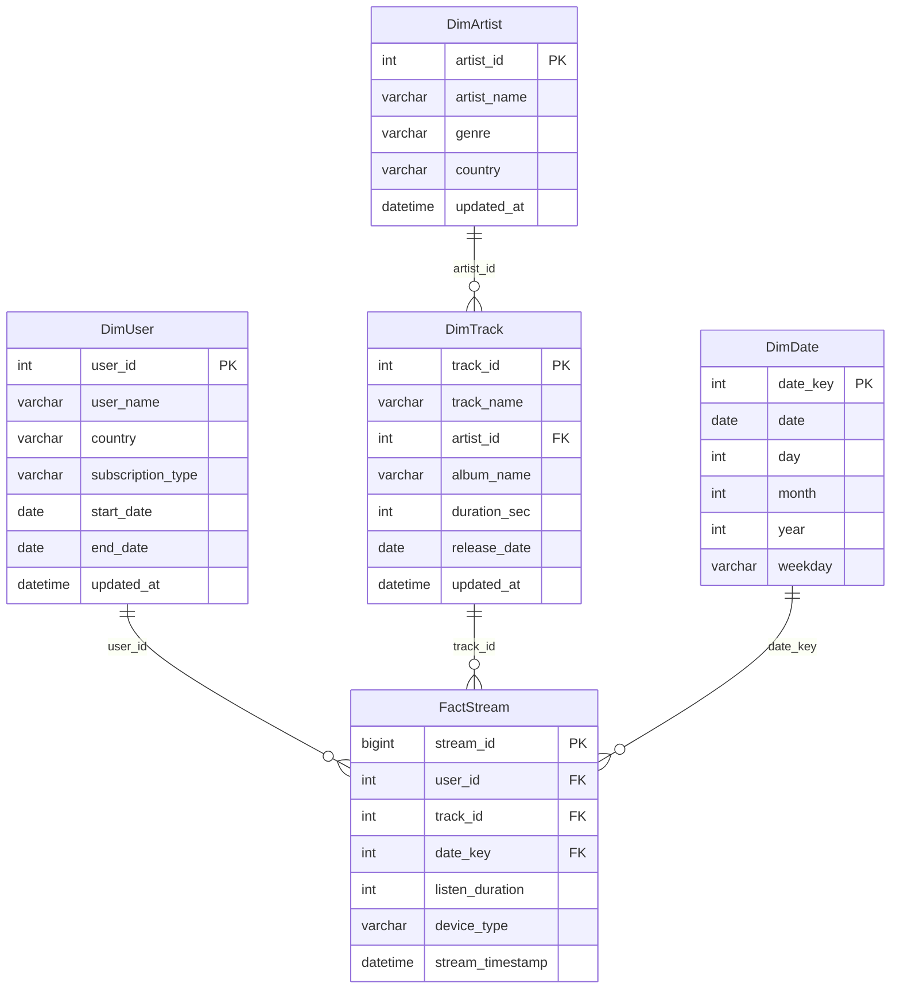

# 📊 SQL Scripts Documentation

This directory contains SQL scripts for setting up and populating the Azure SQL Database source for the Spotify data engineering project.

---

## 📋 Table of Contents

- [Overview](#overview)
- [Star Schema Design](#star-schema-design)
- [SQL Scripts](#sql-scripts)
- [Watermark Strategy](#watermark-strategy)
- [Usage Guide](#usage-guide)
- [Data Characteristics](#data-characteristics)

---

## Overview

The SQL scripts create a **star schema** data model with 4 dimension tables and 1 fact table, containing synthetic Spotify data (including stream event facts). This serves as the source system for the batch ETL pipeline.

**Database**: `spotifydb`  
**Schema**: `dbo`  
**Total Tables**: 5 (4 dimensions + 1 fact)  

---

## Star Schema Design

```
                        ┌─────────────────┐
                        │    DimDate      │
                        ├─────────────────┤
                        │ PK: date_key    │
                        │ date            │
                        │ day             │
                        │ month           │
                        │ year            │
                        │ weekday         │
                        └────────┬────────┘
                                 │
┌─────────────────┐              │              ┌─────────────────┐
│    DimUser      │              │              │    DimArtist    │
├─────────────────┤              │              ├─────────────────┤
│ PK: user_id     │              │              │ PK: artist_id   │
│ user_name       │              │              │ artist_name     │
│ country         │              │              │ genre           │
│ subscription    │              │              │ country         │
│ start_date      │              │              │ updated_at      │
│ end_date        │              │              └────────┬────────┘
│ updated_at      │              │                       │
└────────┬────────┘              │                       │
         │                       │                       │
         │        ┌──────────────▼──────────────┐        │
         │        │       FactStream            │        │
         │        ├─────────────────────────────┤        │
         └───────►│ PK: stream_id               │◄───────┘
                  │ FK: user_id                 │
                  │ FK: track_id                │
                  │ FK: date_key                │
                  │ listen_duration             │
                  │ device_type                 │
                  │ stream_timestamp            │
                  └──────────────┬──────────────┘
                                 │
                        ┌────────▼────────┐
                        │    DimTrack     │
                        ├─────────────────┤
                        │ PK: track_id    │
                        │ track_name      │
                        │ artist_id (FK)  │
                        │ album_name      │
                        │ duration_sec    │
                        │ release_date    │
                        │ updated_at      │
                        └─────────────────┘
```

### **Table Relationships**



---

## SQL Scripts

### 1. **`ddl_script.sql`** - Schema Definition

**Purpose**: Create all tables with proper schema definition

**Contents**:
- DROP TABLE statements (clean slate)
- CREATE TABLE statements for star schema
- Primary key definitions
- Watermark column specifications

**Table Definitions**:

| Table | Primary Key | Watermark Column | Purpose |
|-------|-------------|------------------|---------|
| `DimUser` | `user_id` (INT) | `updated_at` (DATETIME) | Spotify users with subscription info |
| `DimArtist` | `artist_id` (INT) | `updated_at` (DATETIME) | Music artists with genre |
| `DimTrack` | `track_id` (INT) | `updated_at` (DATETIME) | Songs/tracks with metadata |
| `DimDate` | `date_key` (INT) | `date` (DATE) | Date dimension (calendar) |
| `FactStream` | `stream_id` (BIGINT) | `stream_timestamp` (DATETIME) | Streaming events (fact table) |

**Key Features**:
- ✅ Includes watermark column comments (for ADF parameter)
- ✅ Proper data types for efficient storage
- ✅ Foreign key relationships (not enforced, documented)
- ✅ Ready for incremental loading pattern

**How to Use**:
```sql
-- Execute in Azure SQL Database (spotifydb)
-- Using SQL Server Management Studio, Azure Data Studio, or Azure Portal Query Editor

-- This script will:
-- 1. Drop existing tables (if any)
-- 2. Create fresh schema
-- 3. Ready for initial data load
```

**Watermark Configuration Block** (Top of file):
```sql
/*
Parameter name: table_list
Datatype: array
Value:
[
  {
    "tableName": "DimUser",
    "tableSchemaName": "dbo",
    "Watermark_Column": "updated_at"
  },
  ...
]
*/
```
📝 **Note**: This JSON is used in ADF pipeline parameters (`pl_spotify_data_ingestion.json`)

---

### 2. **`initial_load.sql`** - Seed Data

**Purpose**: Populate tables with synthetic Spotify data

**Data Volume**:
- **DimUser**: 500 users (lines 1-501)
- **DimArtist**: 500 artists (lines 503-1003)  
- **DimTrack**: 1000 tracks (lines 1005-2005+)
- **DimDate**: ~1000 dates (date dimension)
- **FactStream**: ~10,000+ streaming events

**Sample Data** (DimUser):
```sql
INSERT INTO DimUser (user_id, user_name, country, subscription_type, start_date, end_date, updated_at) 
VALUES (1, 'Carlos Berry', 'Switzerland', 'Premium', '2023-10-17', NULL, '2025-09-23 19:49:55');
```

**Data Characteristics**:

| Dimension | Attributes | Examples |
|-----------|-----------|----------|
| **Users** | 500 unique users | Countries: 100+ diverse locations |
| | Subscription types: Free, Premium, Family | Active subscriptions (end_date = NULL) |
| | | Updated timestamps: Sept-Oct 2025 |
| **Artists** | 500 artists | Genres: Rock, Pop, Jazz, Hip-Hop, Electronic, Classical |
| | Diverse countries | Names generated using Python Faker |
| **Tracks** | 1000+ songs | Duration: 150-400 seconds |
| | Album associations | Release dates: 2020-2025 |
| | Artist relationships | Various album names |
| **Dates** | Calendar dimension | Date range: 2023-2026 |
| | Day/Month/Year breakdown | Weekday information |
| **Streams** | Streaming facts | Devices: Mobile, Desktop, Smart Speaker |
| | Listen durations | Timestamps: Recent activity |
| | User-track associations | Date key linkage |

**How to Use**:
```sql
-- Execute AFTER ddl_script.sql
-- Execution time: ~1-2 minutes (large file)

-- Validates:
-- ✅ All tables created
-- ✅ Primary keys enforced
-- ✅ Data loads successfully
```

**Post-Load Verification**:
```sql
-- Check record counts
SELECT 'DimUser' as table_name, COUNT(*) as record_count FROM dbo.DimUser
UNION ALL
SELECT 'DimArtist', COUNT(*) FROM dbo.DimArtist
UNION ALL
SELECT 'DimTrack', COUNT(*) FROM dbo.DimTrack
UNION ALL
SELECT 'DimDate', COUNT(*) FROM dbo.DimDate
UNION ALL
SELECT 'FactStream', COUNT(*) FROM dbo.FactStream;

-- Expected results:
-- DimUser: 500
-- DimArtist: 500
-- DimTrack: 1000+
-- DimDate: 1000+
-- FactStream: 10,000+
```

---

### 3. **`incremental_load.sql`** - CDC Simulation

**Purpose**: Simulate data changes to test incremental loading and SCD Type 2

**Change Types**:

#### **A. Bulk Updates (15 rows per table)**

Simulates attribute changes in existing records:

```sql
-- DimUser: Subscription changes
UPDATE DimUser SET subscription_type = 'Premium', updated_at = '2025-10-08 08:10:00' WHERE user_id = 2;
-- Family → Premium (triggers CDC)

-- DimArtist: Genre/country changes
UPDATE DimArtist SET genre = 'Pop Rock', updated_at = '2025-10-08 08:05:00' WHERE artist_id = 3;
-- Triggers SCD Type 2 in Gold layer

-- DimTrack: Album/duration changes
UPDATE DimTrack SET album_name = 'Deluxe Edition', updated_at = '2025-10-08 08:10:00' WHERE track_id = 25;
-- Updates propagate through pipeline

-- FactStream: Listen duration/device changes
UPDATE FactStream SET device_type = 'Mobile', stream_timestamp = '2025-10-08 09:15:00' WHERE stream_id = 101;
```

**Total Updates**: 60 rows (15 × 4 tables)

#### **B. New Record Inserts**

Simulates new entities:

```sql
-- 10 New Artists (artist_id: 501-510)
INSERT INTO DimArtist (artist_id, artist_name, genre, country, updated_at)
VALUES
  (501, 'Marcus Chen', 'Pop', 'Taiwan', '2025-10-09 08:00:00'),
  (502, 'Aisha Kamara', 'R&B', 'Sierra Leone', '2025-10-09 08:00:00'),
  ...;

-- 15 New Tracks (track_id: 501-515)
INSERT INTO DimTrack (track_id, track_name, artist_id, album_name, duration_sec, release_date, updated_at)
VALUES
  (501, 'Neon Dreams', 501, 'Pulse Album', 198, '2025-10-01', '2025-10-09 08:00:00'),
  ...;

-- 10 New Users (user_id: 501-510)
INSERT INTO DimUser (user_id, user_name, country, subscription_type, start_date, end_date, updated_at)
VALUES
  (501, 'Elena Vasquez', 'Spain', 'Premium', '2025-10-07', NULL, '2025-10-09 09:00:00'),
  ...;
```

**Total Inserts**: 35 new records

#### **Test Scenario Summary**

| Change Type | DimUser | DimArtist | DimTrack | FactStream | Total |
|-------------|---------|-----------|----------|------------|-------|
| Updates | 15 | 15 | 15 | 15 | 60 |
| Inserts | 10 | 10 | 15 | 0 | 35 |
| **Total Changes** | **25** | **25** | **30** | **15** | **95** |

**Expected Pipeline Behavior**:

1. **ADF Pipeline**:
   - Detects 95 changed records (watermark filter)
   - Copies to Bronze as Parquet
   - Updates watermarks in Azure Table

2. **Silver Layer**:
   - 60 UPDATE operations (hash_diff changes detected)
   - 35 INSERT operations (new records)

3. **Gold Layer**:
   - 60 new versions created (SCD Type 2)
   - 60 old records expired (is_current = false)
   - 35 new records inserted

**How to Use**:
```sql
-- Execute AFTER initial pipeline run completes
-- Simulates real-world data changes

-- Recommended workflow:
-- 1. Run initial_load.sql
-- 2. Execute ADF pipeline (initial load)
-- 3. Verify Gold layer has 500 users, 500 artists
-- 4. Run incremental_load.sql
-- 5. Execute ADF pipeline (incremental load)
-- 6. Verify Gold layer has SCD Type 2 history
```

**Validation Queries**:
```sql
-- Check updated records (should see new timestamps)
SELECT user_id, subscription_type, updated_at 
FROM dbo.DimUser 
WHERE updated_at > '2025-10-08'
ORDER BY updated_at DESC;

-- Verify new artist IDs
SELECT artist_id, artist_name, genre
FROM dbo.DimArtist
WHERE artist_id > 500;

-- Count total changes
SELECT 
    (SELECT COUNT(*) FROM dbo.DimUser WHERE updated_at > '2025-10-08') as user_changes,
    (SELECT COUNT(*) FROM dbo.DimArtist WHERE updated_at > '2025-10-08') as artist_changes,
    (SELECT COUNT(*) FROM dbo.DimTrack WHERE updated_at > '2025-10-08') as track_changes;
```

---

## Watermark Strategy

### **What is a Watermark?**

A **watermark** is a timestamp or sequential value that tracks the last successfully processed record. It enables **incremental data loading** by identifying new/changed records since the last extraction.

### **Watermark Columns by Table**

| Table | Watermark Column | Data Type | Purpose |
|-------|------------------|-----------|---------|
| **DimUser** | `updated_at` | DATETIME | Tracks when user attributes changed |
| **DimArtist** | `updated_at` | DATETIME | Tracks when artist info updated |
| **DimTrack** | `updated_at` | DATETIME | Tracks when track metadata changed |
| **DimDate** | `date` | DATE | Natural key (dates are immutable) |
| **FactStream** | `stream_timestamp` | DATETIME | When streaming event occurred |

### **Incremental Load Query Pattern**

```sql
-- Generic pattern used by ADF
SELECT * FROM {schema}.{table}
WHERE {watermark_column} > '@{old_watermark_value}'
  AND {watermark_column} <= '@{new_watermark_value}';

-- Example for DimUser
SELECT * FROM dbo.DimUser
WHERE updated_at > '2025-09-29 19:49:55'     -- Old watermark (from Azure Table)
  AND updated_at <= '2025-10-08 09:20:00';   -- New watermark (MAX from source)
  
-- Returns: Only changed/new records since last load
```

### **Watermark Storage**

Watermarks are stored in **Azure Table Storage** (managed by Logic App):

| PartitionKey | RowKey | LastWatermarkValue | Purpose |
|--------------|--------|-------------------|---------|
| dbo | DimUser | 2025-10-08 09:20:00 | Last processed timestamp |
| dbo | DimArtist | 2025-10-08 09:15:00 | Last processed timestamp |
| dbo | DimTrack | 2025-10-08 09:15:00 | Last processed timestamp |
| dbo | DimDate | 2025-10-08 | Last processed date |
| dbo | FactStream | 2025-10-08 10:00:00 | Last processed event |

**Initialization**: Use `pl_seed_ingestion_metadata` pipeline to set initial values (`1900-01-01 00:00:00`)

---

## Data Characteristics

### **Synthetic Data Generation**

Data was generated using **Python Faker library** with the following patterns:

**DimUser** (500 records):
- **Countries**: 100+ diverse locations (random distribution)
- **Subscription Types**: 
  - Free: ~33%
  - Premium: ~33%
  - Family: ~33%
- **Start Dates**: Random between 2023-10 and 2025-09
- **End Dates**: Mostly NULL (active subscriptions)
- **Updated Timestamps**: Sept-Oct 2025

**DimArtist** (500 records):
- **Genres**: Rock, Pop, Jazz, Hip-Hop, Electronic, Classical (even distribution)
- **Countries**: Global representation
- **Names**: Randomized (Faker person names)

**DimTrack** (1000+ records):
- **Duration**: 150-450 seconds (2.5-7.5 minutes)
- **Release Dates**: 2020-2025
- **Album Names**: Descriptive names with "Album" suffix
- **Artist Association**: Links to DimArtist

**DimDate** (~1000 records):
- **Date Range**: 2023-2026
- **Date Key**: YYYYMMDD format (e.g., 20250930)
- **Weekday**: Monday-Sunday

**FactStream** (10,000+ records):
- **Listen Duration**: 60-600 seconds
- **Device Types**: Mobile (60%), Desktop (30%), Smart Speaker (10%)
- **Stream Timestamps**: Sept-Oct 2025
- **Distribution**: Random user-track combinations

---

## Usage Guide

### **Initial Setup (First Time)**

```bash
# Step 1: Deploy infrastructure
cd ../infra
terraform apply

# Step 2: Get SQL Server connection details
terraform output sql_server_fqdn
terraform output sql_database_name

# Step 3: Connect to SQL Database
# Use Azure Portal Query Editor or local SQL client
# Server: sql-spotify-<suffix>.database.windows.net
# Database: spotifydb
# Auth: SQL Authentication (username/password from terraform.tfvars)

# Step 4: Execute DDL script
# Copy contents of ddl_script.sql
# Execute in Query Editor

# Step 5: Execute initial load script
# Copy contents of initial_load.sql
# Execute in Query Editor (takes 1-2 minutes)

# Step 6: Verify data
SELECT COUNT(*) FROM dbo.DimUser;  -- Should return 500
```

### **Simulating Incremental Changes**

```bash
# After initial pipeline run completes:

# Step 1: Execute incremental_load.sql
# This simulates real-world changes:
# - Users changing subscriptions
# - Artists updating genres
# - New tracks released
# - New users signing up

# Step 2: Trigger ADF pipeline
# Pipeline will detect changes via watermark comparison

# Step 3: Verify in Gold layer
# Query Databricks to see SCD Type 2 history
```

### **Validation Queries**

**Check for Recent Changes**:
```sql
-- Find records updated in the last day
SELECT 'DimUser' as table_name, COUNT(*) as recent_updates
FROM dbo.DimUser
WHERE updated_at >= DATEADD(day, -1, GETDATE())
UNION ALL
SELECT 'DimArtist', COUNT(*)
FROM dbo.DimArtist
WHERE updated_at >= DATEADD(day, -1, GETDATE());
```

**Watermark Value Check**:
```sql
-- Get current maximum watermark for each table
SELECT 'DimUser' as table_name, MAX(updated_at) as max_watermark
FROM dbo.DimUser
UNION ALL
SELECT 'DimArtist', MAX(updated_at)
FROM dbo.DimArtist
UNION ALL
SELECT 'DimTrack', MAX(updated_at)
FROM dbo.DimTrack
UNION ALL
SELECT 'FactStream', MAX(stream_timestamp)
FROM dbo.FactStream;
```

**Data Quality Checks**:
```sql
-- Check for NULL values in key columns
SELECT 'DimUser' as table_name, 
       COUNT(*) as null_names
FROM dbo.DimUser
WHERE user_name IS NULL;

-- Verify subscription types are valid
SELECT subscription_type, COUNT(*) as count
FROM dbo.DimUser
GROUP BY subscription_type;
-- Should only show: Free, Premium, Family

-- Check artist-track relationships
SELECT COUNT(*) as orphaned_tracks
FROM dbo.DimTrack t
LEFT JOIN dbo.DimArtist a ON t.artist_id = a.artist_id
WHERE a.artist_id IS NULL;
-- Should return 0
```

---

## Connection Details

### **Connection String Format**

```
Server=tcp:{sql_server_fqdn},1433;
Initial Catalog=spotifydb;
User ID=sqladmin;
Password={from_key_vault};
Encrypt=True;
TrustServerCertificate=False;
Connection Timeout=30;
```

**Get from Terraform**:
```bash
cd ../infra
terraform output sql_server_fqdn
terraform output sql_connection_string
```

### **Access Methods**

1. **Azure Portal Query Editor**
   - Navigate to SQL Database → Query Editor
   - Login with SQL authentication
   - Paste and execute SQL scripts

2. **Azure Data Studio** (Recommended)
   ```bash
   # Download: https://docs.microsoft.com/en-us/sql/azure-data-studio/
   # Connect using:
   # - Server: <sql_server_fqdn>
   # - Database: spotifydb
   # - Authentication: SQL Login
   ```

3. **SQL Server Management Studio (SSMS)**
   - Classic SQL Server tool
   - Full featured IDE

4. **Azure CLI** (Command line)
   ```bash
   az sql db show-connection-string \
     --server sql-spotify-<suffix> \
     --name spotifydb \
     --client sqlcmd
   ```

---

## Best Practices

### **Script Execution Order**

```
1. ddl_script.sql           ← Create schema (first time only)
2. initial_load.sql         ← Seed data (first time only)
3. (Run ADF pipeline)       ← Initial data load to Bronze/Silver/Gold
4. incremental_load.sql     ← Simulate changes (repeatable)
5. (Run ADF pipeline)       ← Incremental load (CDC detection)
6. (Verify Gold layer)      ← Check SCD Type 2 history
```

### **Data Refresh Strategy**

**Development**:
```sql
-- Clean slate for testing
DROP TABLE IF EXISTS dbo.FactStream;  -- Drop fact first (FK dependencies)
DROP TABLE IF EXISTS dbo.DimUser;
DROP TABLE IF EXISTS dbo.DimArtist;
DROP TABLE IF EXISTS dbo.DimTrack;
DROP TABLE IF EXISTS dbo.DimDate;

-- Re-run ddl_script.sql and initial_load.sql
```

**Production**:
- Never DROP tables (data loss)
- Use incremental_load.sql pattern for continuous updates
- Monitor watermarks for consistency

### **Backup & Recovery**

```sql
-- Export before major changes
-- Use Azure SQL Database automated backups:
-- - Point-in-time restore: Last 7-35 days
-- - Long-term retention: Up to 10 years
```

```bash
# Manual export via Azure CLI
az sql db export \
  --server sql-spotify-<suffix> \
  --name spotifydb \
  --admin-user sqladmin \
  --admin-password <password> \
  --storage-key <storage_key> \
  --storage-key-type StorageAccessKey \
  --storage-uri https://{storage}.blob.core.windows.net/backups/spotifydb.bacpac
```

---

## Troubleshooting

### **Common Issues**

**1. "Cannot insert duplicate key"**
```sql
-- Issue: Trying to run initial_load.sql twice
-- Solution: Drop and recreate tables, or use incremental_load.sql
```

**2. "String data would be truncated"**
```sql
-- Issue: Data longer than VARCHAR column definition
-- Solution: Verify ddl_script.sql column lengths match data
```

**3. "Cannot connect to SQL Server"**
```sql
-- Issue: Firewall rules
-- Solution: Add your IP to SQL Server firewall
az sql server firewall-rule create \
  --resource-group rg-spotify-dataeng \
  --server sql-spotify-<suffix> \
  --name AllowMyIP \
  --start-ip-address <your_ip> \
  --end-ip-address <your_ip>
```

**4. "Login failed for user"**
```sql
-- Issue: Incorrect credentials
-- Solution: Verify username/password match terraform.tfvars
-- Or retrieve from Key Vault:
az keyvault secret show --vault-name kv-spotify-<suffix> --name sql-admin-password
```

---

## Integration with Pipeline

### **ADF Pipeline Integration**

The SQL scripts are designed to work seamlessly with the ADF ingestion pipeline:

**Pipeline Parameter** (`pl_spotify_data_ingestion.json`):
```json
{
  "table_list": [
    {
      "tableName": "DimUser",
      "tableSchemaName": "dbo",
      "Watermark_Column": "updated_at"
    },
    ...
  ]
}
```

**SQL Query Generated by ADF**:
```sql
-- Dynamic query built by Copy Activity
SELECT * FROM dbo.DimUser
WHERE updated_at > '@{activity('Get Old Watermark Value').output.Entity.LastWatermarkValue}'
  AND updated_at <= '@{activity('Get New Watermark Value').output.firstRow.NewWatermarkValue}';
```

**Watermark Update**:
```json
{
  "PartitionKey": "dbo",
  "RowKey": "DimUser",
  "LastWatermarkValue": "2025-10-08 09:20:00",
  "OperationType": "update"
}
```

📖 **See**: [pipeline/README.md](../pipeline/README.md) for complete pipeline documentation

---

## Sample Queries

### **Business Intelligence Queries**

**Most Active Users**:
```sql
SELECT TOP 10
    u.user_name,
    u.country,
    u.subscription_type,
    COUNT(f.stream_id) as total_streams,
    SUM(f.listen_duration) as total_listen_seconds
FROM dbo.FactStream f
INNER JOIN dbo.DimUser u ON f.user_id = u.user_id
GROUP BY u.user_name, u.country, u.subscription_type
ORDER BY total_streams DESC;
```

**Most Popular Artists**:
```sql
SELECT TOP 10
    a.artist_name,
    a.genre,
    a.country,
    COUNT(DISTINCT t.track_id) as track_count,
    COUNT(f.stream_id) as stream_count
FROM dbo.DimArtist a
INNER JOIN dbo.DimTrack t ON a.artist_id = t.artist_id
LEFT JOIN dbo.FactStream f ON t.track_id = f.track_id
GROUP BY a.artist_name, a.genre, a.country
ORDER BY stream_count DESC;
```

**Subscription Distribution**:
```sql
SELECT 
    subscription_type,
    COUNT(*) as user_count,
    CAST(COUNT(*) * 100.0 / (SELECT COUNT(*) FROM dbo.DimUser) AS DECIMAL(5,2)) as percentage
FROM dbo.DimUser
WHERE end_date IS NULL  -- Active subscriptions only
GROUP BY subscription_type
ORDER BY user_count DESC;
```

**Streaming Activity by Device**:
```sql
SELECT 
    device_type,
    COUNT(*) as stream_count,
    AVG(listen_duration) as avg_duration_seconds,
    SUM(listen_duration) / 3600.0 as total_hours
FROM dbo.FactStream
GROUP BY device_type
ORDER BY stream_count DESC;
```

---

## File Details

| File | Size | Lines | Execution Time | Purpose |
|------|------|-------|----------------|---------|
| `ddl_script.sql` | ~3 KB | 86 | <1 second | Schema creation |
| `initial_load.sql` | ~505 KB | 2000+ | 1-2 minutes | Initial data load |
| `incremental_load.sql` | ~8 KB | 143 | <5 seconds | CDC simulation |

---

## Next Steps

After executing these scripts:

1. ✅ **Seed Metadata Store**: Run `pl_seed_ingestion_metadata` pipeline in ADF
2. ✅ **Initial Pipeline Run**: Execute `pl_spotify_data_ingestion` for full load
3. ✅ **Verify Bronze**: Check ADLS Gen2 bronze container for Parquet files
4. ✅ **Verify Silver**: Query `spotify_catalog.silver.*` tables in Databricks
5. ✅ **Verify Gold**: Query `spotify_catalog.gold.*` for SCD Type 2 tables
6. ✅ **Test Incremental**: Run `incremental_load.sql` and re-execute pipeline
7. ✅ **Validate History**: Check Gold layer for multiple versions of changed records

---

## Related Documentation

- **[../pipeline/README.md](../pipeline/README.md)**: ADF pipeline that consumes this data
- **[../infra/README.md](../infra/README.md)**: Infrastructure deployment (creates SQL DB)
- **[../databricks/spotify_dab/README.md](../databricks/spotify_dab/README.md)**: Transformation logic
- **[../ARCHITECTURE.md](../ARCHITECTURE.md)**: Complete system architecture

---

**Last Updated**: April 4, 2026  
**Author**: Vikneshwara R B
